ProyectoNP
================
Valentina Muñoz Palma
2025-05-19

## R Markdown

This is an R Markdown document. Markdown is a simple formatting syntax
for authoring HTML, PDF, and MS Word documents. For more details on
using R Markdown see <http://rmarkdown.rstudio.com>.

When you click the **Knit** button a document will be generated that
includes both content as well as the output of any embedded R code
chunks within the document. You can embed an R code chunk like this:

## Including Plots

You can also embed plots, for example:

Note that the `echo = FALSE` parameter was added to the code chunk to
prevent printing of the R code that generated the plot.

``` r
install.packages("tidyverse")
```

    ## Installing package into '/cloud/lib/x86_64-pc-linux-gnu-library/4.4'
    ## (as 'lib' is unspecified)

``` r
install.packages("readxl")
```

    ## Installing package into '/cloud/lib/x86_64-pc-linux-gnu-library/4.4'
    ## (as 'lib' is unspecified)

``` r
install.packages("gt")
```

    ## Installing package into '/cloud/lib/x86_64-pc-linux-gnu-library/4.4'
    ## (as 'lib' is unspecified)

``` r
install.packages("car")
```

    ## Installing package into '/cloud/lib/x86_64-pc-linux-gnu-library/4.4'
    ## (as 'lib' is unspecified)

``` r
install.packages("tidyr")
```

    ## Installing package into '/cloud/lib/x86_64-pc-linux-gnu-library/4.4'
    ## (as 'lib' is unspecified)

``` r
install.packages("purrr")
```

    ## Installing package into '/cloud/lib/x86_64-pc-linux-gnu-library/4.4'
    ## (as 'lib' is unspecified)

``` r
library(tidyverse)
```

    ## ── Attaching core tidyverse packages ──────────────────────── tidyverse 2.0.0 ──
    ## ✔ dplyr     1.1.4     ✔ readr     2.1.5
    ## ✔ forcats   1.0.0     ✔ stringr   1.5.1
    ## ✔ ggplot2   3.5.2     ✔ tibble    3.2.1
    ## ✔ lubridate 1.9.4     ✔ tidyr     1.3.1
    ## ✔ purrr     1.0.4     
    ## ── Conflicts ────────────────────────────────────────── tidyverse_conflicts() ──
    ## ✖ dplyr::filter() masks stats::filter()
    ## ✖ dplyr::lag()    masks stats::lag()
    ## ℹ Use the conflicted package (<http://conflicted.r-lib.org/>) to force all conflicts to become errors

``` r
library(readxl)
library(gt)
library(car) 
```

    ## Loading required package: carData
    ## 
    ## Attaching package: 'car'
    ## 
    ## The following object is masked from 'package:dplyr':
    ## 
    ##     recode
    ## 
    ## The following object is masked from 'package:purrr':
    ## 
    ##     some

``` r
library(tidyr)
library(purrr)
```

``` r
datos_goles <- read_excel("Datos de goles 2018-2024.xlsx")
print("Nombres de las columnas:")
```

    ## [1] "Nombres de las columnas:"

``` r
print(colnames(datos_goles))
```

    ##  [1] "ID"        "TORNEO"    "YEAR"      "FASE"      "LOCAL"     "VISITANTE"
    ##  [7] "P1_L"      "P1_V"      "P2_L"      "P2_V"      "P3_L"      "P3_V"     
    ## [13] "P4_L"      "P4_V"      "P5_L"      "P5_V"      "P6_L"      "P6_V"     
    ## [19] "TN_L"      "TN_V"      "PR1_L"     "PR1_V"     "PR2_L"     "PR2_V"    
    ## [25] "TPR_L"     "TPR_V"     "DURACION"  "1_PATEO"   "PE1_L"     "PE1_V"    
    ## [31] "PE2_L"     "PE2_V"     "PE3_L"     "PE3_V"     "PE4_L"     "PE4_V"    
    ## [37] "PE5_L"     "PE5_V"     "TPE_L"     "TPE_V"     "TOTAL_L"   "TOTAL_V"  
    ## [43] "P_GOL_1"   "PRIM_GOL"  "GANO"      "GOL_GAN"   "GOL_PERD"

``` r
columnas_numericas_nombres <- c("ID", "YEAR","P1_L", "P1_V", "P2_L", "P2_V", "P3_L", "P3_V", "P4_L", "P4_V","P5_L", "P5_V", "P6_L", "P6_V","TN_L", "TN_V", "PR1_L", "PR1_V", "PR2_L", "PR2_V","TPR_L", "TPR_V", "PE1_L", "PE1_V", "PE2_L", "PE2_V", "PE3_L", "PE3_V",
  "PE4_L", "PE4_V", "PE5_L", "PE5_V",
  "TPE_L", "TPE_V","TOTAL_L", "TOTAL_V","GOL_GAN", "GOL_PERD")
for (col_nombre in columnas_numericas_nombres) {
  if (col_nombre %in% colnames(datos_goles)) {
    datos_goles[[col_nombre]] <- ifelse(datos_goles[[col_nombre]] %in% c("No Aplica", "N/A", ""), NA, datos_goles[[col_nombre]])
    datos_goles[[col_nombre]] <- as.numeric(datos_goles[[col_nombre]])
  } else {
    print(paste("Advertencia: La columna", col_nombre, "no se encontró en los datos para conversión numérica."))
  }
}

columnas_categoricas_nombres <- c("TORNEO", "FASE", "LOCAL", "VISITANTE", "DURACION", "1_PATEO", "PRIM_GOL", "GANO","P_GOL_1")
for (col_nombre in columnas_categoricas_nombres) {
  if (col_nombre %in% colnames(datos_goles)) {
    datos_goles[[col_nombre]] <- as.factor(datos_goles[[col_nombre]])
  } else {
    print(paste("Advertencia: La columna", col_nombre, "no se encontró en los datos para conversión a factor."))
  }
}

print("Estructura DESPUÉS de convertir a factor:")
```

    ## [1] "Estructura DESPUÉS de convertir a factor:"

``` r
str(datos_goles)
```

    ## tibble [62 × 47] (S3: tbl_df/tbl/data.frame)
    ##  $ ID       : num [1:62] 18 38 40 53 57 7 13 20 42 52 ...
    ##  $ TORNEO   : Factor w/ 2 levels "EURO COPA","MUNDIAL": 1 2 2 1 1 2 2 1 2 1 ...
    ##  $ YEAR     : num [1:62] 2020 2022 2022 2024 2024 ...
    ##  $ FASE     : Factor w/ 5 levels "CF","FI","FI 3",..: 4 4 1 4 1 4 5 4 1 4 ...
    ##  $ LOCAL    : Factor w/ 23 levels "Argentina","Austria",..: 11 13 6 15 15 19 9 3 13 9 ...
    ##  $ VISITANTE: Factor w/ 29 levels "Argentina","Australia",..: 3 25 5 23 10 26 4 19 19 4 ...
    ##  $ P1_L     : num [1:62] 0 0 0 0 0 0 0 0 0 0 ...
    ##  $ P1_V     : num [1:62] 0 0 0 0 0 0 0 0 0 0 ...
    ##  $ P2_L     : num [1:62] 0 0 0 0 0 0 0 0 0 0 ...
    ##  $ P2_V     : num [1:62] 0 0 0 0 0 0 0 0 0 0 ...
    ##  $ P3_L     : num [1:62] 0 0 0 0 0 0 0 1 1 0 ...
    ##  $ P3_V     : num [1:62] 0 0 0 0 0 0 0 0 0 0 ...
    ##  $ P4_L     : num [1:62] 0 0 0 0 0 0 1 0 0 0 ...
    ##  $ P4_V     : num [1:62] 0 0 0 0 0 0 0 0 0 0 ...
    ##  $ P5_L     : num [1:62] 0 0 0 0 0 1 0 0 0 0 ...
    ##  $ P5_V     : num [1:62] 0 0 0 0 0 0 0 0 0 0 ...
    ##  $ P6_L     : num [1:62] 0 0 0 0 0 0 0 0 0 1 ...
    ##  $ P6_V     : num [1:62] 0 0 0 0 0 0 0 0 0 0 ...
    ##  $ TN_L     : num [1:62] 0 0 0 0 0 1 1 1 1 1 ...
    ##  $ TN_V     : num [1:62] 0 0 0 0 0 0 0 0 0 0 ...
    ##  $ PR1_L    : num [1:62] 2 0 0 0 0 0 0 0 0 0 ...
    ##  $ PR1_V    : num [1:62] 0 0 0 0 0 0 0 0 0 0 ...
    ##  $ PR2_L    : num [1:62] 0 0 1 0 0 0 0 0 0 0 ...
    ##  $ PR2_V    : num [1:62] 1 0 1 0 0 0 0 0 0 0 ...
    ##  $ TPR_L    : num [1:62] 2 0 1 0 0 0 0 0 0 0 ...
    ##  $ TPR_V    : num [1:62] 1 0 1 0 0 0 0 0 0 0 ...
    ##  $ DURACION : Factor w/ 3 levels "normal","penalties",..: 3 2 2 2 2 1 1 1 1 1 ...
    ##  $ 1_PATEO  : Factor w/ 3 levels "local","No Aplica",..: 2 1 1 3 3 2 2 2 2 2 ...
    ##  $ PE1_L    : num [1:62] 0 1 1 1 1 0 0 0 0 0 ...
    ##  $ PE1_V    : num [1:62] 0 0 0 0 1 0 0 0 0 0 ...
    ##  $ PE2_L    : num [1:62] 0 1 1 1 1 0 0 0 0 0 ...
    ##  $ PE2_V    : num [1:62] 0 0 1 0 1 0 0 0 0 0 ...
    ##  $ PE3_L    : num [1:62] 0 0 1 1 0 0 0 0 0 0 ...
    ##  $ PE3_V    : num [1:62] 0 0 1 0 1 0 0 0 0 0 ...
    ##  $ PE4_L    : num [1:62] 0 1 1 0 1 0 0 0 0 0 ...
    ##  $ PE4_V    : num [1:62] 0 0 0 0 1 0 0 0 0 0 ...
    ##  $ PE5_L    : num [1:62] 0 0 0 0 0 0 0 0 0 0 ...
    ##  $ PE5_V    : num [1:62] 0 0 0 0 1 0 0 0 0 0 ...
    ##  $ TPE_L    : num [1:62] 0 3 4 3 3 0 0 0 0 0 ...
    ##  $ TPE_V    : num [1:62] 0 0 2 0 5 0 0 0 0 0 ...
    ##  $ TOTAL_L  : num [1:62] 2 3 5 3 3 1 1 1 1 1 ...
    ##  $ TOTAL_V  : num [1:62] 1 0 3 0 5 0 0 0 0 0 ...
    ##  $ P_GOL_1  : Factor w/ 9 levels "1","2","3","4",..: 7 9 8 9 9 5 4 3 3 6 ...
    ##  $ PRIM_GOL : Factor w/ 2 levels "local","visitante": 1 1 2 1 2 1 1 1 1 1 ...
    ##  $ GANO     : Factor w/ 2 levels "local","visitante": 1 1 1 1 2 1 1 1 1 1 ...
    ##  $ GOL_GAN  : num [1:62] 95 NA 117 NA NA 66 51 42 42 85 ...
    ##  $ GOL_PERD : num [1:62] 114 NA 106 NA NA NA NA NA NA NA ...

``` r
#quitar partidos que terminaron el tiempo regular con empate 0-0
datos_goles <- datos_goles %>%
  filter(!(TN_L == 0 & TN_V == 0))
#agregar variable nueva
datos_goles <- datos_goles %>%
  mutate(
    TOTAL_GN=TN_L+TN_V)
```

``` r
#descriptiva################################################################
#grafica periodo del primer gol segun quien anoto primero--------------------------------------------------------
ggplot(datos_goles, aes(x = factor(P_GOL_1), fill = PRIM_GOL)) +
  geom_bar(position = "fill") +  
  labs(
    x = "Período en que se anoto el primer gol",
    y = "Proporción",
    title = "Proporción de primer gol segun quien lo anoto"
  ) +scale_fill_manual(
    values = c("local" = "#342BA8", "visitante" = "#D93E1F")
  ) 
```

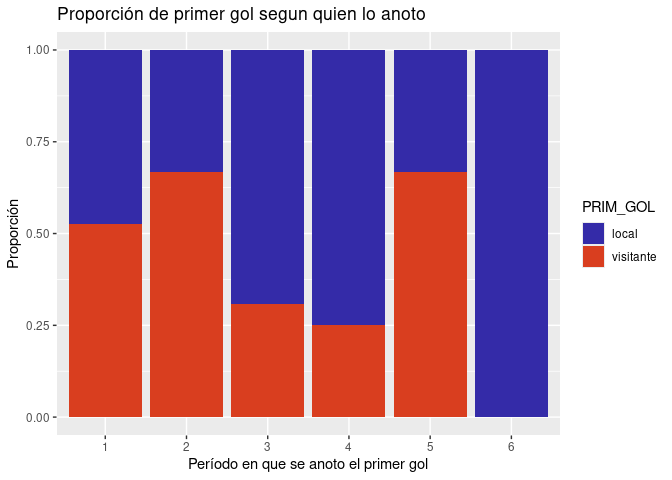<!-- -->

``` r
#grafica periodo que anoto el primer gol segun equipo que lo anoto y gano--------------------------------------------------------
win_anot <- filter(datos_goles, PRIM_GOL == GANO & PRIM_GOL %in% c("local", "visitante"))
ggplot(win_anot, aes(x = factor(P_GOL_1), fill = GANO)) +
  geom_bar(position = "fill") +  
  labs(
    x = "Período (P_GOL_1)",
    y = "Proporción",
    title = "Proporción del periodo del primer gol segun quien gano"
  ) +scale_fill_manual(
    values = c("local" = "#342BA8", "visitante" = "#D93E1F")
  ) 
```

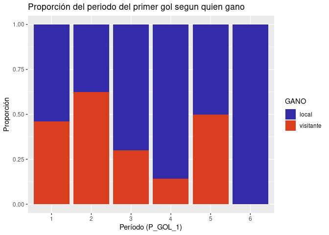<!-- -->

``` r
#porcentaje de anotar primero y ganar--------------------------------------------------------
porcentaje_global_victorias_al_anotar_primero <- datos_goles %>%
  filter(PRIM_GOL %in% c("local", "visitante") & !is.na(PRIM_GOL) & !is.na(GANO)) %>%
  summarise(
    porcentaje_global = mean(GANO == PRIM_GOL, na.rm = TRUE) * 100
  )
#print("Porcentaje global de victorias al marcar primero:")
print(porcentaje_global_victorias_al_anotar_primero)
```

    ## # A tibble: 1 × 1
    ##   porcentaje_global
    ##               <dbl>
    ## 1              73.7

``` r
#porcentaje de veces q gano si anotaba primero dependiendo del equipo
porcentaje_win_anot <- datos_goles %>%
  filter(PRIM_GOL %in% c("local", "visitante") & !is.na(PRIM_GOL)) %>%
  group_by(PRIM_GOL) %>%
  summarise(
    partidos_totales = n(),
    victorias = sum(GANO == PRIM_GOL, na.rm = TRUE),
    porcentaje_win_anot_calc = (victorias / partidos_totales) * 100,
    .groups = 'drop' 
  )
#print("Porcentaje de victorias al marcar primero (Local vs Visitante):")
print(porcentaje_win_anot)
```

    ## # A tibble: 2 × 4
    ##   PRIM_GOL  partidos_totales victorias porcentaje_win_anot_calc
    ##   <fct>                <int>     <int>                    <dbl>
    ## 1 local                   31        26                     83.9
    ## 2 visitante               26        16                     61.5

``` r
#grafico
if(nrow(porcentaje_win_anot) > 0){
  ggplot(porcentaje_win_anot, aes(x = PRIM_GOL, y = porcentaje_win_anot_calc, fill = PRIM_GOL)) +
    geom_col() +
    geom_text(aes(label = paste0(round(porcentaje_win_anot_calc, 1), "%")), vjust = -0.5) +
    labs(
      title = "Porcentaje de Victorias al Marcar Primero",
      x = "Equipo que Anotó Primero",
      y = "Porcentaje de Victorias (%)"
    ) +
    theme_minimal()+scale_fill_manual(
      values = c("local" = "#342BA8", "visitante" = "#D93E1F")
    ) 
}
```

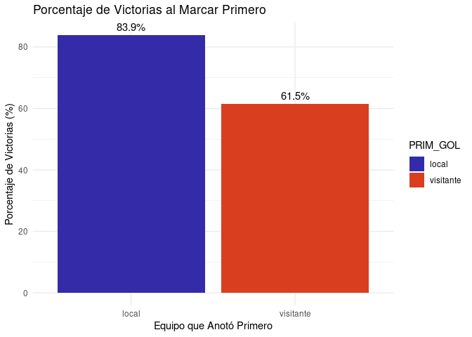<!-- -->

``` r
#distribucion cantidad de primeros goles por periodo--------------------------------------------------------
periodo_labels <- c("0-15", "15-30", "30-45", "45-60", "60-75", "75-90")
ggplot(datos_goles, aes(x = factor(P_GOL_1, levels = 1:6, labels = periodo_labels))) +
  geom_histogram(stat = "count", fill = "#342BA8", color = "white") +
  labs(
    title = "Frecuencia del Primer Gol por Período",
    x = "Período del Partido",
    y = "Número de Partidos"
  ) +
  theme_minimal() +
  theme(axis.text.x = element_text(angle = 45, hjust = 1))
```

    ## Warning in geom_histogram(stat = "count", fill = "#342BA8", color = "white"):
    ## Ignoring unknown parameters: `binwidth`, `bins`, and `pad`

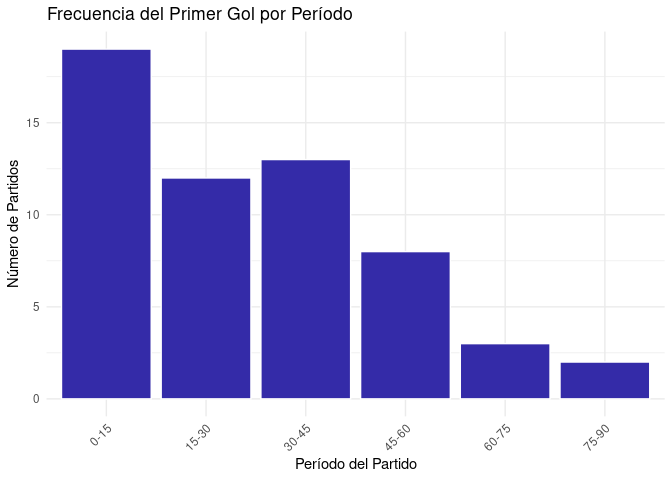<!-- -->

``` r
#cantidad de goles por periodo--------------------------------------------------------
goles_por_periodo_agregado <- datos_goles %>%
  mutate(
    goles_p1 = P1_L + P1_V,
    goles_p2 = P2_L + P2_V,
    goles_p3 = P3_L + P3_V,
    goles_p4 = P4_L + P4_V,
    goles_p5 = P5_L + P5_V,
    goles_p6 = P6_L + P6_V
  ) %>%
  select(starts_with("goles_p")) %>% 
  pivot_longer(
    cols = everything(),
    names_to = "periodo_txt",
    values_to = "goles"
  ) %>%
  mutate(
    periodo_factor = factor(
      periodo_txt,
      levels = c("goles_p1", "goles_p2", "goles_p3", "goles_p4", "goles_p5", "goles_p6", "goles_pr1", "goles_pr2"),
      labels = c("0-15", "16-30", "31-45", "46-60", "61-75", "76-90", "Prór. 1", "Prór. 2")
    )
  )
goles_porcentaje_periodo_agregado <- goles_por_periodo_agregado %>%
  filter(!is.na(goles)) %>% 
  group_by(periodo_factor) %>%
  summarise(total_goles_periodo = sum(goles, na.rm = TRUE), .groups = 'drop') %>%
  mutate(
    porcentaje = (total_goles_periodo / sum(total_goles_periodo, na.rm = TRUE)) * 100,
    etiqueta = sprintf("%.1f%%", porcentaje)
  )
#print("Porcentaje de goles marcados por período (Agregado):")
#view(goles_porcentaje_periodo_agregado)
#
ggplot(goles_porcentaje_periodo_agregado, aes(x = periodo_factor, y = porcentaje)) +
  geom_bar(stat = "identity", fill = "#342BA8", color = "white") +
  geom_text(
    aes(label = etiqueta),
    vjust = -0.5,
    size = 3
  ) +
  labs(
    title = "Porcentaje de Goles Totales Marcados por Período del Partido",
    x = "Período del Partido",
    y = "Porcentaje de Goles (%)"
  ) +
  theme_minimal() +
  theme(axis.text.x = element_text(angle = 45, hjust = 1))
```

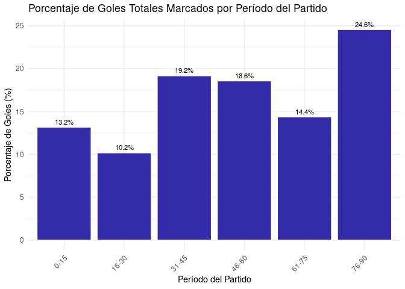<!-- -->

``` r
#tabla 1################################################################
# --- PASO 1: Datos por Año -----------------------------------------------------------
data_by_year <- datos_goles %>%
  group_by(TORNEO, YEAR) %>%
  summarise(
    val_Matches = n(),
    val_Normal = sum(DURACION == "normal", na.rm = TRUE),
    val_Prorroga = sum(DURACION == "prorroga", na.rm = TRUE),
    val_Penalties = sum(DURACION == "penalties", na.rm = TRUE),
    .groups = "drop"
  ) %>%
  mutate(
    Display_Column = as.character(YEAR),
    Partidos = as.character(val_Matches),
    `Partidos terminados en tiempo regular` = as.character(val_Normal),
    `Partidos terminados en tiempo adicional` = as.character(val_Prorroga),
    `Partidos terminados en penalties` = as.character(val_Penalties)
  ) %>%
  select(
    TORNEO_Group = TORNEO, 
    Display_Column,
    Partidos,
    `Partidos terminados en tiempo regular`,
    `Partidos terminados en tiempo adicional`,
    `Partidos terminados en penalties`
  )
# --- PASO 2: Totales por Torneo (con porcentajes) -----------------------------------------------------------
data_torneo_totals <- datos_goles %>%
  group_by(TORNEO) %>%
  summarise(
    Num_Matches = n(),
    Num_Normal = sum(DURACION == "normal", na.rm = TRUE),
    Num_Prorroga = sum(DURACION == "prorroga", na.rm = TRUE),
    Num_Penalties = sum(DURACION == "penalties", na.rm = TRUE),
    .groups = "drop"
  ) %>%
  mutate(
    Display_Column = "Total", 
    Partidos = sprintf("%d (100.0%%)", Num_Matches),
    `Partidos terminados en tiempo regular` = sprintf("%d (%.1f%%)", Num_Normal, ifelse(Num_Matches == 0, 0, (Num_Normal / Num_Matches) * 100)),
    `Partidos terminados en tiempo adicional` = sprintf("%d (%.1f%%)", Num_Prorroga, ifelse(Num_Matches == 0, 0, (Num_Prorroga / Num_Matches) * 100)),
    `Partidos terminados en penalties` = sprintf("%d (%.1f%%)", Num_Penalties, ifelse(Num_Matches == 0, 0, (Num_Penalties / Num_Matches) * 100))
  ) %>%
  select(
    TORNEO_Group = TORNEO,
    Display_Column,
    Partidos,
    `Partidos terminados en tiempo regular`,
    `Partidos terminados en tiempo adicional`,
    `Partidos terminados en penalties`
  )
# --- PASO 3: Gran Total (con porcentajes) -----------------------------------------------------------
data_grand_total <- datos_goles %>%
  summarise(
    Num_Matches = n(),
    Num_Normal = sum(DURACION == "normal", na.rm = TRUE),
    Num_Prorroga = sum(DURACION == "prorroga", na.rm = TRUE),
    Num_Penalties = sum(DURACION == "penalties", na.rm = TRUE),
    .groups = "drop"
  ) %>%
  mutate(
    TORNEO_Group = "Total", 
    Display_Column = "",    
    Partidos = sprintf("%d (100.0%%)", Num_Matches),
    `Partidos terminados en tiempo regular` = sprintf("%d (%.1f%%)", Num_Normal, ifelse(Num_Matches == 0, 0, (Num_Normal / Num_Matches) * 100)),
    `Partidos terminados en tiempo adicional` = sprintf("%d (%.1f%%)", Num_Prorroga, ifelse(Num_Matches == 0, 0, (Num_Prorroga / Num_Matches) * 100)),
    `Partidos terminados en penalties` = sprintf("%d (%.1f%%)", Num_Penalties, ifelse(Num_Matches == 0, 0, (Num_Penalties / Num_Matches) * 100))
  ) %>%
  select(
    TORNEO_Group,
    Display_Column,
    Partidos,
    `Partidos terminados en tiempo regular`,
    `Partidos terminados en tiempo adicional`,
    `Partidos terminados en penalties`
  )
# --- PASO 4: Combinar todos los datos -----------------------------------------------------------
combined_data <- bind_rows(data_by_year, data_torneo_totals, data_grand_total) %>%
  mutate(
    Order_TORNEO_Group = case_when(
      TORNEO_Group == "MUNDIAL" ~ 1,
      TORNEO_Group == "EURO COPA" ~ 2,
      TORNEO_Group == "Total" ~ 3, 
      TRUE ~ 99 
    ),
    Order_Display_Column = ifelse(Display_Column == "Total", 2, 1)
  ) %>%
  arrange(Order_TORNEO_Group, Order_Display_Column, Display_Column) %>%
  mutate(
    TORNEO_Group = case_when(
      TORNEO_Group == "MUNDIAL" ~ "Mundial", 
      TORNEO_Group == "EURO COPA" ~ "Euro copa", 
      TRUE ~ TORNEO_Group 
    )
  ) %>%
  select(-Order_TORNEO_Group, -Order_Display_Column)
# --- PASO 5: Crear la tabla con `gt` -----------------------------------------------------------
final_table <- combined_data %>%
  gt(groupname_col = "TORNEO_Group", rowname_col = "Display_Column") %>%
  cols_label(Display_Column = "Year") %>%
  tab_header(title = "Resumen de la duración de los partidos por torneo y año") %>%
  cols_align(
    align = "right",
    columns = c(Partidos, `Partidos terminados en tiempo regular`, `Partidos terminados en tiempo adicional`, `Partidos terminados en penalties`)
  ) %>%
  tab_style(
    style = cell_text(weight = "bold"),
    locations = cells_body(
      columns = vars(Display_Column), # La columna que contiene "Año" o "Total"
      rows = Display_Column == "Total" # Condición para aplicar el estilo
    )
  ) %>%
  tab_style(
    style = cell_text(weight = "bold"),
    locations = cells_body(
      columns = vars(Display_Column),
      rows = Display_Column == ""
    )
  )
```

    ## Warning: Since gt v0.3.0, `columns = vars(...)` has been deprecated.
    ## • Please use `columns = c(...)` instead.
    ## Since gt v0.3.0, `columns = vars(...)` has been deprecated.
    ## • Please use `columns = c(...)` instead.

``` r
# Mostrar la tabla
print(final_table)
```

    ## <div id="wdozjpxwkt" style="padding-left:0px;padding-right:0px;padding-top:10px;padding-bottom:10px;overflow-x:auto;overflow-y:auto;width:auto;height:auto;">
    ##   <style>#wdozjpxwkt table {
    ##   font-family: system-ui, 'Segoe UI', Roboto, Helvetica, Arial, sans-serif, 'Apple Color Emoji', 'Segoe UI Emoji', 'Segoe UI Symbol', 'Noto Color Emoji';
    ##   -webkit-font-smoothing: antialiased;
    ##   -moz-osx-font-smoothing: grayscale;
    ## }
    ## 
    ## #wdozjpxwkt thead, #wdozjpxwkt tbody, #wdozjpxwkt tfoot, #wdozjpxwkt tr, #wdozjpxwkt td, #wdozjpxwkt th {
    ##   border-style: none;
    ## }
    ## 
    ## #wdozjpxwkt p {
    ##   margin: 0;
    ##   padding: 0;
    ## }
    ## 
    ## #wdozjpxwkt .gt_table {
    ##   display: table;
    ##   border-collapse: collapse;
    ##   line-height: normal;
    ##   margin-left: auto;
    ##   margin-right: auto;
    ##   color: #333333;
    ##   font-size: 16px;
    ##   font-weight: normal;
    ##   font-style: normal;
    ##   background-color: #FFFFFF;
    ##   width: auto;
    ##   border-top-style: solid;
    ##   border-top-width: 2px;
    ##   border-top-color: #A8A8A8;
    ##   border-right-style: none;
    ##   border-right-width: 2px;
    ##   border-right-color: #D3D3D3;
    ##   border-bottom-style: solid;
    ##   border-bottom-width: 2px;
    ##   border-bottom-color: #A8A8A8;
    ##   border-left-style: none;
    ##   border-left-width: 2px;
    ##   border-left-color: #D3D3D3;
    ## }
    ## 
    ## #wdozjpxwkt .gt_caption {
    ##   padding-top: 4px;
    ##   padding-bottom: 4px;
    ## }
    ## 
    ## #wdozjpxwkt .gt_title {
    ##   color: #333333;
    ##   font-size: 125%;
    ##   font-weight: initial;
    ##   padding-top: 4px;
    ##   padding-bottom: 4px;
    ##   padding-left: 5px;
    ##   padding-right: 5px;
    ##   border-bottom-color: #FFFFFF;
    ##   border-bottom-width: 0;
    ## }
    ## 
    ## #wdozjpxwkt .gt_subtitle {
    ##   color: #333333;
    ##   font-size: 85%;
    ##   font-weight: initial;
    ##   padding-top: 3px;
    ##   padding-bottom: 5px;
    ##   padding-left: 5px;
    ##   padding-right: 5px;
    ##   border-top-color: #FFFFFF;
    ##   border-top-width: 0;
    ## }
    ## 
    ## #wdozjpxwkt .gt_heading {
    ##   background-color: #FFFFFF;
    ##   text-align: center;
    ##   border-bottom-color: #FFFFFF;
    ##   border-left-style: none;
    ##   border-left-width: 1px;
    ##   border-left-color: #D3D3D3;
    ##   border-right-style: none;
    ##   border-right-width: 1px;
    ##   border-right-color: #D3D3D3;
    ## }
    ## 
    ## #wdozjpxwkt .gt_bottom_border {
    ##   border-bottom-style: solid;
    ##   border-bottom-width: 2px;
    ##   border-bottom-color: #D3D3D3;
    ## }
    ## 
    ## #wdozjpxwkt .gt_col_headings {
    ##   border-top-style: solid;
    ##   border-top-width: 2px;
    ##   border-top-color: #D3D3D3;
    ##   border-bottom-style: solid;
    ##   border-bottom-width: 2px;
    ##   border-bottom-color: #D3D3D3;
    ##   border-left-style: none;
    ##   border-left-width: 1px;
    ##   border-left-color: #D3D3D3;
    ##   border-right-style: none;
    ##   border-right-width: 1px;
    ##   border-right-color: #D3D3D3;
    ## }
    ## 
    ## #wdozjpxwkt .gt_col_heading {
    ##   color: #333333;
    ##   background-color: #FFFFFF;
    ##   font-size: 100%;
    ##   font-weight: normal;
    ##   text-transform: inherit;
    ##   border-left-style: none;
    ##   border-left-width: 1px;
    ##   border-left-color: #D3D3D3;
    ##   border-right-style: none;
    ##   border-right-width: 1px;
    ##   border-right-color: #D3D3D3;
    ##   vertical-align: bottom;
    ##   padding-top: 5px;
    ##   padding-bottom: 6px;
    ##   padding-left: 5px;
    ##   padding-right: 5px;
    ##   overflow-x: hidden;
    ## }
    ## 
    ## #wdozjpxwkt .gt_column_spanner_outer {
    ##   color: #333333;
    ##   background-color: #FFFFFF;
    ##   font-size: 100%;
    ##   font-weight: normal;
    ##   text-transform: inherit;
    ##   padding-top: 0;
    ##   padding-bottom: 0;
    ##   padding-left: 4px;
    ##   padding-right: 4px;
    ## }
    ## 
    ## #wdozjpxwkt .gt_column_spanner_outer:first-child {
    ##   padding-left: 0;
    ## }
    ## 
    ## #wdozjpxwkt .gt_column_spanner_outer:last-child {
    ##   padding-right: 0;
    ## }
    ## 
    ## #wdozjpxwkt .gt_column_spanner {
    ##   border-bottom-style: solid;
    ##   border-bottom-width: 2px;
    ##   border-bottom-color: #D3D3D3;
    ##   vertical-align: bottom;
    ##   padding-top: 5px;
    ##   padding-bottom: 5px;
    ##   overflow-x: hidden;
    ##   display: inline-block;
    ##   width: 100%;
    ## }
    ## 
    ## #wdozjpxwkt .gt_spanner_row {
    ##   border-bottom-style: hidden;
    ## }
    ## 
    ## #wdozjpxwkt .gt_group_heading {
    ##   padding-top: 8px;
    ##   padding-bottom: 8px;
    ##   padding-left: 5px;
    ##   padding-right: 5px;
    ##   color: #333333;
    ##   background-color: #FFFFFF;
    ##   font-size: 100%;
    ##   font-weight: initial;
    ##   text-transform: inherit;
    ##   border-top-style: solid;
    ##   border-top-width: 2px;
    ##   border-top-color: #D3D3D3;
    ##   border-bottom-style: solid;
    ##   border-bottom-width: 2px;
    ##   border-bottom-color: #D3D3D3;
    ##   border-left-style: none;
    ##   border-left-width: 1px;
    ##   border-left-color: #D3D3D3;
    ##   border-right-style: none;
    ##   border-right-width: 1px;
    ##   border-right-color: #D3D3D3;
    ##   vertical-align: middle;
    ##   text-align: left;
    ## }
    ## 
    ## #wdozjpxwkt .gt_empty_group_heading {
    ##   padding: 0.5px;
    ##   color: #333333;
    ##   background-color: #FFFFFF;
    ##   font-size: 100%;
    ##   font-weight: initial;
    ##   border-top-style: solid;
    ##   border-top-width: 2px;
    ##   border-top-color: #D3D3D3;
    ##   border-bottom-style: solid;
    ##   border-bottom-width: 2px;
    ##   border-bottom-color: #D3D3D3;
    ##   vertical-align: middle;
    ## }
    ## 
    ## #wdozjpxwkt .gt_from_md > :first-child {
    ##   margin-top: 0;
    ## }
    ## 
    ## #wdozjpxwkt .gt_from_md > :last-child {
    ##   margin-bottom: 0;
    ## }
    ## 
    ## #wdozjpxwkt .gt_row {
    ##   padding-top: 8px;
    ##   padding-bottom: 8px;
    ##   padding-left: 5px;
    ##   padding-right: 5px;
    ##   margin: 10px;
    ##   border-top-style: solid;
    ##   border-top-width: 1px;
    ##   border-top-color: #D3D3D3;
    ##   border-left-style: none;
    ##   border-left-width: 1px;
    ##   border-left-color: #D3D3D3;
    ##   border-right-style: none;
    ##   border-right-width: 1px;
    ##   border-right-color: #D3D3D3;
    ##   vertical-align: middle;
    ##   overflow-x: hidden;
    ## }
    ## 
    ## #wdozjpxwkt .gt_stub {
    ##   color: #333333;
    ##   background-color: #FFFFFF;
    ##   font-size: 100%;
    ##   font-weight: initial;
    ##   text-transform: inherit;
    ##   border-right-style: solid;
    ##   border-right-width: 2px;
    ##   border-right-color: #D3D3D3;
    ##   padding-left: 5px;
    ##   padding-right: 5px;
    ## }
    ## 
    ## #wdozjpxwkt .gt_stub_row_group {
    ##   color: #333333;
    ##   background-color: #FFFFFF;
    ##   font-size: 100%;
    ##   font-weight: initial;
    ##   text-transform: inherit;
    ##   border-right-style: solid;
    ##   border-right-width: 2px;
    ##   border-right-color: #D3D3D3;
    ##   padding-left: 5px;
    ##   padding-right: 5px;
    ##   vertical-align: top;
    ## }
    ## 
    ## #wdozjpxwkt .gt_row_group_first td {
    ##   border-top-width: 2px;
    ## }
    ## 
    ## #wdozjpxwkt .gt_row_group_first th {
    ##   border-top-width: 2px;
    ## }
    ## 
    ## #wdozjpxwkt .gt_summary_row {
    ##   color: #333333;
    ##   background-color: #FFFFFF;
    ##   text-transform: inherit;
    ##   padding-top: 8px;
    ##   padding-bottom: 8px;
    ##   padding-left: 5px;
    ##   padding-right: 5px;
    ## }
    ## 
    ## #wdozjpxwkt .gt_first_summary_row {
    ##   border-top-style: solid;
    ##   border-top-color: #D3D3D3;
    ## }
    ## 
    ## #wdozjpxwkt .gt_first_summary_row.thick {
    ##   border-top-width: 2px;
    ## }
    ## 
    ## #wdozjpxwkt .gt_last_summary_row {
    ##   padding-top: 8px;
    ##   padding-bottom: 8px;
    ##   padding-left: 5px;
    ##   padding-right: 5px;
    ##   border-bottom-style: solid;
    ##   border-bottom-width: 2px;
    ##   border-bottom-color: #D3D3D3;
    ## }
    ## 
    ## #wdozjpxwkt .gt_grand_summary_row {
    ##   color: #333333;
    ##   background-color: #FFFFFF;
    ##   text-transform: inherit;
    ##   padding-top: 8px;
    ##   padding-bottom: 8px;
    ##   padding-left: 5px;
    ##   padding-right: 5px;
    ## }
    ## 
    ## #wdozjpxwkt .gt_first_grand_summary_row {
    ##   padding-top: 8px;
    ##   padding-bottom: 8px;
    ##   padding-left: 5px;
    ##   padding-right: 5px;
    ##   border-top-style: double;
    ##   border-top-width: 6px;
    ##   border-top-color: #D3D3D3;
    ## }
    ## 
    ## #wdozjpxwkt .gt_last_grand_summary_row_top {
    ##   padding-top: 8px;
    ##   padding-bottom: 8px;
    ##   padding-left: 5px;
    ##   padding-right: 5px;
    ##   border-bottom-style: double;
    ##   border-bottom-width: 6px;
    ##   border-bottom-color: #D3D3D3;
    ## }
    ## 
    ## #wdozjpxwkt .gt_striped {
    ##   background-color: rgba(128, 128, 128, 0.05);
    ## }
    ## 
    ## #wdozjpxwkt .gt_table_body {
    ##   border-top-style: solid;
    ##   border-top-width: 2px;
    ##   border-top-color: #D3D3D3;
    ##   border-bottom-style: solid;
    ##   border-bottom-width: 2px;
    ##   border-bottom-color: #D3D3D3;
    ## }
    ## 
    ## #wdozjpxwkt .gt_footnotes {
    ##   color: #333333;
    ##   background-color: #FFFFFF;
    ##   border-bottom-style: none;
    ##   border-bottom-width: 2px;
    ##   border-bottom-color: #D3D3D3;
    ##   border-left-style: none;
    ##   border-left-width: 2px;
    ##   border-left-color: #D3D3D3;
    ##   border-right-style: none;
    ##   border-right-width: 2px;
    ##   border-right-color: #D3D3D3;
    ## }
    ## 
    ## #wdozjpxwkt .gt_footnote {
    ##   margin: 0px;
    ##   font-size: 90%;
    ##   padding-top: 4px;
    ##   padding-bottom: 4px;
    ##   padding-left: 5px;
    ##   padding-right: 5px;
    ## }
    ## 
    ## #wdozjpxwkt .gt_sourcenotes {
    ##   color: #333333;
    ##   background-color: #FFFFFF;
    ##   border-bottom-style: none;
    ##   border-bottom-width: 2px;
    ##   border-bottom-color: #D3D3D3;
    ##   border-left-style: none;
    ##   border-left-width: 2px;
    ##   border-left-color: #D3D3D3;
    ##   border-right-style: none;
    ##   border-right-width: 2px;
    ##   border-right-color: #D3D3D3;
    ## }
    ## 
    ## #wdozjpxwkt .gt_sourcenote {
    ##   font-size: 90%;
    ##   padding-top: 4px;
    ##   padding-bottom: 4px;
    ##   padding-left: 5px;
    ##   padding-right: 5px;
    ## }
    ## 
    ## #wdozjpxwkt .gt_left {
    ##   text-align: left;
    ## }
    ## 
    ## #wdozjpxwkt .gt_center {
    ##   text-align: center;
    ## }
    ## 
    ## #wdozjpxwkt .gt_right {
    ##   text-align: right;
    ##   font-variant-numeric: tabular-nums;
    ## }
    ## 
    ## #wdozjpxwkt .gt_font_normal {
    ##   font-weight: normal;
    ## }
    ## 
    ## #wdozjpxwkt .gt_font_bold {
    ##   font-weight: bold;
    ## }
    ## 
    ## #wdozjpxwkt .gt_font_italic {
    ##   font-style: italic;
    ## }
    ## 
    ## #wdozjpxwkt .gt_super {
    ##   font-size: 65%;
    ## }
    ## 
    ## #wdozjpxwkt .gt_footnote_marks {
    ##   font-size: 75%;
    ##   vertical-align: 0.4em;
    ##   position: initial;
    ## }
    ## 
    ## #wdozjpxwkt .gt_asterisk {
    ##   font-size: 100%;
    ##   vertical-align: 0;
    ## }
    ## 
    ## #wdozjpxwkt .gt_indent_1 {
    ##   text-indent: 5px;
    ## }
    ## 
    ## #wdozjpxwkt .gt_indent_2 {
    ##   text-indent: 10px;
    ## }
    ## 
    ## #wdozjpxwkt .gt_indent_3 {
    ##   text-indent: 15px;
    ## }
    ## 
    ## #wdozjpxwkt .gt_indent_4 {
    ##   text-indent: 20px;
    ## }
    ## 
    ## #wdozjpxwkt .gt_indent_5 {
    ##   text-indent: 25px;
    ## }
    ## 
    ## #wdozjpxwkt .katex-display {
    ##   display: inline-flex !important;
    ##   margin-bottom: 0.75em !important;
    ## }
    ## 
    ## #wdozjpxwkt div.Reactable > div.rt-table > div.rt-thead > div.rt-tr.rt-tr-group-header > div.rt-th-group:after {
    ##   height: 0px !important;
    ## }
    ## </style>
    ##   <table class="gt_table" data-quarto-disable-processing="false" data-quarto-bootstrap="false">
    ##   <thead>
    ##     <tr class="gt_heading">
    ##       <td colspan="5" class="gt_heading gt_title gt_font_normal gt_bottom_border" style>Resumen de la duración de los partidos por torneo y año</td>
    ##     </tr>
    ##     
    ##     <tr class="gt_col_headings">
    ##       <th class="gt_col_heading gt_columns_bottom_border gt_left" rowspan="1" colspan="1" scope="col" id="a::stub"></th>
    ##       <th class="gt_col_heading gt_columns_bottom_border gt_right" rowspan="1" colspan="1" scope="col" id="Partidos">Partidos</th>
    ##       <th class="gt_col_heading gt_columns_bottom_border gt_right" rowspan="1" colspan="1" scope="col" id="Partidos-terminados-en-tiempo-regular">Partidos terminados en tiempo regular</th>
    ##       <th class="gt_col_heading gt_columns_bottom_border gt_right" rowspan="1" colspan="1" scope="col" id="Partidos-terminados-en-tiempo-adicional">Partidos terminados en tiempo adicional</th>
    ##       <th class="gt_col_heading gt_columns_bottom_border gt_right" rowspan="1" colspan="1" scope="col" id="Partidos-terminados-en-penalties">Partidos terminados en penalties</th>
    ##     </tr>
    ##   </thead>
    ##   <tbody class="gt_table_body">
    ##     <tr class="gt_group_heading_row">
    ##       <th colspan="5" class="gt_group_heading" scope="colgroup" id="Mundial">Mundial</th>
    ##     </tr>
    ##     <tr class="gt_row_group_first"><th id="stub_1_1" scope="row" class="gt_row gt_left gt_stub">2018</th>
    ## <td headers="Mundial stub_1_1 Partidos" class="gt_row gt_right">16</td>
    ## <td headers="Mundial stub_1_1 Partidos terminados en tiempo regular" class="gt_row gt_right">11</td>
    ## <td headers="Mundial stub_1_1 Partidos terminados en tiempo adicional" class="gt_row gt_right">1</td>
    ## <td headers="Mundial stub_1_1 Partidos terminados en penalties" class="gt_row gt_right">4</td></tr>
    ##     <tr><th id="stub_1_2" scope="row" class="gt_row gt_left gt_stub">2022</th>
    ## <td headers="Mundial stub_1_2 Partidos" class="gt_row gt_right">14</td>
    ## <td headers="Mundial stub_1_2 Partidos terminados en tiempo regular" class="gt_row gt_right">11</td>
    ## <td headers="Mundial stub_1_2 Partidos terminados en tiempo adicional" class="gt_row gt_right">0</td>
    ## <td headers="Mundial stub_1_2 Partidos terminados en penalties" class="gt_row gt_right">3</td></tr>
    ##     <tr><th id="stub_1_3" scope="row" class="gt_row gt_left gt_stub">Total</th>
    ## <td headers="Mundial stub_1_3 Partidos" class="gt_row gt_right">30 (100.0%)</td>
    ## <td headers="Mundial stub_1_3 Partidos terminados en tiempo regular" class="gt_row gt_right">22 (73.3%)</td>
    ## <td headers="Mundial stub_1_3 Partidos terminados en tiempo adicional" class="gt_row gt_right">1 (3.3%)</td>
    ## <td headers="Mundial stub_1_3 Partidos terminados en penalties" class="gt_row gt_right">7 (23.3%)</td></tr>
    ##     <tr class="gt_group_heading_row">
    ##       <th colspan="5" class="gt_group_heading" scope="colgroup" id="Euro copa">Euro copa</th>
    ##     </tr>
    ##     <tr class="gt_row_group_first"><th id="stub_1_4" scope="row" class="gt_row gt_left gt_stub">2020</th>
    ## <td headers="Euro copa stub_1_4 Partidos" class="gt_row gt_right">14</td>
    ## <td headers="Euro copa stub_1_4 Partidos terminados en tiempo regular" class="gt_row gt_right">7</td>
    ## <td headers="Euro copa stub_1_4 Partidos terminados en tiempo adicional" class="gt_row gt_right">3</td>
    ## <td headers="Euro copa stub_1_4 Partidos terminados en penalties" class="gt_row gt_right">4</td></tr>
    ##     <tr><th id="stub_1_5" scope="row" class="gt_row gt_left gt_stub">2024</th>
    ## <td headers="Euro copa stub_1_5 Partidos" class="gt_row gt_right">13</td>
    ## <td headers="Euro copa stub_1_5 Partidos terminados en tiempo regular" class="gt_row gt_right">10</td>
    ## <td headers="Euro copa stub_1_5 Partidos terminados en tiempo adicional" class="gt_row gt_right">2</td>
    ## <td headers="Euro copa stub_1_5 Partidos terminados en penalties" class="gt_row gt_right">1</td></tr>
    ##     <tr><th id="stub_1_6" scope="row" class="gt_row gt_left gt_stub">Total</th>
    ## <td headers="Euro copa stub_1_6 Partidos" class="gt_row gt_right">27 (100.0%)</td>
    ## <td headers="Euro copa stub_1_6 Partidos terminados en tiempo regular" class="gt_row gt_right">17 (63.0%)</td>
    ## <td headers="Euro copa stub_1_6 Partidos terminados en tiempo adicional" class="gt_row gt_right">5 (18.5%)</td>
    ## <td headers="Euro copa stub_1_6 Partidos terminados en penalties" class="gt_row gt_right">5 (18.5%)</td></tr>
    ##     <tr class="gt_group_heading_row">
    ##       <th colspan="5" class="gt_group_heading" scope="colgroup" id="Total">Total</th>
    ##     </tr>
    ##     <tr class="gt_row_group_first"><th id="stub_1_7" scope="row" class="gt_row gt_left gt_stub"></th>
    ## <td headers="Total stub_1_7 Partidos" class="gt_row gt_right">57 (100.0%)</td>
    ## <td headers="Total stub_1_7 Partidos terminados en tiempo regular" class="gt_row gt_right">39 (68.4%)</td>
    ## <td headers="Total stub_1_7 Partidos terminados en tiempo adicional" class="gt_row gt_right">6 (10.5%)</td>
    ## <td headers="Total stub_1_7 Partidos terminados en penalties" class="gt_row gt_right">12 (21.1%)</td></tr>
    ##   </tbody>
    ##   
    ##   
    ## </table>
    ## </div>

``` r
#tabla 2################################################################
# Paso 1: Calcular estadísticas por TORNEO y DURACION--------------------------------------------------------
stats_por_torneo <- datos_goles %>%
  filter(PRIM_GOL %in% c("local", "visitante")) %>% 
  mutate(primero_marco_y_gano = (PRIM_GOL == GANO & !is.na(GANO))) %>% 
  group_by(TORNEO, DURACION) %>%
  summarise(
    total_partidos_con_primer_gol = n(),
    partidos_ganados_por_quien_marco_primero = sum(primero_marco_y_gano, na.rm = TRUE),
    .groups = 'drop'
  ) %>%
  mutate(
    porcentaje_victoria_marcando_primero = ifelse(total_partidos_con_primer_gol == 0, 0,
                                                  (partidos_ganados_por_quien_marco_primero / total_partidos_con_primer_gol) * 100)
  )
# Paso 2: Calcular estadísticas para el TOTAL GENERAL (Ambas Competiciones)--------------------------------------------------------
stats_total_general <- datos_goles %>%
  filter(PRIM_GOL %in% c("local", "visitante")) %>%
  mutate(primero_marco_y_gano = (PRIM_GOL == GANO & !is.na(GANO))) %>%
  group_by(DURACION) %>% 
  summarise(
    total_partidos_con_primer_gol = n(),
    partidos_ganados_por_quien_marco_primero = sum(primero_marco_y_gano, na.rm = TRUE),
    .groups = 'drop'
  ) %>%
  mutate(
    porcentaje_victoria_marcando_primero = ifelse(total_partidos_con_primer_gol == 0, 0,
                                                  (partidos_ganados_por_quien_marco_primero / total_partidos_con_primer_gol) * 100),
    TORNEO = "Total" 
  )
all_percentages_data <- bind_rows(
  stats_por_torneo %>% select(TORNEO, DURACION, porcentaje_victoria_marcando_primero),
  stats_total_general %>% select(TORNEO, DURACION, porcentaje_victoria_marcando_primero)
) %>%
  rename(percentage = porcentaje_victoria_marcando_primero) 
# --- PASO 3 (REVISADO): Pivotar los datos a formato ancho -----------------------------------------------------------
tabla_datos_ancha <- all_percentages_data %>%
  mutate(
    Competición = case_when(
      TORNEO == "MUNDIAL" ~ "Mundial",
      TORNEO == "EURO COPA" ~ "Euro copa",
      TORNEO == "Total" ~ "Total",
      TRUE ~ as.character(TORNEO)
    ),
    `Condición_Duracion` = case_when(
      DURACION == "normal" ~ "Efecto de marcar primero en el tiempo reglamentario",
      DURACION == "prorroga" ~ "Efecto de marcar primero en el tiempo Añadido",
      DURACION == "penalties" ~ "Efecto de marcar primero en los penaltis",
      TRUE ~ as.character(DURACION)
    )
  ) %>%
  select(Competición, `Condición_Duracion`, percentage) %>%
  pivot_wider(names_from = `Condición_Duracion`, values_from = percentage) %>%
  mutate(
    Competición_Order = case_when(
      Competición == "Mundial" ~ 2,
      Competición == "Euro copa" ~ 1,
      Competición == "Total" ~ 3,
      TRUE ~ 4 
    )
  ) %>%
  arrange(Competición_Order) %>%
  select(-Competición_Order) 
# --- PASO 4 (REVISADO): Crear la tabla gt con el formato ancho -----------------------------------------------------------
tabla_gt_ancha_final <- tabla_datos_ancha %>%
  gt() %>% 
  cols_label(
    Competición = md("**Competición**"),
    `Efecto de marcar primero en el tiempo reglamentario` = md("**Efecto de marcar primero en el tiempo reglamentario**"),
    `Efecto de marcar primero en el tiempo Añadido` = md("**Efecto de marcar primero en el tiempo Añadido**"),
    `Efecto de marcar primero en los penaltis` = md("**Efecto de marcar primero en los penaltis**")
  ) %>%
  fmt_number(
    columns = c("Efecto de marcar primero en el tiempo reglamentario", "Efecto de marcar primero en el tiempo Añadido", "Efecto de marcar primero en los penaltis"),
    decimals = 2,
    pattern = "{x}%"
  ) %>%
  tab_header(
    title = md("**Tabla 2: Efecto de Marcar Primero en Ganar el Partido**"),
    subtitle = md("Porcentaje de victorias del equipo que marcó primero, según duración del partido.")
  ) %>%
  tab_spanner(
    label = md("**% de Victorias al Marcar Primero**"),
    columns = c("Efecto de marcar primero en el tiempo reglamentario", "Efecto de marcar primero en el tiempo Añadido", "Efecto de marcar primero en los penaltis")
  ) %>%
  cols_align(
    align = "center",
    columns = c("Efecto de marcar primero en el tiempo reglamentario", "Efecto de marcar primero en el tiempo Añadido", "Efecto de marcar primero en los penaltis")
  ) %>%
  cols_align(
    align = "left",
    columns = vars(Competición) 
  ) %>%
  opt_table_lines("default") 
```

    ## Warning: Since gt v0.3.0, `columns = vars(...)` has been deprecated.
    ## • Please use `columns = c(...)` instead.

``` r
print(tabla_gt_ancha_final)
```

    ## <div id="vzzvvivfyf" style="padding-left:0px;padding-right:0px;padding-top:10px;padding-bottom:10px;overflow-x:auto;overflow-y:auto;width:auto;height:auto;">
    ##   <style>#vzzvvivfyf table {
    ##   font-family: system-ui, 'Segoe UI', Roboto, Helvetica, Arial, sans-serif, 'Apple Color Emoji', 'Segoe UI Emoji', 'Segoe UI Symbol', 'Noto Color Emoji';
    ##   -webkit-font-smoothing: antialiased;
    ##   -moz-osx-font-smoothing: grayscale;
    ## }
    ## 
    ## #vzzvvivfyf thead, #vzzvvivfyf tbody, #vzzvvivfyf tfoot, #vzzvvivfyf tr, #vzzvvivfyf td, #vzzvvivfyf th {
    ##   border-style: none;
    ## }
    ## 
    ## #vzzvvivfyf p {
    ##   margin: 0;
    ##   padding: 0;
    ## }
    ## 
    ## #vzzvvivfyf .gt_table {
    ##   display: table;
    ##   border-collapse: collapse;
    ##   line-height: normal;
    ##   margin-left: auto;
    ##   margin-right: auto;
    ##   color: #333333;
    ##   font-size: 16px;
    ##   font-weight: normal;
    ##   font-style: normal;
    ##   background-color: #FFFFFF;
    ##   width: auto;
    ##   border-top-style: solid;
    ##   border-top-width: 2px;
    ##   border-top-color: #A8A8A8;
    ##   border-right-style: none;
    ##   border-right-width: 2px;
    ##   border-right-color: #D3D3D3;
    ##   border-bottom-style: solid;
    ##   border-bottom-width: 2px;
    ##   border-bottom-color: #A8A8A8;
    ##   border-left-style: none;
    ##   border-left-width: 2px;
    ##   border-left-color: #D3D3D3;
    ## }
    ## 
    ## #vzzvvivfyf .gt_caption {
    ##   padding-top: 4px;
    ##   padding-bottom: 4px;
    ## }
    ## 
    ## #vzzvvivfyf .gt_title {
    ##   color: #333333;
    ##   font-size: 125%;
    ##   font-weight: initial;
    ##   padding-top: 4px;
    ##   padding-bottom: 4px;
    ##   padding-left: 5px;
    ##   padding-right: 5px;
    ##   border-bottom-color: #FFFFFF;
    ##   border-bottom-width: 0;
    ## }
    ## 
    ## #vzzvvivfyf .gt_subtitle {
    ##   color: #333333;
    ##   font-size: 85%;
    ##   font-weight: initial;
    ##   padding-top: 3px;
    ##   padding-bottom: 5px;
    ##   padding-left: 5px;
    ##   padding-right: 5px;
    ##   border-top-color: #FFFFFF;
    ##   border-top-width: 0;
    ## }
    ## 
    ## #vzzvvivfyf .gt_heading {
    ##   background-color: #FFFFFF;
    ##   text-align: center;
    ##   border-bottom-color: #FFFFFF;
    ##   border-left-style: none;
    ##   border-left-width: 1px;
    ##   border-left-color: #D3D3D3;
    ##   border-right-style: none;
    ##   border-right-width: 1px;
    ##   border-right-color: #D3D3D3;
    ## }
    ## 
    ## #vzzvvivfyf .gt_bottom_border {
    ##   border-bottom-style: solid;
    ##   border-bottom-width: 2px;
    ##   border-bottom-color: #D3D3D3;
    ## }
    ## 
    ## #vzzvvivfyf .gt_col_headings {
    ##   border-top-style: solid;
    ##   border-top-width: 2px;
    ##   border-top-color: #D3D3D3;
    ##   border-bottom-style: solid;
    ##   border-bottom-width: 2px;
    ##   border-bottom-color: #D3D3D3;
    ##   border-left-style: none;
    ##   border-left-width: 1px;
    ##   border-left-color: #D3D3D3;
    ##   border-right-style: none;
    ##   border-right-width: 1px;
    ##   border-right-color: #D3D3D3;
    ## }
    ## 
    ## #vzzvvivfyf .gt_col_heading {
    ##   color: #333333;
    ##   background-color: #FFFFFF;
    ##   font-size: 100%;
    ##   font-weight: normal;
    ##   text-transform: inherit;
    ##   border-left-style: none;
    ##   border-left-width: 1px;
    ##   border-left-color: #D3D3D3;
    ##   border-right-style: none;
    ##   border-right-width: 1px;
    ##   border-right-color: #D3D3D3;
    ##   vertical-align: bottom;
    ##   padding-top: 5px;
    ##   padding-bottom: 6px;
    ##   padding-left: 5px;
    ##   padding-right: 5px;
    ##   overflow-x: hidden;
    ## }
    ## 
    ## #vzzvvivfyf .gt_column_spanner_outer {
    ##   color: #333333;
    ##   background-color: #FFFFFF;
    ##   font-size: 100%;
    ##   font-weight: normal;
    ##   text-transform: inherit;
    ##   padding-top: 0;
    ##   padding-bottom: 0;
    ##   padding-left: 4px;
    ##   padding-right: 4px;
    ## }
    ## 
    ## #vzzvvivfyf .gt_column_spanner_outer:first-child {
    ##   padding-left: 0;
    ## }
    ## 
    ## #vzzvvivfyf .gt_column_spanner_outer:last-child {
    ##   padding-right: 0;
    ## }
    ## 
    ## #vzzvvivfyf .gt_column_spanner {
    ##   border-bottom-style: solid;
    ##   border-bottom-width: 2px;
    ##   border-bottom-color: #D3D3D3;
    ##   vertical-align: bottom;
    ##   padding-top: 5px;
    ##   padding-bottom: 5px;
    ##   overflow-x: hidden;
    ##   display: inline-block;
    ##   width: 100%;
    ## }
    ## 
    ## #vzzvvivfyf .gt_spanner_row {
    ##   border-bottom-style: hidden;
    ## }
    ## 
    ## #vzzvvivfyf .gt_group_heading {
    ##   padding-top: 8px;
    ##   padding-bottom: 8px;
    ##   padding-left: 5px;
    ##   padding-right: 5px;
    ##   color: #333333;
    ##   background-color: #FFFFFF;
    ##   font-size: 100%;
    ##   font-weight: initial;
    ##   text-transform: inherit;
    ##   border-top-style: solid;
    ##   border-top-width: 2px;
    ##   border-top-color: #D3D3D3;
    ##   border-bottom-style: solid;
    ##   border-bottom-width: 2px;
    ##   border-bottom-color: #D3D3D3;
    ##   border-left-style: none;
    ##   border-left-width: 1px;
    ##   border-left-color: #D3D3D3;
    ##   border-right-style: none;
    ##   border-right-width: 1px;
    ##   border-right-color: #D3D3D3;
    ##   vertical-align: middle;
    ##   text-align: left;
    ## }
    ## 
    ## #vzzvvivfyf .gt_empty_group_heading {
    ##   padding: 0.5px;
    ##   color: #333333;
    ##   background-color: #FFFFFF;
    ##   font-size: 100%;
    ##   font-weight: initial;
    ##   border-top-style: solid;
    ##   border-top-width: 2px;
    ##   border-top-color: #D3D3D3;
    ##   border-bottom-style: solid;
    ##   border-bottom-width: 2px;
    ##   border-bottom-color: #D3D3D3;
    ##   vertical-align: middle;
    ## }
    ## 
    ## #vzzvvivfyf .gt_from_md > :first-child {
    ##   margin-top: 0;
    ## }
    ## 
    ## #vzzvvivfyf .gt_from_md > :last-child {
    ##   margin-bottom: 0;
    ## }
    ## 
    ## #vzzvvivfyf .gt_row {
    ##   padding-top: 8px;
    ##   padding-bottom: 8px;
    ##   padding-left: 5px;
    ##   padding-right: 5px;
    ##   margin: 10px;
    ##   border-top-style: solid;
    ##   border-top-width: 1px;
    ##   border-top-color: #D3D3D3;
    ##   border-left-style: none;
    ##   border-left-width: 1px;
    ##   border-left-color: #D3D3D3;
    ##   border-right-style: none;
    ##   border-right-width: 1px;
    ##   border-right-color: #D3D3D3;
    ##   vertical-align: middle;
    ##   overflow-x: hidden;
    ## }
    ## 
    ## #vzzvvivfyf .gt_stub {
    ##   color: #333333;
    ##   background-color: #FFFFFF;
    ##   font-size: 100%;
    ##   font-weight: initial;
    ##   text-transform: inherit;
    ##   border-right-style: solid;
    ##   border-right-width: 2px;
    ##   border-right-color: #D3D3D3;
    ##   padding-left: 5px;
    ##   padding-right: 5px;
    ## }
    ## 
    ## #vzzvvivfyf .gt_stub_row_group {
    ##   color: #333333;
    ##   background-color: #FFFFFF;
    ##   font-size: 100%;
    ##   font-weight: initial;
    ##   text-transform: inherit;
    ##   border-right-style: solid;
    ##   border-right-width: 2px;
    ##   border-right-color: #D3D3D3;
    ##   padding-left: 5px;
    ##   padding-right: 5px;
    ##   vertical-align: top;
    ## }
    ## 
    ## #vzzvvivfyf .gt_row_group_first td {
    ##   border-top-width: 2px;
    ## }
    ## 
    ## #vzzvvivfyf .gt_row_group_first th {
    ##   border-top-width: 2px;
    ## }
    ## 
    ## #vzzvvivfyf .gt_summary_row {
    ##   color: #333333;
    ##   background-color: #FFFFFF;
    ##   text-transform: inherit;
    ##   padding-top: 8px;
    ##   padding-bottom: 8px;
    ##   padding-left: 5px;
    ##   padding-right: 5px;
    ## }
    ## 
    ## #vzzvvivfyf .gt_first_summary_row {
    ##   border-top-style: solid;
    ##   border-top-color: #D3D3D3;
    ## }
    ## 
    ## #vzzvvivfyf .gt_first_summary_row.thick {
    ##   border-top-width: 2px;
    ## }
    ## 
    ## #vzzvvivfyf .gt_last_summary_row {
    ##   padding-top: 8px;
    ##   padding-bottom: 8px;
    ##   padding-left: 5px;
    ##   padding-right: 5px;
    ##   border-bottom-style: solid;
    ##   border-bottom-width: 2px;
    ##   border-bottom-color: #D3D3D3;
    ## }
    ## 
    ## #vzzvvivfyf .gt_grand_summary_row {
    ##   color: #333333;
    ##   background-color: #FFFFFF;
    ##   text-transform: inherit;
    ##   padding-top: 8px;
    ##   padding-bottom: 8px;
    ##   padding-left: 5px;
    ##   padding-right: 5px;
    ## }
    ## 
    ## #vzzvvivfyf .gt_first_grand_summary_row {
    ##   padding-top: 8px;
    ##   padding-bottom: 8px;
    ##   padding-left: 5px;
    ##   padding-right: 5px;
    ##   border-top-style: double;
    ##   border-top-width: 6px;
    ##   border-top-color: #D3D3D3;
    ## }
    ## 
    ## #vzzvvivfyf .gt_last_grand_summary_row_top {
    ##   padding-top: 8px;
    ##   padding-bottom: 8px;
    ##   padding-left: 5px;
    ##   padding-right: 5px;
    ##   border-bottom-style: double;
    ##   border-bottom-width: 6px;
    ##   border-bottom-color: #D3D3D3;
    ## }
    ## 
    ## #vzzvvivfyf .gt_striped {
    ##   background-color: rgba(128, 128, 128, 0.05);
    ## }
    ## 
    ## #vzzvvivfyf .gt_table_body {
    ##   border-top-style: solid;
    ##   border-top-width: 2px;
    ##   border-top-color: #D3D3D3;
    ##   border-bottom-style: solid;
    ##   border-bottom-width: 2px;
    ##   border-bottom-color: #D3D3D3;
    ## }
    ## 
    ## #vzzvvivfyf .gt_footnotes {
    ##   color: #333333;
    ##   background-color: #FFFFFF;
    ##   border-bottom-style: none;
    ##   border-bottom-width: 2px;
    ##   border-bottom-color: #D3D3D3;
    ##   border-left-style: none;
    ##   border-left-width: 2px;
    ##   border-left-color: #D3D3D3;
    ##   border-right-style: none;
    ##   border-right-width: 2px;
    ##   border-right-color: #D3D3D3;
    ## }
    ## 
    ## #vzzvvivfyf .gt_footnote {
    ##   margin: 0px;
    ##   font-size: 90%;
    ##   padding-top: 4px;
    ##   padding-bottom: 4px;
    ##   padding-left: 5px;
    ##   padding-right: 5px;
    ## }
    ## 
    ## #vzzvvivfyf .gt_sourcenotes {
    ##   color: #333333;
    ##   background-color: #FFFFFF;
    ##   border-bottom-style: none;
    ##   border-bottom-width: 2px;
    ##   border-bottom-color: #D3D3D3;
    ##   border-left-style: none;
    ##   border-left-width: 2px;
    ##   border-left-color: #D3D3D3;
    ##   border-right-style: none;
    ##   border-right-width: 2px;
    ##   border-right-color: #D3D3D3;
    ## }
    ## 
    ## #vzzvvivfyf .gt_sourcenote {
    ##   font-size: 90%;
    ##   padding-top: 4px;
    ##   padding-bottom: 4px;
    ##   padding-left: 5px;
    ##   padding-right: 5px;
    ## }
    ## 
    ## #vzzvvivfyf .gt_left {
    ##   text-align: left;
    ## }
    ## 
    ## #vzzvvivfyf .gt_center {
    ##   text-align: center;
    ## }
    ## 
    ## #vzzvvivfyf .gt_right {
    ##   text-align: right;
    ##   font-variant-numeric: tabular-nums;
    ## }
    ## 
    ## #vzzvvivfyf .gt_font_normal {
    ##   font-weight: normal;
    ## }
    ## 
    ## #vzzvvivfyf .gt_font_bold {
    ##   font-weight: bold;
    ## }
    ## 
    ## #vzzvvivfyf .gt_font_italic {
    ##   font-style: italic;
    ## }
    ## 
    ## #vzzvvivfyf .gt_super {
    ##   font-size: 65%;
    ## }
    ## 
    ## #vzzvvivfyf .gt_footnote_marks {
    ##   font-size: 75%;
    ##   vertical-align: 0.4em;
    ##   position: initial;
    ## }
    ## 
    ## #vzzvvivfyf .gt_asterisk {
    ##   font-size: 100%;
    ##   vertical-align: 0;
    ## }
    ## 
    ## #vzzvvivfyf .gt_indent_1 {
    ##   text-indent: 5px;
    ## }
    ## 
    ## #vzzvvivfyf .gt_indent_2 {
    ##   text-indent: 10px;
    ## }
    ## 
    ## #vzzvvivfyf .gt_indent_3 {
    ##   text-indent: 15px;
    ## }
    ## 
    ## #vzzvvivfyf .gt_indent_4 {
    ##   text-indent: 20px;
    ## }
    ## 
    ## #vzzvvivfyf .gt_indent_5 {
    ##   text-indent: 25px;
    ## }
    ## 
    ## #vzzvvivfyf .katex-display {
    ##   display: inline-flex !important;
    ##   margin-bottom: 0.75em !important;
    ## }
    ## 
    ## #vzzvvivfyf div.Reactable > div.rt-table > div.rt-thead > div.rt-tr.rt-tr-group-header > div.rt-th-group:after {
    ##   height: 0px !important;
    ## }
    ## </style>
    ##   <table class="gt_table" data-quarto-disable-processing="false" data-quarto-bootstrap="false">
    ##   <thead>
    ##     <tr class="gt_heading">
    ##       <td colspan="4" class="gt_heading gt_title gt_font_normal" style><span class='gt_from_md'><strong>Tabla 2: Efecto de Marcar Primero en Ganar el Partido</strong></span></td>
    ##     </tr>
    ##     <tr class="gt_heading">
    ##       <td colspan="4" class="gt_heading gt_subtitle gt_font_normal gt_bottom_border" style><span class='gt_from_md'>Porcentaje de victorias del equipo que marcó primero, según duración del partido.</span></td>
    ##     </tr>
    ##     <tr class="gt_col_headings gt_spanner_row">
    ##       <th class="gt_col_heading gt_columns_bottom_border gt_left" rowspan="2" colspan="1" scope="col" id="Competición"><span class='gt_from_md'><strong>Competición</strong></span></th>
    ##       <th class="gt_center gt_columns_top_border gt_column_spanner_outer" rowspan="1" colspan="3" scope="colgroup" id="**% de Victorias al Marcar Primero**">
    ##         <div class="gt_column_spanner"><span class='gt_from_md'><strong>% de Victorias al Marcar Primero</strong></span></div>
    ##       </th>
    ##     </tr>
    ##     <tr class="gt_col_headings">
    ##       <th class="gt_col_heading gt_columns_bottom_border gt_center" rowspan="1" colspan="1" scope="col" id="Efecto-de-marcar-primero-en-el-tiempo-reglamentario"><span class='gt_from_md'><strong>Efecto de marcar primero en el tiempo reglamentario</strong></span></th>
    ##       <th class="gt_col_heading gt_columns_bottom_border gt_center" rowspan="1" colspan="1" scope="col" id="Efecto-de-marcar-primero-en-el-tiempo-Añadido"><span class='gt_from_md'><strong>Efecto de marcar primero en el tiempo Añadido</strong></span></th>
    ##       <th class="gt_col_heading gt_columns_bottom_border gt_center" rowspan="1" colspan="1" scope="col" id="Efecto-de-marcar-primero-en-los-penaltis"><span class='gt_from_md'><strong>Efecto de marcar primero en los penaltis</strong></span></th>
    ##     </tr>
    ##   </thead>
    ##   <tbody class="gt_table_body">
    ##     <tr><td headers="Competición" class="gt_row gt_left">Euro copa</td>
    ## <td headers="Efecto de marcar primero en el tiempo reglamentario" class="gt_row gt_center">76.47%</td>
    ## <td headers="Efecto de marcar primero en el tiempo Añadido" class="gt_row gt_center">40.00%</td>
    ## <td headers="Efecto de marcar primero en los penaltis" class="gt_row gt_center">60.00%</td></tr>
    ##     <tr><td headers="Competición" class="gt_row gt_left">Mundial</td>
    ## <td headers="Efecto de marcar primero en el tiempo reglamentario" class="gt_row gt_center">95.45%</td>
    ## <td headers="Efecto de marcar primero en el tiempo Añadido" class="gt_row gt_center">0.00%</td>
    ## <td headers="Efecto de marcar primero en los penaltis" class="gt_row gt_center">42.86%</td></tr>
    ##     <tr><td headers="Competición" class="gt_row gt_left">Total</td>
    ## <td headers="Efecto de marcar primero en el tiempo reglamentario" class="gt_row gt_center">87.18%</td>
    ## <td headers="Efecto de marcar primero en el tiempo Añadido" class="gt_row gt_center">33.33%</td>
    ## <td headers="Efecto de marcar primero en los penaltis" class="gt_row gt_center">50.00%</td></tr>
    ##   </tbody>
    ##   
    ##   
    ## </table>
    ## </div>

``` r
#nuevas variables################################################################
datos_goles=datos_goles%>%mutate(
  goles_p1 = P1_L + P1_V,
  goles_p2 = P2_L + P2_V,
  goles_p3 = P3_L + P3_V,
  goles_p4 = P4_L + P4_V,
  goles_p5 = P5_L + P5_V,
  goles_p6 = P6_L + P6_V)
```

``` r
#tabla 3 por pasitos ################################################################
#efecto de marcar primero y ganar--------------------------------------------------------
datos_goles_con_efecto <- datos_goles %>%
  mutate(
    PRIM_GOL = as.character(PRIM_GOL), 
    GANO = as.character(GANO),
    marco_primero_y_gano_partido = case_when(
      is.na(PRIM_GOL) | PRIM_GOL == "" |            
        is.na(GANO) | GANO == "" | GANO == "Empate" | GANO == "EMPATE" ~ FALSE, 
      PRIM_GOL == GANO                                ~ TRUE,
      TRUE                                            ~ FALSE 
    )
  )
# --- MODIFICACIÓN AL PASO 2 de tu código -----------------------------------------------------------
efecto_anual_counts <- datos_goles_con_efecto %>%
  filter(!is.na(PRIM_GOL) & PRIM_GOL != "") %>% 
  group_by(TORNEO, YEAR) %>%
  summarise(
    partidos_con_primer_gol_valido = n(), 
    victorias_marcando_primero = sum(marco_primero_y_gano_partido, na.rm = TRUE),
    .groups = 'drop'
  ) %>%
  mutate(
    PORC_MARCAR_PRIMERO_GANAR = ifelse(partidos_con_primer_gol_valido > 0, 
                                       (victorias_marcando_primero / partidos_con_primer_gol_valido) * 100, 
                                       0)
  )
lista_resultados_fisher <- list()
# 1. Comparación Mundiales (2018 vs. 2022) con Prueba Exacta de Fisher################################################################
mundial_2018_stats_fisher <- efecto_anual_counts %>% 
  filter(TORNEO == "MUNDIAL" & YEAR == 2018)
mundial_2022_stats_fisher <- efecto_anual_counts %>%
  filter(TORNEO == "MUNDIAL" & YEAR == 2022)
if(nrow(mundial_2018_stats_fisher) == 1 && nrow(mundial_2022_stats_fisher) == 1) {
  k_mundial_2018 <- mundial_2018_stats_fisher$victorias_marcando_primero
  n_mundial_2018 <- mundial_2018_stats_fisher$partidos_con_primer_gol_valido
  fracasos_mundial_2018 <- n_mundial_2018 - k_mundial_2018
  k_mundial_2022 <- mundial_2022_stats_fisher$victorias_marcando_primero
  n_mundial_2022 <- mundial_2022_stats_fisher$partidos_con_primer_gol_valido
  fracasos_mundial_2022 <- n_mundial_2022 - k_mundial_2022
  tabla_contingencia_mundial <- matrix(
    c(k_mundial_2018, fracasos_mundial_2018,
      k_mundial_2022, fracasos_mundial_2022),
    nrow = 2, byrow = FALSE,
    dimnames = list(
      Resultado = c("MarcóPrimero_y_Ganó", "MarcóPrimero_y_NO_Ganó"),
      Año_Mundial = c("2018", "2022")
    )
  )
  test_fisher_mundial <- fisher.test(tabla_contingencia_mundial)
  #print(test_fisher_mundial)
  # Extraer y guardar los resultados--------------------------------------------------------
  prop_mundial_2018 <- ifelse(n_mundial_2018 > 0, (k_mundial_2018 / n_mundial_2018) * 100, 0)
  prop_mundial_2022 <- ifelse(n_mundial_2022 > 0, (k_mundial_2022 / n_mundial_2022) * 100, 0)
  resultados_mundial <- data.frame(
    Comparacion = "Mundial: 2018 vs 2022",
    Torneo_Base = "MUNDIAL",
    Año1 = 2018,
    Prop_Año1_Porc = prop_mundial_2018,
    Exitos_Año1 = k_mundial_2018,
    Total_Año1 = n_mundial_2018,
    Año2 = 2022,
    Prop_Año2_Porc = prop_mundial_2022,
    Exitos_Año2 = k_mundial_2022,
    Total_Año2 = n_mundial_2022,
    Odds_Ratio = as.numeric(test_fisher_mundial$estimate), 
    OR_CI_Lower = test_fisher_mundial$conf.int[1],     
    OR_CI_Upper = test_fisher_mundial$conf.int[2],      
    P_Valor = test_fisher_mundial$p.value
  )
  lista_resultados_fisher[["Mundial_2018_vs_2022"]] <- resultados_mundial
} else {
  print("Error: No se pudieron obtener datos para la comparación de Mundiales.")
}
# 2. Comparación Eurocopas (2020 vs. 2024) con Prueba Exacta de Fisher--------------------------------------------------------
euro_2020_stats_fisher <- efecto_anual_counts %>% 
  filter(TORNEO == "EURO COPA" & YEAR == 2020)
euro_2024_stats_fisher <- efecto_anual_counts %>%
  filter(TORNEO == "EURO COPA" & YEAR == 2024)
if(nrow(euro_2020_stats_fisher) == 1 && nrow(euro_2024_stats_fisher) == 1) {
  k_euro_2020 <- euro_2020_stats_fisher$victorias_marcando_primero
  n_euro_2020 <- euro_2020_stats_fisher$partidos_con_primer_gol_valido
  fracasos_euro_2020 <- n_euro_2020 - k_euro_2020
  k_euro_2024 <- euro_2024_stats_fisher$victorias_marcando_primero
  n_euro_2024 <- euro_2024_stats_fisher$partidos_con_primer_gol_valido
  fracasos_euro_2024 <- n_euro_2024 - k_euro_2024
  tabla_contingencia_euro <- matrix(
    c(k_euro_2020, fracasos_euro_2020,
      k_euro_2024, fracasos_euro_2024),
    nrow = 2, byrow = FALSE, 
    dimnames = list(
      Resultado = c("MarcóPrimero_y_Ganó", "MarcóPrimero_y_NO_Ganó"),
      Año_Eurocopa = c("2020", "2024")
    )
  )
  test_fisher_euro <- fisher.test(tabla_contingencia_euro)
  # Extraer y guardar los resultados--------------------------------------------------------
  prop_euro_2020 <- ifelse(n_euro_2020 > 0, (k_euro_2020 / n_euro_2020) * 100, 0)
  prop_euro_2024 <- ifelse(n_euro_2024 > 0, (k_euro_2024 / n_euro_2024) * 100, 0)
  resultados_euro <- data.frame(
    Comparacion = "Eurocopa: 2020 vs 2024",
    Torneo_Base = "EURO COPA",
    Año1 = 2020,
    Prop_Año1_Porc = prop_euro_2020,
    Exitos_Año1 = k_euro_2020,
    Total_Año1 = n_euro_2020,
    Año2 = 2024,
    Prop_Año2_Porc = prop_euro_2024,
    Exitos_Año2 = k_euro_2024,
    Total_Año2 = n_euro_2024,
    Odds_Ratio = as.numeric(test_fisher_euro$estimate),
    OR_CI_Lower = test_fisher_euro$conf.int[1],
    OR_CI_Upper = test_fisher_euro$conf.int[2],
    P_Valor = test_fisher_euro$p.value
  )
  lista_resultados_fisher[["Euro_2020_vs_2024"]] <- resultados_euro
} else {
  print("Error: No se pudieron obtener datos para la comparación de Eurocopas.")
}
# Combinar todos los resultados en una sola tabla--------------------------------------------------------
if (length(lista_resultados_fisher) > 0) {
  tabla_final_fisher <- dplyr::bind_rows(lista_resultados_fisher)
  print("Tabla Final con Resultados de Fisher:")
  print(tabla_final_fisher)
} else {
  print("No se generaron resultados para la tabla final.")
}
```

    ## [1] "Tabla Final con Resultados de Fisher:"
    ##              Comparacion Torneo_Base Año1 Prop_Año1_Porc Exitos_Año1 Total_Año1
    ## 1  Mundial: 2018 vs 2022     MUNDIAL 2018       68.75000          11         16
    ## 2 Eurocopa: 2020 vs 2024   EURO COPA 2020       78.57143          11         14
    ##   Año2 Prop_Año2_Porc Exitos_Año2 Total_Año2 Odds_Ratio OR_CI_Lower OR_CI_Upper
    ## 1 2022       92.85714          13         14  0.1787131 0.003333534    1.952383
    ## 2 2024       53.84615           7         13  3.0070555 0.455284868   25.049960
    ##     P_Valor
    ## 1 0.1754789
    ## 2 0.2364607

``` r
#view(tabla_final_fisher)
print(tabla_final_fisher%>%select(Comparacion,Prop_Año1_Porc,Total_Año1,Prop_Año2_Porc,Total_Año2,Odds_Ratio, P_Valor))
```

    ##              Comparacion Prop_Año1_Porc Total_Año1 Prop_Año2_Porc Total_Año2
    ## 1  Mundial: 2018 vs 2022       68.75000         16       92.85714         14
    ## 2 Eurocopa: 2020 vs 2024       78.57143         14       53.84615         13
    ##   Odds_Ratio   P_Valor
    ## 1  0.1787131 0.1754789
    ## 2  3.0070555 0.2364607

``` r
data=datos_goles%>%select(TORNEO,YEAR,TOTAL_GN,goles_p1,goles_p2,goles_p3,goles_p4,goles_p5,goles_p6,GOL_GAN,GOL_PERD)
#normalidad variables por fecha--------------------------------------------------------
# 1. Definir las variables numéricas que quieres testear
variables_numericas_a_testear <- c("TOTAL_GN", "goles_p1", "goles_p2", "goles_p3", 
                                   "goles_p4", "goles_p5", "goles_p6", 
                                   "GOL_GAN", "GOL_PERD")
# 2. Crear una función auxiliar para ejecutar Shapiro-Wilk y devolver un data frame/tibble--------------------------------------------------------
ejecutar_shapiro_wilk <- function(valores_columna) {
  valores_limpios <- valores_columna[!is.na(valores_columna)]
   if (length(valores_limpios) >= 3 && length(valores_limpios) <= 5000) {
    test_resultado <- shapiro.test(valores_limpios)
    return(
      tibble(
        N_Observaciones = length(valores_limpios),
        W_Statistic = test_resultado$statistic,
        P_Value = test_resultado$p.value
      )
    )
  } else if (length(valores_limpios) > 5000) {
    return(
      tibble(
        N_Observaciones = length(valores_limpios),
        W_Statistic = NA_real_,
        P_Value = NA_real_
      )
    )
  } else {
    return(
      tibble(
        N_Observaciones = length(valores_limpios),
        W_Statistic = NA_real_,
        P_Value = NA_real_,
      )
    )
  }
}
# 3. Remodelar los datos a formato largo (long format)--------------------------------------------------------
data_formato_largo <- data %>%
  select(TORNEO, YEAR, all_of(variables_numericas_a_testear)) %>%
  pivot_longer(
    cols = all_of(variables_numericas_a_testear), 
    names_to = "Variable_Testeada",              
    values_to = "Valor_Observado"              
  )
# 4. Agrupar por TORNEO, YEAR y Variable_Testeada, y aplicar la prueba de normalidad--------------------------------------------------------
resultados_normalidad <- data_formato_largo %>%
  group_by(TORNEO, YEAR, Variable_Testeada) %>%
  summarise(
    resultados_shapiro = list(ejecutar_shapiro_wilk(Valor_Observado)),
    .groups = 'drop' 
  ) %>%
  unnest(resultados_shapiro) 
#print(resultados_normalidad)
#view(resultados_normalidad)
resultados_evaluacion_normalidad <- resultados_normalidad %>%
  mutate(
    Evaluacion_Normalidad = ifelse(
      is.na(P_Value), 
      "No se pudo determinar (datos insuficientes o N > 5000 para Shapiro)", 
      ifelse(
        P_Value >= 0.05, 
        "Presenta Normalidad (p >= 0.05)", 
        "No Presenta Normalidad (p < 0.05)"
      )
    )
  )
print(resultados_evaluacion_normalidad)
```

    ## # A tibble: 36 × 7
    ##    TORNEO     YEAR Variable_Testeada N_Observaciones W_Statistic   P_Value
    ##    <fct>     <dbl> <chr>                       <int>       <dbl>     <dbl>
    ##  1 EURO COPA  2020 GOL_GAN                        14       0.931 0.312    
    ##  2 EURO COPA  2020 GOL_PERD                        9       0.987 0.990    
    ##  3 EURO COPA  2020 TOTAL_GN                       14       0.809 0.00646  
    ##  4 EURO COPA  2020 goles_p1                       14       0.616 0.0000565
    ##  5 EURO COPA  2020 goles_p2                       14       0.576 0.0000250
    ##  6 EURO COPA  2020 goles_p3                       14       0.679 0.000225 
    ##  7 EURO COPA  2020 goles_p4                       14       0.735 0.000878 
    ##  8 EURO COPA  2020 goles_p5                       14       0.576 0.0000250
    ##  9 EURO COPA  2020 goles_p6                       14       0.740 0.000984 
    ## 10 EURO COPA  2024 GOL_GAN                        13       0.955 0.680    
    ## # ℹ 26 more rows
    ## # ℹ 1 more variable: Evaluacion_Normalidad <chr>

``` r
#view(resultados_evaluacion_normalidad)
```

``` r
#QQ plot para confirmar normalidad################################################################
cat("\n--- Generando Gráficos Q-Q para Casos Específicos ---\n")
```

    ## 
    ## --- Generando Gráficos Q-Q para Casos Específicos ---

``` r
# 1. Define las combinaciones específicas para las que quieres los gráficos Q-Q--------------------------------------------------------
combinaciones_qq <- tribble(
  ~TORNEO_str,  ~YEAR_num, ~Variable_str,
  "EURO COPA",  2020,      "GOL_GAN",
  "EURO COPA",  2020,      "GOL_PERD",
  "EURO COPA",  2024,      "GOL_GAN",
  "EURO COPA",  2024,      "GOL_PERD",
  "MUNDIAL",    2018,      "GOL_GAN",
  "MUNDIAL",    2018,      "GOL_PERD",
  "MUNDIAL",    2022,      "GOL_GAN",
  "MUNDIAL",    2022,      "GOL_PERD",
  "MUNDIAL",    2022,      "TOTAL_GN"
)
# 2. Unir con los resultados de Shapiro para obtener P_Value y N_Observaciones--------------------------------------------------------
if (exists("resultados_normalidad") && nrow(resultados_normalidad) > 0) {
  combinaciones_qq_con_stats <- combinaciones_qq %>%
    mutate(
      TORNEO = factor(TORNEO_str, levels = levels(resultados_normalidad$TORNEO)),
      YEAR = as.double(YEAR_num),
      Variable_Testeada = Variable_str
    ) %>%
    left_join(resultados_normalidad, by = c("TORNEO", "YEAR", "Variable_Testeada")) %>%
    filter(!is.na(P_Value)) 
  if (nrow(combinaciones_qq_con_stats) == 0) {
    print("No se encontraron resultados de Shapiro-Wilk para las combinaciones especificadas. Verifica los nombres y años.")
  } else {
    # 3. Iterar sobre estas combinaciones y generar los gráficos--------------------------------------------------------
    for (i in 1:nrow(combinaciones_qq_con_stats)) {
      fila_actual_qq <- combinaciones_qq_con_stats[i, ]
      nombre_torneo_qq <- fila_actual_qq$TORNEO
      año_qq <- fila_actual_qq$YEAR
      variable_qq <- fila_actual_qq$Variable_Testeada
      shapiro_p_val_qq <- fila_actual_qq$P_Value
      shapiro_n_obs_qq <- fila_actual_qq$N_Observaciones 
      datos_para_grafico_qq <- data_formato_largo %>%
        filter(
          TORNEO == nombre_torneo_qq, 
          YEAR == año_qq,             
          Variable_Testeada == variable_qq
        ) %>%
        pull(Valor_Observado) %>%
        na.omit()
      if (length(datos_para_grafico_qq) < 3) {
        print(paste("Saltando Q-Q plot para:", variable_qq, "en", nombre_torneo_qq, año_qq, 
                    "- Datos insuficientes después de quitar NAs:", length(datos_para_grafico_qq)))
        next 
      }
      titulo_grafico_qq <- paste("Gráfico Q-Q para:", variable_qq,
                                 "\nTorneo:", nombre_torneo_qq, "- Año:", año_qq,
                                 "\n(Shapiro P-Valor:", round(shapiro_p_val_qq, 4), ", N Efectivo:", shapiro_n_obs_qq, ")")
      df_para_plot_qq <- data.frame(Valores = datos_para_grafico_qq)
      grafico_qq_actual <- ggplot(df_para_plot_qq, aes(sample = Valores)) +
        geom_qq(color = "#342BA8", shape = 16, alpha = 0.7) +
        geom_qq_line(color = "#D93E1F", linewidth = 1) +     
        labs(
          title = titulo_grafico_qq,
          x = "Cuantiles Teóricos (Normal)",
          y = "Cuantiles de la Muestra"
        ) +
        theme_minimal() +
        theme(plot.title = element_text(hjust = 0.5, size = 10))
      print(grafico_qq_actual) 
    }
  }
} else {
  print("El dataframe 'resultados_normalidad' no existe o está vacío. Asegúrate de haber corrido las pruebas de normalidad primero.")
}
```

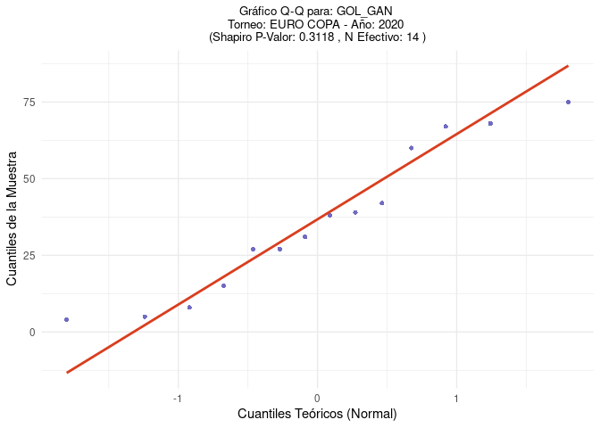<!-- -->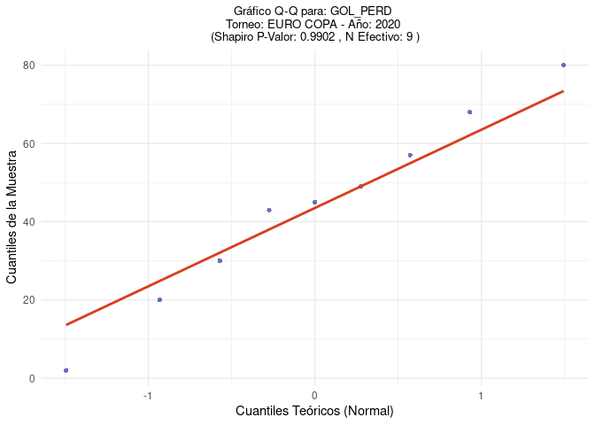<!-- -->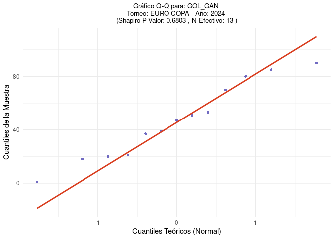<!-- --><!-- --><!-- -->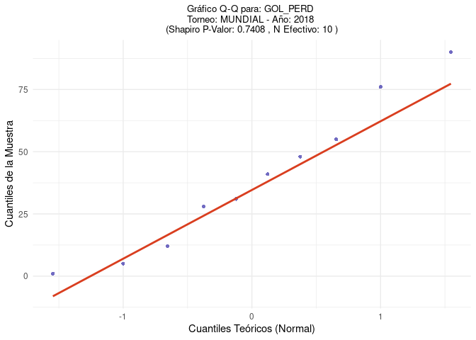<!-- -->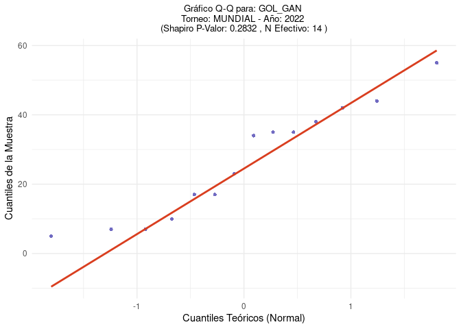<!-- -->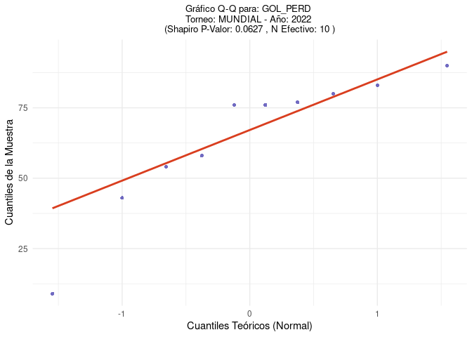<!-- -->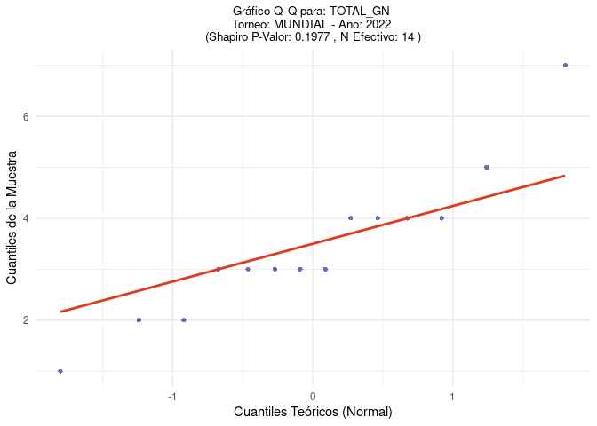<!-- -->

``` r
#pruebas de homocedasticidad################################################################
# 3. Define los pares de años a comparar para cada torneo--------------------------------------------------------
comparaciones_por_torneo <- list(
  MUNDIAL = list(años = c(2018, 2022), etiqueta_comp = "Mundial: 2018 vs 2022"),
  `EURO COPA` = list(años = c(2020, 2024), etiqueta_comp = "Eurocopa: 2020 vs 2024") 
)
# 4. Inicializar un tibble para guardar los resultados
resultados_levene_pares_años <- tibble()
# 5. Bucle a través de los torneos, luego las variables
for (nombre_torneo_loop in names(comparaciones_por_torneo)) { 
  info_comparacion_loop <- comparaciones_por_torneo[[nombre_torneo_loop]] 
  años_a_comparar_loop <- info_comparacion_loop$años
  etiqueta_comparacion_loop <- info_comparacion_loop$etiqueta_comp 
  if (length(años_a_comparar_loop) != 2) {
    print(paste("Saltando comparación:", etiqueta_comparacion_loop, "- se necesitan exactamente dos años."))
    next
  }
  for (nombre_variable_loop in variables_numericas_a_testear) { 
    datos_filtrados_levene <- data %>%
      filter(
        TORNEO == nombre_torneo_loop,
        YEAR %in% años_a_comparar_loop
      ) %>%
      select(YEAR, Valor = all_of(nombre_variable_loop)) %>%
      mutate(YEAR = as.factor(YEAR)) %>% 
      drop_na(Valor) 
    stats_por_año_levene <- datos_filtrados_levene %>%
      group_by(YEAR) %>%
      summarise(
        n_obs = n(),
        varianza = var(Valor, na.rm = TRUE) 
      ) %>%
      ungroup()
    n_original_año1_levene <- nrow(filter(data, TORNEO == nombre_torneo_loop & YEAR == años_a_comparar_loop[1]))
    n_original_año2_levene <- nrow(filter(data, TORNEO == nombre_torneo_loop & YEAR == años_a_comparar_loop[2]))
    stats_año1_levene <- stats_por_año_levene %>% filter(YEAR == as.character(años_a_comparar_loop[1]))
    stats_año2_levene <- stats_por_año_levene %>% filter(YEAR == as.character(años_a_comparar_loop[2]))
    f_stat_val_levene <- NA_real_
    p_val_val_levene <- NA_real_
    nota_val_levene <- ""
    if (nrow(stats_año1_levene) == 0 || nrow(stats_año2_levene) == 0 || 
        stats_año1_levene$n_obs < 2 || stats_año2_levene$n_obs < 2) {
      nota_val_levene <- "Datos insuficientes (n<2 en al menos un grupo después de quitar NAs para esta variable)."
    } else {
      var1_levene <- stats_año1_levene$varianza
      var2_levene <- stats_año2_levene$varianza
      if (is.na(var1_levene) || is.na(var2_levene)) { 
        nota_val_levene <- "Varianza no calculable (n<2 o todos NAs) en uno o ambos grupos."
      } else if (var1_levene == 0 && var2_levene == 0) {
        p_val_val_levene <- 1.0 
        nota_val_levene <- "Ambos grupos tienen varianza cero (homocedásticos)."
      } else if (var1_levene == 0 || var2_levene == 0) {
        p_val_val_levene <- 0.00000001 
        nota_val_levene <- "Un grupo tiene varianza cero y el otro no (heterocedásticos)."
      } else {
        resultado_test_obj_levene <- tryCatch({
          leveneTest(Valor ~ YEAR, data = datos_filtrados_levene, center = median)
        }, error = function(e) {
          return(list(error_message = as.character(e$message))) 
        })
        if (!is.null(resultado_test_obj_levene) && is.null(resultado_test_obj_levene$error_message)) {
          f_stat_val_levene <- resultado_test_obj_levene$`F value`[1]
          p_val_val_levene <- resultado_test_obj_levene$`Pr(>F)`[1]
        } else if (!is.null(resultado_test_obj_levene$error_message)) {
          nota_val_levene <- paste("Error en LeveneTest:", resultado_test_obj_levene$error_message)
        } else {
          nota_val_levene <- "Error desconocido en LeveneTest."
        }
      }
    }
    temp_resultado_levene <- tibble(
      Comparacion = etiqueta_comparacion_loop,
      Variable_Testeada = nombre_variable_loop,
      Año1 = años_a_comparar_loop[1],
      N_Total_Año1 = n_original_año1_levene,
      N_Efectivo_Año1 = ifelse(nrow(stats_año1_levene) == 0, 0, stats_año1_levene$n_obs),
      Año2 = años_a_comparar_loop[2],
      N_Total_Año2 = n_original_año2_levene,
      N_Efectivo_Año2 = ifelse(nrow(stats_año2_levene) == 0, 0, stats_año2_levene$n_obs),
      F_Statistic_Levene = f_stat_val_levene,
      P_Value_Levene = p_val_val_levene,
      Nota_Levene = nota_val_levene
    )
    resultados_levene_pares_años <- bind_rows(resultados_levene_pares_años, temp_resultado_levene)
  }
}
# 6. Ver los resultados y añadir conclusión de homocedasticidad
#print("Resultados de la Prueba de Levene para pares de años:")
#print(resultados_levene_pares_años)
#view(resultados_levene_pares_años)

resultados_levene_con_conclusion <- resultados_levene_pares_años %>%
  mutate(
    Conclusion_Homocedasticidad = case_when(
      grepl("varianza cero", Nota_Levene, ignore.case = TRUE) ~ Nota_Levene,
      grepl("Error en LeveneTest", Nota_Levene, ignore.case = TRUE) ~ paste("No se pudo determinar:", Nota_Levene),
      grepl("Datos insuficientes", Nota_Levene, ignore.case = TRUE) ~ paste("No se pudo determinar:", Nota_Levene),
      is.na(P_Value_Levene) & Nota_Levene == "" ~ "P_Value NA sin nota", 
      is.na(P_Value_Levene) ~ Nota_Levene,
      P_Value_Levene >= 0.05 ~ "Homocedasticidad (p >= 0.05)",
      P_Value_Levene < 0.05 ~ "Heterocedasticidad (p < 0.05)",
      TRUE ~ "Revisar caso" 
    )
  )
#print("Resultados de Levene con Conclusión:")
print(resultados_levene_con_conclusion %>% 
        select(Comparacion, Variable_Testeada, N_Efectivo_Año1, N_Efectivo_Año2, P_Value_Levene, Conclusion_Homocedasticidad, Nota_Levene))
```

    ## # A tibble: 18 × 7
    ##    Comparacion  Variable_Testeada N_Efectivo_Año1 N_Efectivo_Año2 P_Value_Levene
    ##    <chr>        <chr>                       <int>           <int>          <dbl>
    ##  1 Mundial: 20… TOTAL_GN                       16              14          1    
    ##  2 Mundial: 20… goles_p1                       16              14          0.780
    ##  3 Mundial: 20… goles_p2                       16              14          0.603
    ##  4 Mundial: 20… goles_p3                       16              14          0.465
    ##  5 Mundial: 20… goles_p4                       16              14          0.594
    ##  6 Mundial: 20… goles_p5                       16              14          0.178
    ##  7 Mundial: 20… goles_p6                       16              14          0.153
    ##  8 Mundial: 20… GOL_GAN                        16              14          0.147
    ##  9 Mundial: 20… GOL_PERD                       10              10          0.436
    ## 10 Eurocopa: 2… TOTAL_GN                       14              13          0.405
    ## 11 Eurocopa: 2… goles_p1                       14              13          0.492
    ## 12 Eurocopa: 2… goles_p2                       14              13          0.430
    ## 13 Eurocopa: 2… goles_p3                       14              13          0.209
    ## 14 Eurocopa: 2… goles_p4                       14              13          0.666
    ## 15 Eurocopa: 2… goles_p5                       14              13          0.364
    ## 16 Eurocopa: 2… goles_p6                       14              13          0.191
    ## 17 Eurocopa: 2… GOL_GAN                        14              13          0.579
    ## 18 Eurocopa: 2… GOL_PERD                        9               9          0.216
    ## # ℹ 2 more variables: Conclusion_Homocedasticidad <chr>, Nota_Levene <chr>

``` r
#view(resultados_levene_con_conclusion)
#view(resultados_levene_con_conclusion%>%select(Comparacion,Variable_Testeada,N_Efectivo_Año1,N_Total_Año1,N_Efectivo_Año2,N_Total_Año2,F_Statistic_Levene,P_Value_Levene,Conclusion_Homocedasticidad))
```

``` r
#mann_whitney################################################################
# 3. Inicializar un tibble para guardar los resultados de Mann-Whitney
resultados_mann_whitney <- tibble()
# 4. Bucle a través de los torneos, luego las variables
for (nombre_torneo_mw in names(comparaciones_por_torneo)) {
  info_comp_mw <- comparaciones_por_torneo[[nombre_torneo_mw]]
  años_comp_mw <- info_comp_mw$años
  etiqueta_comp_mw <- info_comp_mw$etiqueta_comp
  if (length(años_comp_mw) != 2) {
    print(paste("Saltando Mann-Whitney para", etiqueta_comp_mw, "- se necesitan exactamente dos años."))
    next
  }
  for (nombre_variable_mw in variables_numericas_a_testear) {
    datos_filtrados_mw <- data %>%
      filter(
        TORNEO == nombre_torneo_mw,
        YEAR %in% años_comp_mw
      ) %>%
      select(YEAR, Valor = all_of(nombre_variable_mw)) %>%
      mutate(YEAR_factor = as.factor(YEAR)) %>% 
      drop_na(Valor) 
    stats_por_año_mw <- datos_filtrados_mw %>%
      group_by(YEAR_factor) %>% 
      summarise(
        n_obs = n(),
        mediana_valor = median(Valor, na.rm = TRUE) 
      ) %>%
      ungroup()
    stats_año1_mw <- stats_por_año_mw %>% filter(YEAR_factor == as.character(años_comp_mw[1]))
    stats_año2_mw <- stats_por_año_mw %>% filter(YEAR_factor == as.character(años_comp_mw[2]))
    n_efectivo_año1 <- ifelse(nrow(stats_año1_mw) > 0, stats_año1_mw$n_obs, 0)
    mediana_año1 <- ifelse(nrow(stats_año1_mw) > 0, stats_año1_mw$mediana_valor, NA_real_)
    n_efectivo_año2 <- ifelse(nrow(stats_año2_mw) > 0, stats_año2_mw$n_obs, 0)
    mediana_año2 <- ifelse(nrow(stats_año2_mw) > 0, stats_año2_mw$mediana_valor, NA_real_)
    w_stat_mw <- NA_real_
    p_val_mw <- NA_real_
    nota_mw <- ""
    if (n_efectivo_año1 < 1 || n_efectivo_año2 < 1) { 
      nota_mw <- "Datos insuficientes (n<1 en al menos un grupo después de quitar NAs) para Mann-Whitney."
    } else {
      resultado_test_obj_mw <- tryCatch({
        wilcox.test(Valor ~ YEAR_factor, data = datos_filtrados_mw, 
                    exact = FALSE, 
                    conf.int = FALSE,
                    paired = FALSE)
      }, error = function(e) {
        return(list(error_message = as.character(e$message)))
      })
      if (!is.null(resultado_test_obj_mw) && is.null(resultado_test_obj_mw$error_message)) {
        w_stat_mw <- resultado_test_obj_mw$statistic # Estadístico W de Wilcoxon
        p_val_mw <- resultado_test_obj_mw$p.value
      } else if (!is.null(resultado_test_obj_mw$error_message)) {
        nota_mw <- paste("Error en Mann-Whitney:", resultado_test_obj_mw$error_message)
      } else {
        nota_mw <- "Error desconocido en Mann-Whitney."
      }
    }
    temp_resultado_mw <- tibble(
      Comparacion = etiqueta_comp_mw,
      Variable_Testeada = nombre_variable_mw,
      Año1 = años_comp_mw[1],
      N_Efectivo_Año1 = n_efectivo_año1,
      Mediana_Año1 = mediana_año1,
      Año2 = años_comp_mw[2],
      N_Efectivo_Año2 = n_efectivo_año2,
      Mediana_Año2 = mediana_año2,
      W_Statistic_MW = w_stat_mw,
      P_Value_MW = p_val_mw,
      Nota_MW = nota_mw
    )
    resultados_mann_whitney <- bind_rows(resultados_mann_whitney, temp_resultado_mw)
  }
}
# 5. Ver los resultados
#print("Resultados de las Pruebas U de Mann-Whitney para pares de años:")
#View(resultados_mann_whitney)
resultados_mann_whitney_con_conclusion <- resultados_mann_whitney %>%
  mutate(
    Conclusion_MW = case_when(
      !is.na(Nota_MW) & Nota_MW != "" ~ paste("No se pudo determinar:", Nota_MW),
      is.na(P_Value_MW) ~ "P_Value NA sin nota específica",
      P_Value_MW < 0.05 ~ "Diferencia significativa (p < 0.05)",
      P_Value_MW >= 0.05 ~ "No diferencia significativa (p >= 0.05)",
      TRUE ~ "Revisar caso" 
    )
  )
#print("Resultados de Mann-Whitney con Conclusión:")
print(resultados_mann_whitney_con_conclusion %>% 
        select(Comparacion, Variable_Testeada, N_Efectivo_Año1, Mediana_Año1, N_Efectivo_Año2, Mediana_Año2, P_Value_MW, Conclusion_MW))
```

    ## # A tibble: 18 × 8
    ##    Comparacion    Variable_Testeada N_Efectivo_Año1 Mediana_Año1 N_Efectivo_Año2
    ##    <chr>          <chr>                       <int>        <dbl>           <int>
    ##  1 Mundial: 2018… TOTAL_GN                       16          2                14
    ##  2 Mundial: 2018… goles_p1                       16          0                14
    ##  3 Mundial: 2018… goles_p2                       16          0                14
    ##  4 Mundial: 2018… goles_p3                       16          0                14
    ##  5 Mundial: 2018… goles_p4                       16          0.5              14
    ##  6 Mundial: 2018… goles_p5                       16          0                14
    ##  7 Mundial: 2018… goles_p6                       16          0                14
    ##  8 Mundial: 2018… GOL_GAN                        16         39.5              14
    ##  9 Mundial: 2018… GOL_PERD                       10         36                10
    ## 10 Eurocopa: 202… TOTAL_GN                       14          2                13
    ## 11 Eurocopa: 202… goles_p1                       14          0                13
    ## 12 Eurocopa: 202… goles_p2                       14          0                13
    ## 13 Eurocopa: 202… goles_p3                       14          0                13
    ## 14 Eurocopa: 202… goles_p4                       14          0                13
    ## 15 Eurocopa: 202… goles_p5                       14          0                13
    ## 16 Eurocopa: 202… goles_p6                       14          0                13
    ## 17 Eurocopa: 202… GOL_GAN                        14         34.5              13
    ## 18 Eurocopa: 202… GOL_PERD                        9         45                 9
    ## # ℹ 3 more variables: Mediana_Año2 <dbl>, P_Value_MW <dbl>, Conclusion_MW <chr>

``` r
#datos descriptivos para armar la tabla################################################################
data_long_para_medianas <- data %>%
  pivot_longer(
    cols = all_of(variables_numericas_a_testear),
    names_to = "Variable_Analizada",
    values_to = "Valor"
  ) %>%
  drop_na(Valor) 
# Paso 2: Calcular medianas y N para los años individuales especificados en 'comparaciones_por_torneo'
lista_años_individuales <- unlist(lapply(comparaciones_por_torneo, function(x) x$años))
medianas_años_individuales <- data_long_para_medianas %>%
  filter(
    (TORNEO == "MUNDIAL" & YEAR %in% comparaciones_por_torneo$MUNDIAL$años) |
      (TORNEO == "EURO COPA" & YEAR %in% comparaciones_por_torneo$`EURO COPA`$años) 
  ) %>%
  group_by(TORNEO, YEAR, Variable_Analizada) %>%
  summarise(
    Mediana = median(Valor, na.rm = TRUE),
    N_Obs = n(),
    .groups = 'drop'
  ) %>%
  mutate(Grupo_Descriptor = as.character(YEAR))
# Paso 3: Calcular medianas y N para el "Total" de los años combinados por torneo
lista_medianas_totales_torneo <- list()
for (torneo_actual in names(comparaciones_por_torneo)) {
  años_del_torneo_actual <- comparaciones_por_torneo[[torneo_actual]]$años
  etiqueta_total_actual <- paste0("Total ", torneo_actual, " (", 
                                  paste(años_del_torneo_actual, collapse = "+"), ")")
  # Ej: "Total MUNDIAL (2018+2022)"
  medianas_temp_total <- data_long_para_medianas %>%
    filter(TORNEO == torneo_actual, YEAR %in% años_del_torneo_actual) %>%
    group_by(TORNEO, Variable_Analizada) %>% 
    summarise(
      Mediana = median(Valor, na.rm = TRUE),
      N_Obs = n(),
      .groups = 'drop'
    ) %>%
    mutate(
      YEAR = NA_real_, 
      Grupo_Descriptor = etiqueta_total_actual
    )
  lista_medianas_totales_torneo[[torneo_actual]] <- medianas_temp_total
}
# Combinar los dataframes de la lista en uno solo
medianas_totales_por_torneo_df <- bind_rows(lista_medianas_totales_torneo)
medianas_totales_por_torneo_df <- medianas_totales_por_torneo_df %>%
  select(TORNEO, YEAR, Variable_Analizada, Mediana, N_Obs, Grupo_Descriptor)
tabla_descriptivos_medianas <- bind_rows(
  medianas_años_individuales,
  medianas_totales_por_torneo_df
) %>%
  arrange(Variable_Analizada, TORNEO, Grupo_Descriptor)
# Ver los resultados de los descriptivos calculados
#print("Descriptivos Calculados (Medianas y N):")
#View(tabla_descriptivos_medianas)
```

``` r
#ahora si tabla 3################################################################
definicion_columnas_tabla3 <- tribble(
  ~Variable_Interna,                   ~Encabezado_GT,                                       ~Tipo_Descriptivo, ~Order,
  "PORC_MARCAR_PRIMERO_GANAR",         "Efecto marcar primero equipo ganador (%)",             "porcentaje",       1,
  "TOTAL_GN",                          "Goles totales por partido (Mediana (N))",            "mediana",          2,
  "goles_p1",                          "Goles periodo 0-15 min (Mediana (N))",               "mediana",          3,
  "goles_p2",                          "Goles periodo 16-30 min (Mediana (N))",              "mediana",          4,
  "goles_p3",                          "Goles periodo 31-45 min (Mediana (N))",              "mediana",          5,
  "goles_p4",                          "Goles periodo 46-60 min (Mediana (N))",              "mediana",          6,
  "goles_p5",                          "Goles periodo 61-75 min (Mediana (N))",              "mediana",          7,
  "goles_p6",                          "Goles periodo 76-90 min (Mediana (N))",              "mediana",          8,
  "GOL_GAN",                           "Minuto primer gol equipo ganador (Mediana (N))",     "mediana",          9,
  "GOL_PERD",                          "Minuto primer gol equipo perdedor (Mediana (N))",    "mediana",          10
) %>% arrange(Order)
# Crear nombres de columna seguros para el dataframe intermedio (antes de gt)
definicion_columnas_tabla3 <- definicion_columnas_tabla3 %>%
  mutate(Nombre_Col_df = make.names(Encabezado_GT))
#########
# Función para formatear Mediana (N)
formatear_mediana_N <- function(mediana, n_obs) {
  if (length(mediana) != 1 || length(n_obs) != 1 || 
      !is.numeric(mediana) || !is.numeric(n_obs)) {
    return("-") 
  }
  if (is.na(mediana) || is.na(n_obs) || n_obs == 0) {
    return("-")
  }
  paste0(sprintf("%.2f", mediana), " (N=", n_obs, ")")
}
formatear_porcentaje_N <- function(porcentaje, n_obs) {
  if (length(porcentaje) != 1 || length(n_obs) != 1 || 
      !is.numeric(porcentaje) || !is.numeric(n_obs)) {
    return("-") 
  }
  if (is.na(porcentaje) || is.na(n_obs) || n_obs == 0) {
    return("-")
  }
  paste0(sprintf("%.1f%%", porcentaje), " (N=", n_obs, ")")
}
formatear_MW <- function(W_stat, p_val) {
  if (length(W_stat) != 1 || length(p_val) != 1 || !is.numeric(W_stat) || !is.numeric(p_val)) {
    return("-")
  }
  if (is.na(W_stat) || is.na(p_val)) return("-")
  p_val_formateado <- format.pval(p_val, digits = 2, eps = 0.001)
  estrellas_sig <- case_when(p_val < 0.001 ~ "***", p_val < 0.01 ~ "**", p_val < 0.05 ~ "*", TRUE ~ "")
  paste0(round(W_stat, 0), estrellas_sig, " (p=", p_val_formateado, ")")
}
formatear_Fisher <- function(OR, OR_CI_L, OR_CI_U, p_val) {
  if (length(OR) != 1 || length(OR_CI_L) != 1 || length(OR_CI_U) != 1 || length(p_val) != 1 ||
      !is.numeric(OR) || !is.numeric(OR_CI_L) || !is.numeric(OR_CI_U) || !is.numeric(p_val)) {
    return("-")
  }
  if (is.na(OR) || is.na(p_val)) return("-")
  p_val_formateado <- format.pval(p_val, digits = 2, eps = 0.001)
  estrellas_sig <- case_when(p_val < 0.001 ~ "***", p_val < 0.01 ~ "**", p_val < 0.05 ~ "*", TRUE ~ "")
  or_texto <- paste0(sprintf("%.2f", OR), " [", sprintf("%.2f", OR_CI_L), "-", sprintf("%.2f", OR_CI_U), "]")
  paste0(or_texto, estrellas_sig, " (p=", p_val_formateado, ")")
}
#########
filas_para_tabla_gt <- list()
años_mundial <- comparaciones_por_torneo$MUNDIAL$años
años_euro <- comparaciones_por_torneo$`EURO COPA`$años
# --- SECCIÓN MUNDIAL ---
torneo_actual_label <- "Mundial"
torneo_actual_data <- "MUNDIAL" 
años_actuales <- años_mundial
etiqueta_comparacion_actual <- comparaciones_por_torneo$MUNDIAL$etiqueta_comp
fila_mundial_año1 <- tibble(GT_Torneo_Grupo = torneo_actual_label, GT_Etiqueta_Fila = as.character(años_actuales[1]))
for(j in 1:nrow(definicion_columnas_tabla3)){
  var_int <- definicion_columnas_tabla3$Variable_Interna[j]
  col_df_name <- definicion_columnas_tabla3$Nombre_Col_df[j]
  tipo_desc <- definicion_columnas_tabla3$Tipo_Descriptivo[j]
  if(tipo_desc == "porcentaje"){
    datos_fisher_m <- tabla_final_fisher %>% filter(Torneo_Base == torneo_actual_data, Comparacion == etiqueta_comparacion_actual)
    valor_display <- formatear_porcentaje_N(datos_fisher_m$Prop_Año1_Porc, datos_fisher_m$Total_Año1)
  } else { 
    datos_desc_m <- tabla_descriptivos_medianas %>% 
      filter(TORNEO == torneo_actual_data, YEAR == años_actuales[1], Variable_Analizada == var_int)
    valor_display <- formatear_mediana_N(datos_desc_m$Mediana, datos_desc_m$N_Obs)
  }
  fila_mundial_año1[[col_df_name]] <- valor_display
}
filas_para_tabla_gt <- append(filas_para_tabla_gt, list(fila_mundial_año1))
fila_mundial_año2 <- tibble(GT_Torneo_Grupo = torneo_actual_label, GT_Etiqueta_Fila = as.character(años_actuales[2]))
for(j in 1:nrow(definicion_columnas_tabla3)){
  var_int <- definicion_columnas_tabla3$Variable_Interna[j]
  col_df_name <- definicion_columnas_tabla3$Nombre_Col_df[j]
  tipo_desc <- definicion_columnas_tabla3$Tipo_Descriptivo[j]
  if(tipo_desc == "porcentaje"){
    datos_fisher_m <- tabla_final_fisher %>% filter(Torneo_Base == torneo_actual_data, Comparacion == etiqueta_comparacion_actual)
    valor_display <- formatear_porcentaje_N(datos_fisher_m$Prop_Año2_Porc, datos_fisher_m$Total_Año2)
  } else {
    datos_desc_m <- tabla_descriptivos_medianas %>% 
      filter(TORNEO == torneo_actual_data, YEAR == años_actuales[2], Variable_Analizada == var_int)
    valor_display <- formatear_mediana_N(datos_desc_m$Mediana, datos_desc_m$N_Obs)
  }
  fila_mundial_año2[[col_df_name]] <- valor_display
}
filas_para_tabla_gt <- append(filas_para_tabla_gt, list(fila_mundial_año2))
# Fila para Mundial - Total
fila_mundial_total <- tibble(GT_Torneo_Grupo = torneo_actual_label, GT_Etiqueta_Fila = "Total")
for(j in 1:nrow(definicion_columnas_tabla3)){
  var_int <- definicion_columnas_tabla3$Variable_Interna[j]
  col_df_name <- definicion_columnas_tabla3$Nombre_Col_df[j]
  tipo_desc <- definicion_columnas_tabla3$Tipo_Descriptivo[j]
  if(tipo_desc == "porcentaje"){
    total_efecto_stats <- efecto_anual_counts %>%
      filter(TORNEO == torneo_actual_data, YEAR %in% años_actuales) %>%
      summarise(sum_victorias = sum(victorias_marcando_primero, na.rm = TRUE),
                sum_partidos = sum(partidos_con_primer_gol_valido, na.rm = TRUE)) %>%
      mutate(PORC_Total = ifelse(sum_partidos > 0, (sum_victorias / sum_partidos) * 100, 0),
             N_Total = sum_partidos)
    valor_display <- formatear_porcentaje_N(total_efecto_stats$PORC_Total, total_efecto_stats$N_Total)
  } else {
    descriptor_total_actual = paste0("Total ", torneo_actual_data, " (", paste(años_actuales, collapse = "+"), ")")
    datos_desc_m <- tabla_descriptivos_medianas %>% 
      filter(TORNEO == torneo_actual_data, Grupo_Descriptor == descriptor_total_actual, Variable_Analizada == var_int)
    valor_display <- formatear_mediana_N(datos_desc_m$Mediana, datos_desc_m$N_Obs)
  }
  fila_mundial_total[[col_df_name]] <- valor_display
}
filas_para_tabla_gt <- append(filas_para_tabla_gt, list(fila_mundial_total))
fila_mundial_test <- tibble(GT_Torneo_Grupo = torneo_actual_label, GT_Etiqueta_Fila = "Mann-Whitney U / Fisher (p-valor)")

for(j in 1:nrow(definicion_columnas_tabla3)){
  var_int <- definicion_columnas_tabla3$Variable_Interna[j]
  col_df_name <- definicion_columnas_tabla3$Nombre_Col_df[j]
  tipo_desc <- definicion_columnas_tabla3$Tipo_Descriptivo[j]
  if(tipo_desc == "porcentaje"){
    datos_fisher_m <- tabla_final_fisher %>% filter(Torneo_Base == torneo_actual_data, Comparacion == etiqueta_comparacion_actual)
    valor_display <- formatear_Fisher(datos_fisher_m$Odds_Ratio, datos_fisher_m$OR_CI_Lower, datos_fisher_m$OR_CI_Upper, datos_fisher_m$P_Valor)
  } else {
    datos_mw_m <- resultados_mann_whitney_con_conclusion %>% 
      filter(Comparacion == etiqueta_comparacion_actual, Variable_Testeada == var_int)
    valor_display <- formatear_MW(datos_mw_m$W_Statistic_MW, datos_mw_m$P_Value_MW)
  }
  fila_mundial_test[[col_df_name]] <- valor_display
}
filas_para_tabla_gt <- append(filas_para_tabla_gt, list(fila_mundial_test))
# --- SECCIÓN EUROCOPA ---
torneo_actual_label <- "Eurocopa" # Cómo se verá en la tabla
torneo_actual_data <- "EURO COPA"   # Cómo está en tus datos
años_actuales <- años_euro
etiqueta_comparacion_actual <- comparaciones_por_torneo$`EURO COPA`$etiqueta_comp
fila_euro_año1 <- tibble(GT_Torneo_Grupo = torneo_actual_label, GT_Etiqueta_Fila = as.character(años_actuales[1]))
for(j in 1:nrow(definicion_columnas_tabla3)){
  var_int <- definicion_columnas_tabla3$Variable_Interna[j]
  col_df_name <- definicion_columnas_tabla3$Nombre_Col_df[j]
  tipo_desc <- definicion_columnas_tabla3$Tipo_Descriptivo[j]
  if(tipo_desc == "porcentaje"){
    datos_fisher_e <- tabla_final_fisher %>% filter(Torneo_Base == torneo_actual_data, Comparacion == etiqueta_comparacion_actual)
    valor_display <- formatear_porcentaje_N(datos_fisher_e$Prop_Año1_Porc, datos_fisher_e$Total_Año1)
  } else {
    datos_desc_e <- tabla_descriptivos_medianas %>% 
      filter(TORNEO == torneo_actual_data, YEAR == años_actuales[1], Variable_Analizada == var_int)
    valor_display <- formatear_mediana_N(datos_desc_e$Mediana, datos_desc_e$N_Obs)
  }
  fila_euro_año1[[col_df_name]] <- valor_display
}
filas_para_tabla_gt <- append(filas_para_tabla_gt, list(fila_euro_año1))
fila_euro_año2 <- tibble(GT_Torneo_Grupo = torneo_actual_label, GT_Etiqueta_Fila = as.character(años_actuales[2]))
for(j in 1:nrow(definicion_columnas_tabla3)){
  var_int <- definicion_columnas_tabla3$Variable_Interna[j]
  col_df_name <- definicion_columnas_tabla3$Nombre_Col_df[j]
  tipo_desc <- definicion_columnas_tabla3$Tipo_Descriptivo[j]
  if(tipo_desc == "porcentaje"){
    datos_fisher_e <- tabla_final_fisher %>% filter(Torneo_Base == torneo_actual_data, Comparacion == etiqueta_comparacion_actual)
    valor_display <- formatear_porcentaje_N(datos_fisher_e$Prop_Año2_Porc, datos_fisher_e$Total_Año2)
  } else {
    datos_desc_e <- tabla_descriptivos_medianas %>% 
      filter(TORNEO == torneo_actual_data, YEAR == años_actuales[2], Variable_Analizada == var_int)
    valor_display <- formatear_mediana_N(datos_desc_e$Mediana, datos_desc_e$N_Obs)
  }
  fila_euro_año2[[col_df_name]] <- valor_display
}
filas_para_tabla_gt <- append(filas_para_tabla_gt, list(fila_euro_año2))
fila_euro_total <- tibble(GT_Torneo_Grupo = torneo_actual_label, GT_Etiqueta_Fila = "Total")
for(j in 1:nrow(definicion_columnas_tabla3)){
  var_int <- definicion_columnas_tabla3$Variable_Interna[j]
  col_df_name <- definicion_columnas_tabla3$Nombre_Col_df[j]
  tipo_desc <- definicion_columnas_tabla3$Tipo_Descriptivo[j]
  if(tipo_desc == "porcentaje"){
    total_efecto_stats_e <- efecto_anual_counts %>%
      filter(TORNEO == torneo_actual_data, YEAR %in% años_actuales) %>%
      summarise(sum_victorias = sum(victorias_marcando_primero, na.rm = TRUE),
                sum_partidos = sum(partidos_con_primer_gol_valido, na.rm = TRUE)) %>%
      mutate(PORC_Total = ifelse(sum_partidos > 0, (sum_victorias / sum_partidos) * 100, 0),
             N_Total = sum_partidos)
    valor_display <- formatear_porcentaje_N(total_efecto_stats_e$PORC_Total, total_efecto_stats_e$N_Total)
  } else {
    descriptor_total_actual_e = paste0("Total ", torneo_actual_data, " (", paste(años_actuales, collapse = "+"), ")")
    datos_desc_e <- tabla_descriptivos_medianas %>% 
      filter(TORNEO == torneo_actual_data, Grupo_Descriptor == descriptor_total_actual_e, Variable_Analizada == var_int)
    valor_display <- formatear_mediana_N(datos_desc_e$Mediana, datos_desc_e$N_Obs)
  }
  fila_euro_total[[col_df_name]] <- valor_display
}
filas_para_tabla_gt <- append(filas_para_tabla_gt, list(fila_euro_total))
fila_euro_test <- tibble(GT_Torneo_Grupo = torneo_actual_label, GT_Etiqueta_Fila = "Mann-Whitney U / Fisher (p-valor)")
for(j in 1:nrow(definicion_columnas_tabla3)){
  var_int <- definicion_columnas_tabla3$Variable_Interna[j]
  col_df_name <- definicion_columnas_tabla3$Nombre_Col_df[j]
  tipo_desc <- definicion_columnas_tabla3$Tipo_Descriptivo[j]
  if(tipo_desc == "porcentaje"){
    datos_fisher_e <- tabla_final_fisher %>% filter(Torneo_Base == torneo_actual_data, Comparacion == etiqueta_comparacion_actual)
    valor_display <- formatear_Fisher(datos_fisher_e$Odds_Ratio, datos_fisher_e$OR_CI_Lower, datos_fisher_e$OR_CI_Upper, datos_fisher_e$P_Valor)
  } else {
    datos_mw_e <- resultados_mann_whitney_con_conclusion %>% 
      filter(Comparacion == etiqueta_comparacion_actual, Variable_Testeada == var_int)
    valor_display <- formatear_MW(datos_mw_e$W_Statistic_MW, datos_mw_e$P_Value_MW)
  }
  fila_euro_test[[col_df_name]] <- valor_display
}
filas_para_tabla_gt <- append(filas_para_tabla_gt, list(fila_euro_test))
# --- Combinar todas las filas en un único dataframe ---
df_para_tabla3_final <- bind_rows(filas_para_tabla_gt)
#View(df_para_tabla3_final)
#######
# Crear los nombres de las columnas para gt a partir de la definición
nombres_columnas_gt <- setNames(
  definicion_columnas_tabla3$Encabezado_GT,   
  definicion_columnas_tabla3$Nombre_Col_df   
)
tabla3_gt <- df_para_tabla3_final %>%
  gt(groupname_col = "GT_Torneo_Grupo", rowname_col = "GT_Etiqueta_Fila") %>%
  cols_label(
    .list = nombres_columnas_gt 
  ) %>%
  tab_header(
    title = md("**Tabla 3: Diferencias en variables de goles en función del año entre Mundial y Eurocopa**")
  ) %>%
  cols_align(
    align = "center",
    columns = all_of(definicion_columnas_tabla3$Nombre_Col_df) 
  ) %>%
  tab_style(
    style = list(
      cell_text(style = "italic")
    ),
    locations = cells_body(
      rows = GT_Etiqueta_Fila == "Mann-Whitney U / Fisher (p-valor)"
    )
  ) %>%
  tab_style(
    style = list(
      cell_text(weight = "bold")
    ),
    locations = cells_body(
      rows = GT_Etiqueta_Fila == "Total"
    )
  ) %>%
  tab_footnote(
    footnote = md("* p<0.05; ** p<0.01; *** p<0.001")
  )
# Imprimir la tabla final
print(tabla3_gt)
```

    ## <div id="frkkzbpohv" style="padding-left:0px;padding-right:0px;padding-top:10px;padding-bottom:10px;overflow-x:auto;overflow-y:auto;width:auto;height:auto;">
    ##   <style>#frkkzbpohv table {
    ##   font-family: system-ui, 'Segoe UI', Roboto, Helvetica, Arial, sans-serif, 'Apple Color Emoji', 'Segoe UI Emoji', 'Segoe UI Symbol', 'Noto Color Emoji';
    ##   -webkit-font-smoothing: antialiased;
    ##   -moz-osx-font-smoothing: grayscale;
    ## }
    ## 
    ## #frkkzbpohv thead, #frkkzbpohv tbody, #frkkzbpohv tfoot, #frkkzbpohv tr, #frkkzbpohv td, #frkkzbpohv th {
    ##   border-style: none;
    ## }
    ## 
    ## #frkkzbpohv p {
    ##   margin: 0;
    ##   padding: 0;
    ## }
    ## 
    ## #frkkzbpohv .gt_table {
    ##   display: table;
    ##   border-collapse: collapse;
    ##   line-height: normal;
    ##   margin-left: auto;
    ##   margin-right: auto;
    ##   color: #333333;
    ##   font-size: 16px;
    ##   font-weight: normal;
    ##   font-style: normal;
    ##   background-color: #FFFFFF;
    ##   width: auto;
    ##   border-top-style: solid;
    ##   border-top-width: 2px;
    ##   border-top-color: #A8A8A8;
    ##   border-right-style: none;
    ##   border-right-width: 2px;
    ##   border-right-color: #D3D3D3;
    ##   border-bottom-style: solid;
    ##   border-bottom-width: 2px;
    ##   border-bottom-color: #A8A8A8;
    ##   border-left-style: none;
    ##   border-left-width: 2px;
    ##   border-left-color: #D3D3D3;
    ## }
    ## 
    ## #frkkzbpohv .gt_caption {
    ##   padding-top: 4px;
    ##   padding-bottom: 4px;
    ## }
    ## 
    ## #frkkzbpohv .gt_title {
    ##   color: #333333;
    ##   font-size: 125%;
    ##   font-weight: initial;
    ##   padding-top: 4px;
    ##   padding-bottom: 4px;
    ##   padding-left: 5px;
    ##   padding-right: 5px;
    ##   border-bottom-color: #FFFFFF;
    ##   border-bottom-width: 0;
    ## }
    ## 
    ## #frkkzbpohv .gt_subtitle {
    ##   color: #333333;
    ##   font-size: 85%;
    ##   font-weight: initial;
    ##   padding-top: 3px;
    ##   padding-bottom: 5px;
    ##   padding-left: 5px;
    ##   padding-right: 5px;
    ##   border-top-color: #FFFFFF;
    ##   border-top-width: 0;
    ## }
    ## 
    ## #frkkzbpohv .gt_heading {
    ##   background-color: #FFFFFF;
    ##   text-align: center;
    ##   border-bottom-color: #FFFFFF;
    ##   border-left-style: none;
    ##   border-left-width: 1px;
    ##   border-left-color: #D3D3D3;
    ##   border-right-style: none;
    ##   border-right-width: 1px;
    ##   border-right-color: #D3D3D3;
    ## }
    ## 
    ## #frkkzbpohv .gt_bottom_border {
    ##   border-bottom-style: solid;
    ##   border-bottom-width: 2px;
    ##   border-bottom-color: #D3D3D3;
    ## }
    ## 
    ## #frkkzbpohv .gt_col_headings {
    ##   border-top-style: solid;
    ##   border-top-width: 2px;
    ##   border-top-color: #D3D3D3;
    ##   border-bottom-style: solid;
    ##   border-bottom-width: 2px;
    ##   border-bottom-color: #D3D3D3;
    ##   border-left-style: none;
    ##   border-left-width: 1px;
    ##   border-left-color: #D3D3D3;
    ##   border-right-style: none;
    ##   border-right-width: 1px;
    ##   border-right-color: #D3D3D3;
    ## }
    ## 
    ## #frkkzbpohv .gt_col_heading {
    ##   color: #333333;
    ##   background-color: #FFFFFF;
    ##   font-size: 100%;
    ##   font-weight: normal;
    ##   text-transform: inherit;
    ##   border-left-style: none;
    ##   border-left-width: 1px;
    ##   border-left-color: #D3D3D3;
    ##   border-right-style: none;
    ##   border-right-width: 1px;
    ##   border-right-color: #D3D3D3;
    ##   vertical-align: bottom;
    ##   padding-top: 5px;
    ##   padding-bottom: 6px;
    ##   padding-left: 5px;
    ##   padding-right: 5px;
    ##   overflow-x: hidden;
    ## }
    ## 
    ## #frkkzbpohv .gt_column_spanner_outer {
    ##   color: #333333;
    ##   background-color: #FFFFFF;
    ##   font-size: 100%;
    ##   font-weight: normal;
    ##   text-transform: inherit;
    ##   padding-top: 0;
    ##   padding-bottom: 0;
    ##   padding-left: 4px;
    ##   padding-right: 4px;
    ## }
    ## 
    ## #frkkzbpohv .gt_column_spanner_outer:first-child {
    ##   padding-left: 0;
    ## }
    ## 
    ## #frkkzbpohv .gt_column_spanner_outer:last-child {
    ##   padding-right: 0;
    ## }
    ## 
    ## #frkkzbpohv .gt_column_spanner {
    ##   border-bottom-style: solid;
    ##   border-bottom-width: 2px;
    ##   border-bottom-color: #D3D3D3;
    ##   vertical-align: bottom;
    ##   padding-top: 5px;
    ##   padding-bottom: 5px;
    ##   overflow-x: hidden;
    ##   display: inline-block;
    ##   width: 100%;
    ## }
    ## 
    ## #frkkzbpohv .gt_spanner_row {
    ##   border-bottom-style: hidden;
    ## }
    ## 
    ## #frkkzbpohv .gt_group_heading {
    ##   padding-top: 8px;
    ##   padding-bottom: 8px;
    ##   padding-left: 5px;
    ##   padding-right: 5px;
    ##   color: #333333;
    ##   background-color: #FFFFFF;
    ##   font-size: 100%;
    ##   font-weight: initial;
    ##   text-transform: inherit;
    ##   border-top-style: solid;
    ##   border-top-width: 2px;
    ##   border-top-color: #D3D3D3;
    ##   border-bottom-style: solid;
    ##   border-bottom-width: 2px;
    ##   border-bottom-color: #D3D3D3;
    ##   border-left-style: none;
    ##   border-left-width: 1px;
    ##   border-left-color: #D3D3D3;
    ##   border-right-style: none;
    ##   border-right-width: 1px;
    ##   border-right-color: #D3D3D3;
    ##   vertical-align: middle;
    ##   text-align: left;
    ## }
    ## 
    ## #frkkzbpohv .gt_empty_group_heading {
    ##   padding: 0.5px;
    ##   color: #333333;
    ##   background-color: #FFFFFF;
    ##   font-size: 100%;
    ##   font-weight: initial;
    ##   border-top-style: solid;
    ##   border-top-width: 2px;
    ##   border-top-color: #D3D3D3;
    ##   border-bottom-style: solid;
    ##   border-bottom-width: 2px;
    ##   border-bottom-color: #D3D3D3;
    ##   vertical-align: middle;
    ## }
    ## 
    ## #frkkzbpohv .gt_from_md > :first-child {
    ##   margin-top: 0;
    ## }
    ## 
    ## #frkkzbpohv .gt_from_md > :last-child {
    ##   margin-bottom: 0;
    ## }
    ## 
    ## #frkkzbpohv .gt_row {
    ##   padding-top: 8px;
    ##   padding-bottom: 8px;
    ##   padding-left: 5px;
    ##   padding-right: 5px;
    ##   margin: 10px;
    ##   border-top-style: solid;
    ##   border-top-width: 1px;
    ##   border-top-color: #D3D3D3;
    ##   border-left-style: none;
    ##   border-left-width: 1px;
    ##   border-left-color: #D3D3D3;
    ##   border-right-style: none;
    ##   border-right-width: 1px;
    ##   border-right-color: #D3D3D3;
    ##   vertical-align: middle;
    ##   overflow-x: hidden;
    ## }
    ## 
    ## #frkkzbpohv .gt_stub {
    ##   color: #333333;
    ##   background-color: #FFFFFF;
    ##   font-size: 100%;
    ##   font-weight: initial;
    ##   text-transform: inherit;
    ##   border-right-style: solid;
    ##   border-right-width: 2px;
    ##   border-right-color: #D3D3D3;
    ##   padding-left: 5px;
    ##   padding-right: 5px;
    ## }
    ## 
    ## #frkkzbpohv .gt_stub_row_group {
    ##   color: #333333;
    ##   background-color: #FFFFFF;
    ##   font-size: 100%;
    ##   font-weight: initial;
    ##   text-transform: inherit;
    ##   border-right-style: solid;
    ##   border-right-width: 2px;
    ##   border-right-color: #D3D3D3;
    ##   padding-left: 5px;
    ##   padding-right: 5px;
    ##   vertical-align: top;
    ## }
    ## 
    ## #frkkzbpohv .gt_row_group_first td {
    ##   border-top-width: 2px;
    ## }
    ## 
    ## #frkkzbpohv .gt_row_group_first th {
    ##   border-top-width: 2px;
    ## }
    ## 
    ## #frkkzbpohv .gt_summary_row {
    ##   color: #333333;
    ##   background-color: #FFFFFF;
    ##   text-transform: inherit;
    ##   padding-top: 8px;
    ##   padding-bottom: 8px;
    ##   padding-left: 5px;
    ##   padding-right: 5px;
    ## }
    ## 
    ## #frkkzbpohv .gt_first_summary_row {
    ##   border-top-style: solid;
    ##   border-top-color: #D3D3D3;
    ## }
    ## 
    ## #frkkzbpohv .gt_first_summary_row.thick {
    ##   border-top-width: 2px;
    ## }
    ## 
    ## #frkkzbpohv .gt_last_summary_row {
    ##   padding-top: 8px;
    ##   padding-bottom: 8px;
    ##   padding-left: 5px;
    ##   padding-right: 5px;
    ##   border-bottom-style: solid;
    ##   border-bottom-width: 2px;
    ##   border-bottom-color: #D3D3D3;
    ## }
    ## 
    ## #frkkzbpohv .gt_grand_summary_row {
    ##   color: #333333;
    ##   background-color: #FFFFFF;
    ##   text-transform: inherit;
    ##   padding-top: 8px;
    ##   padding-bottom: 8px;
    ##   padding-left: 5px;
    ##   padding-right: 5px;
    ## }
    ## 
    ## #frkkzbpohv .gt_first_grand_summary_row {
    ##   padding-top: 8px;
    ##   padding-bottom: 8px;
    ##   padding-left: 5px;
    ##   padding-right: 5px;
    ##   border-top-style: double;
    ##   border-top-width: 6px;
    ##   border-top-color: #D3D3D3;
    ## }
    ## 
    ## #frkkzbpohv .gt_last_grand_summary_row_top {
    ##   padding-top: 8px;
    ##   padding-bottom: 8px;
    ##   padding-left: 5px;
    ##   padding-right: 5px;
    ##   border-bottom-style: double;
    ##   border-bottom-width: 6px;
    ##   border-bottom-color: #D3D3D3;
    ## }
    ## 
    ## #frkkzbpohv .gt_striped {
    ##   background-color: rgba(128, 128, 128, 0.05);
    ## }
    ## 
    ## #frkkzbpohv .gt_table_body {
    ##   border-top-style: solid;
    ##   border-top-width: 2px;
    ##   border-top-color: #D3D3D3;
    ##   border-bottom-style: solid;
    ##   border-bottom-width: 2px;
    ##   border-bottom-color: #D3D3D3;
    ## }
    ## 
    ## #frkkzbpohv .gt_footnotes {
    ##   color: #333333;
    ##   background-color: #FFFFFF;
    ##   border-bottom-style: none;
    ##   border-bottom-width: 2px;
    ##   border-bottom-color: #D3D3D3;
    ##   border-left-style: none;
    ##   border-left-width: 2px;
    ##   border-left-color: #D3D3D3;
    ##   border-right-style: none;
    ##   border-right-width: 2px;
    ##   border-right-color: #D3D3D3;
    ## }
    ## 
    ## #frkkzbpohv .gt_footnote {
    ##   margin: 0px;
    ##   font-size: 90%;
    ##   padding-top: 4px;
    ##   padding-bottom: 4px;
    ##   padding-left: 5px;
    ##   padding-right: 5px;
    ## }
    ## 
    ## #frkkzbpohv .gt_sourcenotes {
    ##   color: #333333;
    ##   background-color: #FFFFFF;
    ##   border-bottom-style: none;
    ##   border-bottom-width: 2px;
    ##   border-bottom-color: #D3D3D3;
    ##   border-left-style: none;
    ##   border-left-width: 2px;
    ##   border-left-color: #D3D3D3;
    ##   border-right-style: none;
    ##   border-right-width: 2px;
    ##   border-right-color: #D3D3D3;
    ## }
    ## 
    ## #frkkzbpohv .gt_sourcenote {
    ##   font-size: 90%;
    ##   padding-top: 4px;
    ##   padding-bottom: 4px;
    ##   padding-left: 5px;
    ##   padding-right: 5px;
    ## }
    ## 
    ## #frkkzbpohv .gt_left {
    ##   text-align: left;
    ## }
    ## 
    ## #frkkzbpohv .gt_center {
    ##   text-align: center;
    ## }
    ## 
    ## #frkkzbpohv .gt_right {
    ##   text-align: right;
    ##   font-variant-numeric: tabular-nums;
    ## }
    ## 
    ## #frkkzbpohv .gt_font_normal {
    ##   font-weight: normal;
    ## }
    ## 
    ## #frkkzbpohv .gt_font_bold {
    ##   font-weight: bold;
    ## }
    ## 
    ## #frkkzbpohv .gt_font_italic {
    ##   font-style: italic;
    ## }
    ## 
    ## #frkkzbpohv .gt_super {
    ##   font-size: 65%;
    ## }
    ## 
    ## #frkkzbpohv .gt_footnote_marks {
    ##   font-size: 75%;
    ##   vertical-align: 0.4em;
    ##   position: initial;
    ## }
    ## 
    ## #frkkzbpohv .gt_asterisk {
    ##   font-size: 100%;
    ##   vertical-align: 0;
    ## }
    ## 
    ## #frkkzbpohv .gt_indent_1 {
    ##   text-indent: 5px;
    ## }
    ## 
    ## #frkkzbpohv .gt_indent_2 {
    ##   text-indent: 10px;
    ## }
    ## 
    ## #frkkzbpohv .gt_indent_3 {
    ##   text-indent: 15px;
    ## }
    ## 
    ## #frkkzbpohv .gt_indent_4 {
    ##   text-indent: 20px;
    ## }
    ## 
    ## #frkkzbpohv .gt_indent_5 {
    ##   text-indent: 25px;
    ## }
    ## 
    ## #frkkzbpohv .katex-display {
    ##   display: inline-flex !important;
    ##   margin-bottom: 0.75em !important;
    ## }
    ## 
    ## #frkkzbpohv div.Reactable > div.rt-table > div.rt-thead > div.rt-tr.rt-tr-group-header > div.rt-th-group:after {
    ##   height: 0px !important;
    ## }
    ## </style>
    ##   <table class="gt_table" data-quarto-disable-processing="false" data-quarto-bootstrap="false">
    ##   <thead>
    ##     <tr class="gt_heading">
    ##       <td colspan="11" class="gt_heading gt_title gt_font_normal gt_bottom_border" style><span class='gt_from_md'><strong>Tabla 3: Diferencias en variables de goles en función del año entre Mundial y Eurocopa</strong></span></td>
    ##     </tr>
    ##     
    ##     <tr class="gt_col_headings">
    ##       <th class="gt_col_heading gt_columns_bottom_border gt_left" rowspan="1" colspan="1" scope="col" id="a::stub"></th>
    ##       <th class="gt_col_heading gt_columns_bottom_border gt_center" rowspan="1" colspan="1" scope="col" id="Efecto.marcar.primero.equipo.ganador....">Efecto marcar primero equipo ganador (%)</th>
    ##       <th class="gt_col_heading gt_columns_bottom_border gt_center" rowspan="1" colspan="1" scope="col" id="Goles.totales.por.partido..Mediana..N..">Goles totales por partido (Mediana (N))</th>
    ##       <th class="gt_col_heading gt_columns_bottom_border gt_center" rowspan="1" colspan="1" scope="col" id="Goles.periodo.0.15.min..Mediana..N..">Goles periodo 0-15 min (Mediana (N))</th>
    ##       <th class="gt_col_heading gt_columns_bottom_border gt_center" rowspan="1" colspan="1" scope="col" id="Goles.periodo.16.30.min..Mediana..N..">Goles periodo 16-30 min (Mediana (N))</th>
    ##       <th class="gt_col_heading gt_columns_bottom_border gt_center" rowspan="1" colspan="1" scope="col" id="Goles.periodo.31.45.min..Mediana..N..">Goles periodo 31-45 min (Mediana (N))</th>
    ##       <th class="gt_col_heading gt_columns_bottom_border gt_center" rowspan="1" colspan="1" scope="col" id="Goles.periodo.46.60.min..Mediana..N..">Goles periodo 46-60 min (Mediana (N))</th>
    ##       <th class="gt_col_heading gt_columns_bottom_border gt_center" rowspan="1" colspan="1" scope="col" id="Goles.periodo.61.75.min..Mediana..N..">Goles periodo 61-75 min (Mediana (N))</th>
    ##       <th class="gt_col_heading gt_columns_bottom_border gt_center" rowspan="1" colspan="1" scope="col" id="Goles.periodo.76.90.min..Mediana..N..">Goles periodo 76-90 min (Mediana (N))</th>
    ##       <th class="gt_col_heading gt_columns_bottom_border gt_center" rowspan="1" colspan="1" scope="col" id="Minuto.primer.gol.equipo.ganador..Mediana..N..">Minuto primer gol equipo ganador (Mediana (N))</th>
    ##       <th class="gt_col_heading gt_columns_bottom_border gt_center" rowspan="1" colspan="1" scope="col" id="Minuto.primer.gol.equipo.perdedor..Mediana..N..">Minuto primer gol equipo perdedor (Mediana (N))</th>
    ##     </tr>
    ##   </thead>
    ##   <tbody class="gt_table_body">
    ##     <tr class="gt_group_heading_row">
    ##       <th colspan="11" class="gt_group_heading" scope="colgroup" id="Mundial">Mundial</th>
    ##     </tr>
    ##     <tr class="gt_row_group_first"><th id="stub_1_1" scope="row" class="gt_row gt_left gt_stub">2018</th>
    ## <td headers="Mundial stub_1_1 Efecto.marcar.primero.equipo.ganador...." class="gt_row gt_center">68.8% (N=16)</td>
    ## <td headers="Mundial stub_1_1 Goles.totales.por.partido..Mediana..N.." class="gt_row gt_center">2.00 (N=16)</td>
    ## <td headers="Mundial stub_1_1 Goles.periodo.0.15.min..Mediana..N.." class="gt_row gt_center">0.00 (N=16)</td>
    ## <td headers="Mundial stub_1_1 Goles.periodo.16.30.min..Mediana..N.." class="gt_row gt_center">0.00 (N=16)</td>
    ## <td headers="Mundial stub_1_1 Goles.periodo.31.45.min..Mediana..N.." class="gt_row gt_center">0.00 (N=16)</td>
    ## <td headers="Mundial stub_1_1 Goles.periodo.46.60.min..Mediana..N.." class="gt_row gt_center">0.50 (N=16)</td>
    ## <td headers="Mundial stub_1_1 Goles.periodo.61.75.min..Mediana..N.." class="gt_row gt_center">0.00 (N=16)</td>
    ## <td headers="Mundial stub_1_1 Goles.periodo.76.90.min..Mediana..N.." class="gt_row gt_center">0.00 (N=16)</td>
    ## <td headers="Mundial stub_1_1 Minuto.primer.gol.equipo.ganador..Mediana..N.." class="gt_row gt_center">39.50 (N=16)</td>
    ## <td headers="Mundial stub_1_1 Minuto.primer.gol.equipo.perdedor..Mediana..N.." class="gt_row gt_center">36.00 (N=10)</td></tr>
    ##     <tr><th id="stub_1_2" scope="row" class="gt_row gt_left gt_stub">2022</th>
    ## <td headers="Mundial stub_1_2 Efecto.marcar.primero.equipo.ganador...." class="gt_row gt_center">92.9% (N=14)</td>
    ## <td headers="Mundial stub_1_2 Goles.totales.por.partido..Mediana..N.." class="gt_row gt_center">3.00 (N=14)</td>
    ## <td headers="Mundial stub_1_2 Goles.periodo.0.15.min..Mediana..N.." class="gt_row gt_center">0.00 (N=14)</td>
    ## <td headers="Mundial stub_1_2 Goles.periodo.16.30.min..Mediana..N.." class="gt_row gt_center">0.00 (N=14)</td>
    ## <td headers="Mundial stub_1_2 Goles.periodo.31.45.min..Mediana..N.." class="gt_row gt_center">1.00 (N=14)</td>
    ## <td headers="Mundial stub_1_2 Goles.periodo.46.60.min..Mediana..N.." class="gt_row gt_center">0.00 (N=14)</td>
    ## <td headers="Mundial stub_1_2 Goles.periodo.61.75.min..Mediana..N.." class="gt_row gt_center">0.00 (N=14)</td>
    ## <td headers="Mundial stub_1_2 Goles.periodo.76.90.min..Mediana..N.." class="gt_row gt_center">1.00 (N=14)</td>
    ## <td headers="Mundial stub_1_2 Minuto.primer.gol.equipo.ganador..Mediana..N.." class="gt_row gt_center">28.50 (N=14)</td>
    ## <td headers="Mundial stub_1_2 Minuto.primer.gol.equipo.perdedor..Mediana..N.." class="gt_row gt_center">76.00 (N=10)</td></tr>
    ##     <tr><th id="stub_1_3" scope="row" class="gt_row gt_left gt_stub">Total</th>
    ## <td headers="Mundial stub_1_3 Efecto.marcar.primero.equipo.ganador...." class="gt_row gt_center" style="font-weight: bold;">80.0% (N=30)</td>
    ## <td headers="Mundial stub_1_3 Goles.totales.por.partido..Mediana..N.." class="gt_row gt_center" style="font-weight: bold;">3.00 (N=30)</td>
    ## <td headers="Mundial stub_1_3 Goles.periodo.0.15.min..Mediana..N.." class="gt_row gt_center" style="font-weight: bold;">0.00 (N=30)</td>
    ## <td headers="Mundial stub_1_3 Goles.periodo.16.30.min..Mediana..N.." class="gt_row gt_center" style="font-weight: bold;">0.00 (N=30)</td>
    ## <td headers="Mundial stub_1_3 Goles.periodo.31.45.min..Mediana..N.." class="gt_row gt_center" style="font-weight: bold;">1.00 (N=30)</td>
    ## <td headers="Mundial stub_1_3 Goles.periodo.46.60.min..Mediana..N.." class="gt_row gt_center" style="font-weight: bold;">0.00 (N=30)</td>
    ## <td headers="Mundial stub_1_3 Goles.periodo.61.75.min..Mediana..N.." class="gt_row gt_center" style="font-weight: bold;">0.00 (N=30)</td>
    ## <td headers="Mundial stub_1_3 Goles.periodo.76.90.min..Mediana..N.." class="gt_row gt_center" style="font-weight: bold;">0.50 (N=30)</td>
    ## <td headers="Mundial stub_1_3 Minuto.primer.gol.equipo.ganador..Mediana..N.." class="gt_row gt_center" style="font-weight: bold;">34.50 (N=30)</td>
    ## <td headers="Mundial stub_1_3 Minuto.primer.gol.equipo.perdedor..Mediana..N.." class="gt_row gt_center" style="font-weight: bold;">54.50 (N=20)</td></tr>
    ##     <tr><th id="stub_1_4" scope="row" class="gt_row gt_left gt_stub">Mann-Whitney U / Fisher (p-valor)</th>
    ## <td headers="Mundial stub_1_4 Efecto.marcar.primero.equipo.ganador...." class="gt_row gt_center" style="font-style: italic;">0.18 [0.00-1.95] (p=0.18)</td>
    ## <td headers="Mundial stub_1_4 Goles.totales.por.partido..Mediana..N.." class="gt_row gt_center" style="font-style: italic;">-</td>
    ## <td headers="Mundial stub_1_4 Goles.periodo.0.15.min..Mediana..N.." class="gt_row gt_center" style="font-style: italic;">-</td>
    ## <td headers="Mundial stub_1_4 Goles.periodo.16.30.min..Mediana..N.." class="gt_row gt_center" style="font-style: italic;">-</td>
    ## <td headers="Mundial stub_1_4 Goles.periodo.31.45.min..Mediana..N.." class="gt_row gt_center" style="font-style: italic;">-</td>
    ## <td headers="Mundial stub_1_4 Goles.periodo.46.60.min..Mediana..N.." class="gt_row gt_center" style="font-style: italic;">-</td>
    ## <td headers="Mundial stub_1_4 Goles.periodo.61.75.min..Mediana..N.." class="gt_row gt_center" style="font-style: italic;">-</td>
    ## <td headers="Mundial stub_1_4 Goles.periodo.76.90.min..Mediana..N.." class="gt_row gt_center" style="font-style: italic;">-</td>
    ## <td headers="Mundial stub_1_4 Minuto.primer.gol.equipo.ganador..Mediana..N.." class="gt_row gt_center" style="font-style: italic;">-</td>
    ## <td headers="Mundial stub_1_4 Minuto.primer.gol.equipo.perdedor..Mediana..N.." class="gt_row gt_center" style="font-style: italic;">-</td></tr>
    ##     <tr class="gt_group_heading_row">
    ##       <th colspan="11" class="gt_group_heading" scope="colgroup" id="Eurocopa">Eurocopa</th>
    ##     </tr>
    ##     <tr class="gt_row_group_first"><th id="stub_1_5" scope="row" class="gt_row gt_left gt_stub">2020</th>
    ## <td headers="Eurocopa stub_1_5 Efecto.marcar.primero.equipo.ganador...." class="gt_row gt_center">78.6% (N=14)</td>
    ## <td headers="Eurocopa stub_1_5 Goles.totales.por.partido..Mediana..N.." class="gt_row gt_center">2.00 (N=14)</td>
    ## <td headers="Eurocopa stub_1_5 Goles.periodo.0.15.min..Mediana..N.." class="gt_row gt_center">0.00 (N=14)</td>
    ## <td headers="Eurocopa stub_1_5 Goles.periodo.16.30.min..Mediana..N.." class="gt_row gt_center">0.00 (N=14)</td>
    ## <td headers="Eurocopa stub_1_5 Goles.periodo.31.45.min..Mediana..N.." class="gt_row gt_center">0.00 (N=14)</td>
    ## <td headers="Eurocopa stub_1_5 Goles.periodo.46.60.min..Mediana..N.." class="gt_row gt_center">0.00 (N=14)</td>
    ## <td headers="Eurocopa stub_1_5 Goles.periodo.61.75.min..Mediana..N.." class="gt_row gt_center">0.00 (N=14)</td>
    ## <td headers="Eurocopa stub_1_5 Goles.periodo.76.90.min..Mediana..N.." class="gt_row gt_center">0.00 (N=14)</td>
    ## <td headers="Eurocopa stub_1_5 Minuto.primer.gol.equipo.ganador..Mediana..N.." class="gt_row gt_center">34.50 (N=14)</td>
    ## <td headers="Eurocopa stub_1_5 Minuto.primer.gol.equipo.perdedor..Mediana..N.." class="gt_row gt_center">45.00 (N=9)</td></tr>
    ##     <tr><th id="stub_1_6" scope="row" class="gt_row gt_left gt_stub">2024</th>
    ## <td headers="Eurocopa stub_1_6 Efecto.marcar.primero.equipo.ganador...." class="gt_row gt_center">53.8% (N=13)</td>
    ## <td headers="Eurocopa stub_1_6 Goles.totales.por.partido..Mediana..N.." class="gt_row gt_center">3.00 (N=13)</td>
    ## <td headers="Eurocopa stub_1_6 Goles.periodo.0.15.min..Mediana..N.." class="gt_row gt_center">0.00 (N=13)</td>
    ## <td headers="Eurocopa stub_1_6 Goles.periodo.16.30.min..Mediana..N.." class="gt_row gt_center">0.00 (N=13)</td>
    ## <td headers="Eurocopa stub_1_6 Goles.periodo.31.45.min..Mediana..N.." class="gt_row gt_center">0.00 (N=13)</td>
    ## <td headers="Eurocopa stub_1_6 Goles.periodo.46.60.min..Mediana..N.." class="gt_row gt_center">0.00 (N=13)</td>
    ## <td headers="Eurocopa stub_1_6 Goles.periodo.61.75.min..Mediana..N.." class="gt_row gt_center">0.00 (N=13)</td>
    ## <td headers="Eurocopa stub_1_6 Goles.periodo.76.90.min..Mediana..N.." class="gt_row gt_center">1.00 (N=13)</td>
    ## <td headers="Eurocopa stub_1_6 Minuto.primer.gol.equipo.ganador..Mediana..N.." class="gt_row gt_center">47.00 (N=13)</td>
    ## <td headers="Eurocopa stub_1_6 Minuto.primer.gol.equipo.perdedor..Mediana..N.." class="gt_row gt_center">35.00 (N=9)</td></tr>
    ##     <tr><th id="stub_1_7" scope="row" class="gt_row gt_left gt_stub">Total</th>
    ## <td headers="Eurocopa stub_1_7 Efecto.marcar.primero.equipo.ganador...." class="gt_row gt_center" style="font-weight: bold;">66.7% (N=27)</td>
    ## <td headers="Eurocopa stub_1_7 Goles.totales.por.partido..Mediana..N.." class="gt_row gt_center" style="font-weight: bold;">2.00 (N=27)</td>
    ## <td headers="Eurocopa stub_1_7 Goles.periodo.0.15.min..Mediana..N.." class="gt_row gt_center" style="font-weight: bold;">0.00 (N=27)</td>
    ## <td headers="Eurocopa stub_1_7 Goles.periodo.16.30.min..Mediana..N.." class="gt_row gt_center" style="font-weight: bold;">0.00 (N=27)</td>
    ## <td headers="Eurocopa stub_1_7 Goles.periodo.31.45.min..Mediana..N.." class="gt_row gt_center" style="font-weight: bold;">0.00 (N=27)</td>
    ## <td headers="Eurocopa stub_1_7 Goles.periodo.46.60.min..Mediana..N.." class="gt_row gt_center" style="font-weight: bold;">0.00 (N=27)</td>
    ## <td headers="Eurocopa stub_1_7 Goles.periodo.61.75.min..Mediana..N.." class="gt_row gt_center" style="font-weight: bold;">0.00 (N=27)</td>
    ## <td headers="Eurocopa stub_1_7 Goles.periodo.76.90.min..Mediana..N.." class="gt_row gt_center" style="font-weight: bold;">1.00 (N=27)</td>
    ## <td headers="Eurocopa stub_1_7 Minuto.primer.gol.equipo.ganador..Mediana..N.." class="gt_row gt_center" style="font-weight: bold;">39.00 (N=27)</td>
    ## <td headers="Eurocopa stub_1_7 Minuto.primer.gol.equipo.perdedor..Mediana..N.." class="gt_row gt_center" style="font-weight: bold;">44.00 (N=18)</td></tr>
    ##     <tr><th id="stub_1_8" scope="row" class="gt_row gt_left gt_stub">Mann-Whitney U / Fisher (p-valor)</th>
    ## <td headers="Eurocopa stub_1_8 Efecto.marcar.primero.equipo.ganador...." class="gt_row gt_center" style="font-style: italic;">3.01 [0.46-25.05] (p=0.24)</td>
    ## <td headers="Eurocopa stub_1_8 Goles.totales.por.partido..Mediana..N.." class="gt_row gt_center" style="font-style: italic;">-</td>
    ## <td headers="Eurocopa stub_1_8 Goles.periodo.0.15.min..Mediana..N.." class="gt_row gt_center" style="font-style: italic;">-</td>
    ## <td headers="Eurocopa stub_1_8 Goles.periodo.16.30.min..Mediana..N.." class="gt_row gt_center" style="font-style: italic;">-</td>
    ## <td headers="Eurocopa stub_1_8 Goles.periodo.31.45.min..Mediana..N.." class="gt_row gt_center" style="font-style: italic;">-</td>
    ## <td headers="Eurocopa stub_1_8 Goles.periodo.46.60.min..Mediana..N.." class="gt_row gt_center" style="font-style: italic;">-</td>
    ## <td headers="Eurocopa stub_1_8 Goles.periodo.61.75.min..Mediana..N.." class="gt_row gt_center" style="font-style: italic;">-</td>
    ## <td headers="Eurocopa stub_1_8 Goles.periodo.76.90.min..Mediana..N.." class="gt_row gt_center" style="font-style: italic;">-</td>
    ## <td headers="Eurocopa stub_1_8 Minuto.primer.gol.equipo.ganador..Mediana..N.." class="gt_row gt_center" style="font-style: italic;">-</td>
    ## <td headers="Eurocopa stub_1_8 Minuto.primer.gol.equipo.perdedor..Mediana..N.." class="gt_row gt_center" style="font-style: italic;">-</td></tr>
    ##   </tbody>
    ##   
    ##   <tfoot class="gt_footnotes">
    ##     <tr>
    ##       <td class="gt_footnote" colspan="11"> <span class='gt_from_md'><ul>
    ## <li>p&lt;0.05; ** p&lt;0.01; *** p&lt;0.001</li>
    ## </ul>
    ## </span></td>
    ##     </tr>
    ##   </tfoot>
    ## </table>
    ## </div>

``` r
# Calcular la probabilidad de ganar para el equipo que anota primero,
# desglosado por si fue LOCAL o VISITANTE y por PERÍODO del primer gol.
probabilidades_ganar <- datos_goles %>%
  filter(P_GOL_1 %in% c("1", "2", "3", "4", "5", "6")) %>%
  # Agrupamos por quién anotó el primer gol y en qué período
  group_by(PRIM_GOL, P_GOL_1) %>%
  summarise(
    total_partidos_condicion = n(),
    veces_gano_quien_anoto_primero = sum(PRIM_GOL == GANO), 
    .groups = 'drop'
  ) %>%
  mutate(
    prob_ganar = veces_gano_quien_anoto_primero / total_partidos_condicion
  ) %>%
  arrange(PRIM_GOL, P_GOL_1)
# Mostrar la tabla de probabilidades
#view(probabilidades_ganar)
# tabla separada
prob_ganar_local <- probabilidades_ganar %>%
  filter(PRIM_GOL == "local")
prob_ganar_visitante <- probabilidades_ganar %>%
  filter(PRIM_GOL == "visitante")
#print("Probabilidad de Ganar si LOCAL anota primero:")
#print(prob_ganar_local)
#print("Probabilidad de Ganar si VISITANTE anota primero:")
#print(prob_ganar_visitante)
# Preparamos etiquetas para el gráfico (N de cada barra)
probabilidades_ganar_para_plot <- probabilidades_ganar %>%
  mutate(
    etiqueta_prob = paste0(round(prob_ganar * 100, 1), "%\n(N=", total_partidos_condicion, ")")
  )


# Gráfico de barras
ggplot(probabilidades_ganar_para_plot, aes(x = factor(P_GOL_1), y = prob_ganar, fill = PRIM_GOL)) +
  geom_bar(stat = "identity", position = position_dodge(preserve = "single")) +
  geom_text(
    aes(label = etiqueta_prob),
    position = position_dodge(width = 0.9), 
    vjust = -0.5, 
    size = 3
  ) +
  scale_y_continuous(labels = scales::percent_format(), limits = c(0, 1.1), breaks = seq(0, 1, 0.25)) + 
  scale_fill_manual(
    values = c("local" = "#342BA8", "visitante" = "#D93E1F"),
    name = "Equipo que Anotó Primero"
  ) +
  labs(
    title = "Probabilidad de Ganar al Anotar el Primer Gol, por Período y Equipo",
    subtitle = "Basado en Mundiales y Eurocopas (2018-2024), N=57 partidos con primer gol en tiempo reglamentario",
    x = "Período del Primer Gol (1=0-15min, 2=16-30min, etc.)",
    y = "Probabilidad de Ganar"
  ) +
  theme_minimal() +
  theme(
    plot.title = element_text(hjust = 0.5),
    plot.subtitle = element_text(hjust = 0.5),
    legend.position = "top"
  )
```

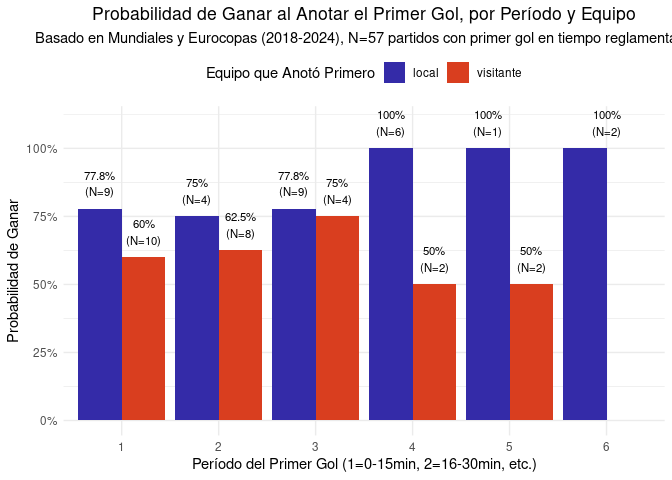<!-- -->

``` r
###pobabilidades de ganar si anota en el tiempo x para caualquier equipo####################
# Calcular la probabilidad de ganar para el equipo que anota primero (AGREGANDO LOCAL Y VISITANTE),
# desglosado solo por PERÍODO del primer gol.
probabilidades_ganar_agregado <- datos_goles %>%
  # Nos aseguramos de que solo consideramos los 6 períodos de tiempo reglamentario
  filter(P_GOL_1 %in% c("1", "2", "3", "4", "5", "6")) %>%
  # Agrupamos solo por el período en que ocurrió el primer gol
  group_by(P_GOL_1) %>%
  summarise(
    total_partidos_primer_gol_en_periodo = n(), 
    veces_gano_quien_anoto_primero_agregado = sum(PRIM_GOL == GANO), 
    .groups = 'drop'
  ) %>%
  mutate(
    prob_ganar_agg = veces_gano_quien_anoto_primero_agregado / total_partidos_primer_gol_en_periodo
  ) %>%
  arrange(P_GOL_1)
# Mostrar la tabla de probabilidades agregada
#print(probabilidades_ganar_agregado)
# Visualizar las probabilidades agregadas
probabilidades_ganar_agregado_para_plot <- probabilidades_ganar_agregado %>%
  mutate(
    etiqueta_prob_agg = paste0(round(prob_ganar_agg * 100, 1), "%\n(N=", total_partidos_primer_gol_en_periodo, ")")
  )

ggplot(probabilidades_ganar_agregado_para_plot, aes(x = factor(P_GOL_1), y = prob_ganar_agg)) +
  geom_bar(stat = "identity", fill = "#342BA8") + 
  geom_text(
    aes(label = etiqueta_prob_agg),
    vjust = -0.5,
    size = 3.5
  ) +
  scale_y_continuous(labels = scales::percent_format(), limits = c(0, 1.1), breaks = seq(0, 1, 0.25)) +
  labs(
    title = "Probabilidad de Ganar al Anotar el Primer Gol (Agregado Local/Visitante)",
    subtitle = "Basado en Mundiales y Eurocopas (2018-2024), N=57 partidos con primer gol en tiempo reglamentario",
    x = "Período del Primer Gol (1=0-15min, 2=16-30min, etc.)",
    y = "Probabilidad de Ganar"
  ) +
  theme_minimal() +
  theme(
    plot.title = element_text(hjust = 0.5),
    plot.subtitle = element_text(hjust = 0.5)
  )
```

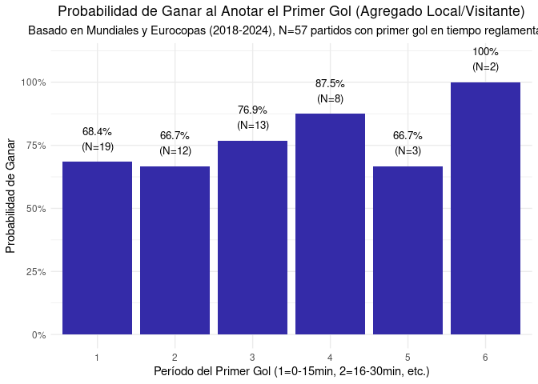<!-- -->

``` r
#regresion logistica#########################################################
# Paso 1: Crear la variable dependiente binaria GanoQuienMarcoPrimero
# 1 si el equipo que anotó el primer gol, ganó el partido.
# 0 si el equipo que anotó el primer gol, NO ganó el partido.
datos_goles <- datos_goles %>%
  mutate(
    GanoQuienMarcoPrimero = ifelse(PRIM_GOL == GANO, 1, 0)
  )
# Verificar la nueva variable (opcional, pero recomendado)
print(" 1 si el equipo que anotó el primer gol, ganó el partido.
# 0 si el equipo que anotó el primer gol, NO ganó el partido.")
```

    ## [1] " 1 si el equipo que anotó el primer gol, ganó el partido.\n# 0 si el equipo que anotó el primer gol, NO ganó el partido."

``` r
 print(table(datos_goles$GanoQuienMarcoPrimero, useNA = "ifany"))
```

    ## 
    ##  0  1 
    ## 15 42

``` r
# Paso 2: Asegurarse de que P_GOL_1 es un factor y establecer un nivel de referencia (opcional pero bueno para la interpretación)
datos_goles_para_modelo <- datos_goles %>%
  filter(P_GOL_1 %in% c("1", "2", "3", "4", "5", "6")) %>%
  mutate(P_GOL_1_factor = factor(P_GOL_1)) 
# Paso 3: Ajustar el modelo de regresión logística
# Modelo: GanoQuienMarcoPrimero en función del período del primer gol
modelo_logistico <- glm(GanoQuienMarcoPrimero ~ P_GOL_1_factor, 
                        data = datos_goles_para_modelo, 
                        family = binomial(link = "logit"))
# Paso 4: Ver el resumen del modelo
print(summary(modelo_logistico))
```

    ## 
    ## Call:
    ## glm(formula = GanoQuienMarcoPrimero ~ P_GOL_1_factor, family = binomial(link = "logit"), 
    ##     data = datos_goles_para_modelo)
    ## 
    ## Coefficients:
    ##                   Estimate Std. Error z value Pr(>|z|)
    ## (Intercept)        0.77319    0.49355   1.567    0.117
    ## P_GOL_1_factor2   -0.08004    0.78650  -0.102    0.919
    ## P_GOL_1_factor3    0.43078    0.82275   0.524    0.601
    ## P_GOL_1_factor4    1.17272    1.17747   0.996    0.319
    ## P_GOL_1_factor5   -0.08004    1.32045  -0.061    0.952
    ## P_GOL_1_factor6   15.79288 1696.73441   0.009    0.993
    ## 
    ## (Dispersion parameter for binomial family taken to be 1)
    ## 
    ##     Null deviance: 65.702  on 56  degrees of freedom
    ## Residual deviance: 62.868  on 51  degrees of freedom
    ## AIC: 74.868
    ## 
    ## Number of Fisher Scoring iterations: 15

``` r
# Otra forma de obtener OR y CI (sin broom, un poco más manual):
coeficientes_log_odds <- coef(modelo_logistico)
odds_ratios <- exp(coeficientes_log_odds)
conf_int_log_odds <- confint(modelo_logistico) 
```

    ## Waiting for profiling to be done...

    ## Warning: glm.fit: fitted probabilities numerically 0 or 1 occurred
    ## Warning: glm.fit: fitted probabilities numerically 0 or 1 occurred
    ## Warning: glm.fit: fitted probabilities numerically 0 or 1 occurred
    ## Warning: glm.fit: fitted probabilities numerically 0 or 1 occurred
    ## Warning: glm.fit: fitted probabilities numerically 0 or 1 occurred
    ## Warning: glm.fit: fitted probabilities numerically 0 or 1 occurred
    ## Warning: glm.fit: fitted probabilities numerically 0 or 1 occurred
    ## Warning: glm.fit: fitted probabilities numerically 0 or 1 occurred
    ## Warning: glm.fit: fitted probabilities numerically 0 or 1 occurred
    ## Warning: glm.fit: fitted probabilities numerically 0 or 1 occurred
    ## Warning: glm.fit: fitted probabilities numerically 0 or 1 occurred
    ## Warning: glm.fit: fitted probabilities numerically 0 or 1 occurred
    ## Warning: glm.fit: fitted probabilities numerically 0 or 1 occurred
    ## Warning: glm.fit: fitted probabilities numerically 0 or 1 occurred
    ## Warning: glm.fit: fitted probabilities numerically 0 or 1 occurred
    ## Warning: glm.fit: fitted probabilities numerically 0 or 1 occurred
    ## Warning: glm.fit: fitted probabilities numerically 0 or 1 occurred
    ## Warning: glm.fit: fitted probabilities numerically 0 or 1 occurred
    ## Warning: glm.fit: fitted probabilities numerically 0 or 1 occurred
    ## Warning: glm.fit: fitted probabilities numerically 0 or 1 occurred
    ## Warning: glm.fit: fitted probabilities numerically 0 or 1 occurred
    ## Warning: glm.fit: fitted probabilities numerically 0 or 1 occurred
    ## Warning: glm.fit: fitted probabilities numerically 0 or 1 occurred
    ## Warning: glm.fit: fitted probabilities numerically 0 or 1 occurred
    ## Warning: glm.fit: fitted probabilities numerically 0 or 1 occurred
    ## Warning: glm.fit: fitted probabilities numerically 0 or 1 occurred

``` r
conf_int_odds_ratios <- exp(conf_int_log_odds)
print("Odds Ratios:")
```

    ## [1] "Odds Ratios:"

``` r
print(odds_ratios)
```

    ##     (Intercept) P_GOL_1_factor2 P_GOL_1_factor3 P_GOL_1_factor4 P_GOL_1_factor5 
    ##    2.166667e+00    9.230769e-01    1.538462e+00    3.230769e+00    9.230769e-01 
    ## P_GOL_1_factor6 
    ##    7.223705e+06

``` r
print("Intervalos de Confianza para Odds Ratios (95%):")
```

    ## [1] "Intervalos de Confianza para Odds Ratios (95%):"

``` r
print(conf_int_odds_ratios)
```

    ##                         2.5 %    97.5 %
    ## (Intercept)      8.562400e-01  6.167268
    ## P_GOL_1_factor2  1.975014e-01  4.569282
    ## P_GOL_1_factor3  3.186791e-01  8.740512
    ## P_GOL_1_factor4  4.248321e-01 67.497798
    ## P_GOL_1_factor5  7.315605e-02 22.167676
    ## P_GOL_1_factor6 3.785718e-109        NA

``` r
######tabla 4#########################################################
# ----- 1. Calcular "Efecto marcar primero equipo ganador (%)" -----
# Calcular éxitos (ganó quien marcó primero) y totales (partidos con primer gol) por torneo
efecto_marcar_primero_stats <- datos_goles %>%
  filter(!is.na(PRIM_GOL) & PRIM_GOL %in% c("local", "visitante")) %>% # Asegurar que hay un primer gol por un equipo
  group_by(TORNEO) %>%
  summarise(
    N_marco_primero_y_gano = sum(GanoQuienMarcoPrimero == 1, na.rm = TRUE),
    N_con_1er_gol = n(), 
    .groups = 'drop'
  ) %>%
  mutate(
    Porcentaje_ganar = ifelse(N_con_1er_gol > 0, (N_marco_primero_y_gano / N_con_1er_gol) * 100, 0)
  )
mundial_stats_efecto <- efecto_marcar_primero_stats %>% filter(TORNEO == "MUNDIAL")
euro_stats_efecto <- efecto_marcar_primero_stats %>% filter(TORNEO == "EURO COPA")
# Inicializar p_valor_efecto por si un grupo no tiene datos
p_valor_efecto <- NA_real_
test_efecto_details <- "Datos insuficientes"

if(nrow(mundial_stats_efecto) == 1 && nrow(euro_stats_efecto) == 1 &&
   mundial_stats_efecto$N_con_1er_gol > 0 && euro_stats_efecto$N_con_1er_gol > 0) {
  
  contingency_table_efecto <- matrix(c(
    mundial_stats_efecto$N_marco_primero_y_gano, mundial_stats_efecto$N_con_1er_gol - mundial_stats_efecto$N_marco_primero_y_gano,
    euro_stats_efecto$N_marco_primero_y_gano, euro_stats_efecto$N_con_1er_gol - euro_stats_efecto$N_marco_primero_y_gano
  ), nrow = 2, byrow = TRUE)
  # Usar fisher.test si las N son pequeñas, prop.test si son más grandes
  test_efecto_resultado <- fisher.test(contingency_table_efecto)
  p_valor_efecto <- test_efecto_resultado$p.value
  test_efecto_details <- paste0("Fisher's Exact, p=", format.pval(p_valor_efecto, digits = 2, eps = 0.001))
}
# Guardar en un formato similar para la tabla final
fila_efecto_marcar_primero <- tibble(
  Variable = "Efecto marcar primero equipo ganador (%)",
  Mundial_Stat = ifelse(nrow(mundial_stats_efecto)==1, 
                        paste0(sprintf("%.1f", mundial_stats_efecto$Porcentaje_ganar), "% (N=", mundial_stats_efecto$N_con_1er_gol, ")"), 
                        "- (N=0)"),
  Eurocopa_Stat = ifelse(nrow(euro_stats_efecto)==1, 
                         paste0(sprintf("%.1f", euro_stats_efecto$Porcentaje_ganar), "% (N=", euro_stats_efecto$N_con_1er_gol, ")"), 
                         "- (N=0)"),
  Test_Resultado = test_efecto_details
)
# ----- 2. Variables Cuantitativas: Descriptivos (Mediana, N) y Mann-Whitney U -----
variables_cuantitativas <- c(
  "TOTAL_GN" = "Goles totales por partido (90 min)",
  "goles_p1" = "Goles periodo 0-15 min",
  "goles_p2" = "Goles periodo 16-30 min",
  "goles_p3" = "Goles periodo 31-45 min",
  "goles_p4" = "Goles periodo 46-60 min",
  "goles_p5" = "Goles periodo 61-75 min",
  "goles_p6" = "Goles periodo 76-90 min",
  "GOL_GAN"  = "Minuto primer gol equipo ganador",
  "GOL_PERD" = "Minuto primer gol equipo perdedor"
)
# Lista para almacenar resultados de cada variable cuantitativa
lista_resultados_cuanti <- list()
for (i in 1:length(variables_cuantitativas)) {
  var_name <- names(variables_cuantitativas)[i]
  var_label <- variables_cuantitativas[i]
  # Calcular descriptivos para MUNDIAL
  desc_mundial <- datos_goles %>%
    filter(TORNEO == "MUNDIAL") %>%
    summarise(
      Mediana = median(.data[[var_name]], na.rm = TRUE),
      N = sum(!is.na(.data[[var_name]]))
    )
  # Calcular descriptivos para EURO COPA
  desc_euro <- datos_goles %>%
    filter(TORNEO == "EURO COPA") %>%
    summarise(
      Mediana = median(.data[[var_name]], na.rm = TRUE),
      N = sum(!is.na(.data[[var_name]]))
    )
  # Formatear descriptivos
  mundial_desc_formato <- if (desc_mundial$N > 0) paste0(sprintf("%.2f", desc_mundial$Mediana), " (N=", desc_mundial$N, ")") else "- (N=0)"
  euro_desc_formato <- if (desc_euro$N > 0) paste0(sprintf("%.2f", desc_euro$Mediana), " (N=", desc_euro$N, ")") else "- (N=0)"
  # Prueba U de Mann-Whitney
  p_valor_mw <- NA_real_
  w_stat_mw <- NA_real_
  test_mw_details <- "Datos insuficientes"
  datos_test_mw <- datos_goles %>% 
    filter(!is.na(.data[[var_name]])) %>%
    mutate(TORNEO = factor(TORNEO)) 
  # Verificar que hay al menos dos niveles en TORNEO con datos para la variable
  if (length(unique(datos_test_mw$TORNEO[datos_test_mw$TORNEO == "MUNDIAL"])) > 0 && 
      length(unique(datos_test_mw$TORNEO[datos_test_mw$TORNEO == "EURO COPA"])) > 0 &&
      sum(datos_test_mw$TORNEO == "MUNDIAL") > 0 && sum(datos_test_mw$TORNEO == "EURO COPA") > 0) {
    # Verificar que hay variabilidad en la variable dependiente o al menos algunos datos por grupo
    if(var(datos_test_mw[[var_name]][datos_test_mw$TORNEO == "MUNDIAL"], na.rm = TRUE) == 0 &&
       var(datos_test_mw[[var_name]][datos_test_mw$TORNEO == "EURO COPA"], na.rm = TRUE) == 0 &&
       !is.na(var(datos_test_mw[[var_name]][datos_test_mw$TORNEO == "MUNDIAL"], na.rm = TRUE)) &&
       !is.na(var(datos_test_mw[[var_name]][datos_test_mw$TORNEO == "EURO COPA"], na.rm = TRUE))) {
      p_valor_mw <- 1.0 # Si ambas varianzas son 0 (todos los valores iguales en ambos grupos), no hay diferencia
      test_mw_details <- "Ambos grupos con varianza cero (no diferencia), p=1.0"
    } else {
      test_resultado_mw <- tryCatch({
        wilcox.test(as.formula(paste(var_name, "~ TORNEO")), data = datos_test_mw, exact = FALSE)
      }, error = function(e) {
        # Podría ocurrir si un grupo tiene cero varianza y el otro no, o N muy bajo.
        return(list(error_message = as.character(e$message)))
      })
      if(!is.null(test_resultado_mw$p.value)){
        p_valor_mw <- test_resultado_mw$p.value
        w_stat_mw <- test_resultado_mw$statistic
        estrellas_sig <- case_when(p_valor_mw < 0.001 ~ "***", p_valor_mw < 0.01 ~ "**", p_valor_mw < 0.05 ~ "*", TRUE ~ "")
        test_mw_details <- paste0("W=", round(w_stat_mw,0), estrellas_sig, ", p=", format.pval(p_valor_mw, digits = 2, eps = 0.001))
      } else if (!is.null(test_resultado_mw$error_message)) {
        test_mw_details <- paste("Error en M-W:", test_resultado_mw$error_message)
      }
    }
  }
  lista_resultados_cuanti[[var_name]] <- tibble(
    Variable = var_label,
    Mundial_Stat = mundial_desc_formato,
    Eurocopa_Stat = euro_desc_formato,
    Test_Resultado = test_mw_details
  )
}
# Combinar todos los resultados
tabla4_parte_inferior_data <- bind_rows(
  fila_efecto_marcar_primero,
  bind_rows(lista_resultados_cuanti)
)
# ----- 3. Crear la tabla con gt -----
tabla4_gt_final <- tabla4_parte_inferior_data %>%
  gt() %>%
  cols_label(
    Variable = md("**Variable Analizada**"),
    Mundial_Stat = md("**Mundial (Mediana (N)) / (% (N))**"),
    Eurocopa_Stat = md("**Eurocopa (Mediana (N)) / (% (N))**"),
    Test_Resultado = md("**Prueba U de Mann-Whitney / Test de Proporciones (p-valor)**")
  ) %>%
  tab_header(
    title = md("**Tabla 4 (Parte Inferior Replicada): Diferencias entre Mundiales y Eurocopas (2018-2024)**")
  ) %>%
  cols_align(
    align = "center",
    columns = c(Mundial_Stat, Eurocopa_Stat, Test_Resultado)
  ) %>%
  cols_align(
    align = "left",
    columns = Variable
  ) %>%
  tab_footnote(
    footnote = md("* p<0.05; ** p<0.01; *** p<0.001. Mediana (N) para variables cuantitativas; % (N) para efecto de marcar primero."),
    locations = cells_column_labels(columns = Test_Resultado)
  )
# Mostrar la tabla
#print(tabla4_gt_final)
```

``` r
######tabla 4 superior
datos_goles_table4_upper <- datos_goles %>%
  mutate(
    # Creamos una etiqueta más corta para TORNEO y la combinamos con YEAR
    TournamentEdition_Label = paste0(ifelse(TORNEO == "MUNDIAL", "WC", "UE"), YEAR),
    # Convertimos a factor para asegurar el orden en tablas y gráficos si es necesario
    TournamentEdition = factor(TournamentEdition_Label, levels = unique(TournamentEdition_Label)[order(unique(YEAR))]) # Ordena por año
  )
# Verificar las ediciones y el número de observaciones por grupo
print("Observaciones por Edición de Torneo para Tabla 4 (Superior):")
```

    ## [1] "Observaciones por Edición de Torneo para Tabla 4 (Superior):"

``` r
print(table(datos_goles_table4_upper$TournamentEdition))
```

    ## 
    ## WC2018 UE2020 WC2022 UE2024 
    ##     16     14     14     13

``` r
# ----- 1. Variable: "Efecto marcar primero equipo ganador (%)" -----
# Calculamos los éxitos (ganó quien marcó primero) y los totales (partidos con primer gol)
# para cada edición de torneo.
efecto_marcar_primero_editions <- datos_goles_table4_upper %>%
  filter(!is.na(PRIM_GOL) & PRIM_GOL %in% c("local", "visitante")) %>% # Partidos con un primer gol identificable
  group_by(TournamentEdition) %>%
  summarise(
    N_marco_primero_y_gano = sum(GanoQuienMarcoPrimero == 1, na.rm = TRUE),
    N_con_1er_gol = n(), 
    .groups = 'drop'
  ) %>%
  mutate(
    Porcentaje_ganar = ifelse(N_con_1er_gol > 0, (N_marco_primero_y_gano / N_con_1er_gol) * 100, 0),
    # Calculamos N_marco_primero_y_no_gano para la tabla de contingencia
    N_marco_primero_y_no_gano = N_con_1er_gol - N_marco_primero_y_gano
  )
# Test Exacto de Fisher para comparar las proporciones entre las 4 ediciones
test_efecto_editions_details <- "Datos insuficientes para Fisher's Test"
# Filtrar ediciones que realmente tienen datos para el test
data_for_fisher <- efecto_marcar_primero_editions %>%
  filter(N_con_1er_gol > 0)
if(nrow(data_for_fisher) >= 2) { 
  # Crear la tabla de contingencia (Ediciones x [GanóMarcando1ro, NoGanóMarcando1ro])
  contingency_table_efecto_editions <- xtabs(cbind(N_marco_primero_y_gano, N_marco_primero_y_no_gano) ~ TournamentEdition,
                                             data = data_for_fisher)
  # Verificar dimensiones de la tabla antes del test
  if(all(dim(contingency_table_efecto_editions) >= c(2,2)) && sum(contingency_table_efecto_editions) > 0 ) {
    test_fisher_resultado <- tryCatch({
      fisher.test(contingency_table_efecto_editions)
    }, error = function(e) list(error_message = as.character(e$message)))
    if (!is.null(test_fisher_resultado$p.value)) {
      p_valor_efecto_editions <- test_fisher_resultado$p.value
      estrellas_sig <- case_when(p_valor_efecto_editions < 0.001 ~ "***", p_valor_efecto_editions < 0.01 ~ "**", p_valor_efecto_editions < 0.05 ~ "*", TRUE ~ "")
      test_efecto_editions_details <- paste0("Fisher's Exact, p=", format.pval(p_valor_efecto_editions, digits = 2, eps = 0.001), estrellas_sig)
    } else if (!is.null(test_fisher_resultado$error_message)){
      test_efecto_editions_details <- paste("Error en Fisher's Test:", test_fisher_resultado$error_message)
    } else {
      test_efecto_editions_details <- "Fisher's Test no arrojó p-valor."
    }
  } else {
    test_efecto_editions_details <- "Tabla de contingencia no es al menos 2x2 o es vacía después de filtros."
  }
}
# Preparar la fila para la tabla gt
descriptivos_efecto_pivot <- efecto_marcar_primero_editions %>%
  mutate(Stat_Display = paste0(sprintf("%.1f", Porcentaje_ganar), "% (N=", N_con_1er_gol, ")")) %>%
  select(TournamentEdition, Stat_Display) %>%
  tidyr::pivot_wider(names_from = TournamentEdition, values_from = Stat_Display, values_fill = list(Stat_Display = "- (N=0)"))
# Lista para almacenar todas las filas de la tabla final
tabla_final_data_list <- list()
tabla_final_data_list[[length(tabla_final_data_list) + 1]] <- descriptivos_efecto_pivot %>%
  mutate(Variable = "Efecto marcar primero equipo ganador (%)", Test_Resultado = test_efecto_editions_details) %>%
  relocate(Variable, .before = 1)
# ----- 2. Variables Cuantitativas: Descriptivos (Mediana, N) y Kruskal-Wallis -----
variables_cuantitativas_labels <- c(
  "TOTAL_GN" = "Goles totales por partido (90 min)",
  "goles_p1" = "Goles periodo 0-15 min",
  "goles_p2" = "Goles periodo 16-30 min",
  "goles_p3" = "Goles periodo 31-45 min",
  "goles_p4" = "Goles periodo 46-60 min",
  "goles_p5" = "Goles periodo 61-75 min",
  "goles_p6" = "Goles periodo 76-90 min",
  "GOL_GAN"  = "Minuto primer gol equipo ganador",
  "GOL_PERD" = "Minuto primer gol equipo perdedor"
)
for (i in 1:length(variables_cuantitativas_labels)) {
  var_col_name <- names(variables_cuantitativas_labels)[i]
  var_row_label <- variables_cuantitativas_labels[i]
  descriptivos_var_editions <- datos_goles_table4_upper %>%
    filter(!is.na(.data[[var_col_name]])) %>%
    group_by(TournamentEdition) %>%
    summarise(
      Mediana = median(.data[[var_col_name]], na.rm = TRUE), # na.rm es por si acaso, aunque ya filtramos NAs antes
      N = n(),
      .groups = 'drop'
    ) %>%
    mutate(
      Stat_Display = ifelse(N > 0, paste0(sprintf("%.2f", Mediana), " (N=", N, ")"), "- (N=0)")
    ) %>%
    select(TournamentEdition, Stat_Display) %>%
    tidyr::pivot_wider(names_from = TournamentEdition, values_from = Stat_Display, values_fill = list(Stat_Display = "- (N=0)"))
  kruskal_test_details <- "Datos insuficientes para Kruskal-Wallis"
  datos_test_kw <- datos_goles_table4_upper %>% filter(!is.na(.data[[var_col_name]]))
  if (length(unique(datos_test_kw$TournamentEdition)) >= 2 && nrow(datos_test_kw) >=3 ) {
    if (length(unique(datos_test_kw[[var_col_name]])) > 1) { # Kruskal-Wallis necesita variación
      test_kw_resultado <- kruskal.test(as.formula(paste(var_col_name, "~ TournamentEdition")), 
                                        data = datos_test_kw)
      p_valor_kw <- test_kw_resultado$p.value
      kw_stat <- test_kw_resultado$statistic
      kw_df <- test_kw_resultado$parameters 
      estrellas_sig <- case_when(p_valor_kw < 0.001 ~ "***", p_valor_kw < 0.01 ~ "**", p_valor_kw < 0.05 ~ "*", TRUE ~ "")
      kruskal_test_details <- paste0("X2(", kw_df, ")=", round(kw_stat,1), estrellas_sig, ", p=", format.pval(p_valor_kw, digits = 2, eps = 0.001))
    } else {
      kruskal_test_details <- "No hay varianza en la variable para los grupos combinados."
    }
  }
  tabla_final_data_list[[length(tabla_final_data_list) + 1]] <- descriptivos_var_editions %>%
    mutate(Variable = var_row_label, Test_Resultado = kruskal_test_details) %>%
    relocate(Variable, .before = 1)
}
# Combinar todas las filas en un dataframe final
df_tabla4_upper_final <- bind_rows(tabla_final_data_list)
ediciones_ordenadas <- levels(datos_goles_table4_upper$TournamentEdition)
column_order_final <- c("Variable", ediciones_ordenadas, "Test_Resultado")
# Añadir columnas de edición que pudieran faltar con NAs (o "- (N=0)") y reordenar
for(edicion in ediciones_ordenadas){
  if(!edicion %in% names(df_tabla4_upper_final)){
    df_tabla4_upper_final[[edicion]] <- "- (N=0)"
  }
}
df_tabla4_upper_final <- df_tabla4_upper_final %>%
  select(any_of(column_order_final)) # Usa any_of para evitar errores si alguna columna de edición realmente no se generó
# ----- 3. Crear la tabla con gt -----
# Crear etiquetas para las columnas de edición de torneo
edition_labels_gt <- setNames(
  paste0(ediciones_ordenadas, " (Med (N)) / (% (N))"), # Etiquetas descriptivas
  ediciones_ordenadas                                 # Nombres actuales de las columnas
)
tabla4_upper_gt_final <- df_tabla4_upper_final %>%
  gt() %>%
  cols_label(
    Variable = md("**Variable Analizada**"),
    !!!edition_labels_gt, # Expande la lista de etiquetas de edición
    Test_Resultado = md("**K-W ($X^2(p)$) / Fisher (p)**") # Ajustar según los tests
  ) %>%
  tab_header(
    title = md("**Tabla 4 (Parte Superior Adaptada): Comparación entre Ediciones de Torneos (2018-2024)**")
  ) %>%
  cols_align(
    align = "center",
    columns = c(all_of(ediciones_ordenadas), Test_Resultado)
  ) %>%
  cols_align(
    align = "left",
    columns = Variable
  ) %>%
  tab_footnote(
    footnote = md("* p<0.05; ** p<0.01; *** p<0.001. Mediana (N) para variables cuantitativas; % (N) para efecto de marcar primero."),
    locations = cells_column_labels(columns = Test_Resultado)
  ) %>%
  # Condensar un poco la tabla si es muy ancha
  tab_options(
    table.font.size = px(12),
    column_labels.font.size = px(12)
  )
# Mostrar la tabla
#print(tabla4_upper_gt_final)
```

``` r
####tabla 4 final#####
# --- PASO 0: Renombrar las columnas de Test_Resultado ANTES de unir ---
df_tabla4_upper_final_renamed <- df_tabla4_upper_final %>%
  rename(Test_Editions = Test_Resultado)

tabla4_parte_inferior_data_renamed <- tabla4_parte_inferior_data %>%
  rename(Test_Overall_WC_UE = Test_Resultado)

# --- PASO 1: Unir los dos dataframes por la columna 'Variable' ---
tabla4_combinada_datos <- full_join(df_tabla4_upper_final_renamed, 
                                    tabla4_parte_inferior_data_renamed, 
                                    by = "Variable")
ediciones_ordenadas <- levels(datos_goles_table4_upper$TournamentEdition) 
# Crear etiquetas para las columnas de edición de torneo
edition_stat_labels_gt <- setNames(
  paste0(ediciones_ordenadas, "<br>(Med (N)) / (% (N))"), # Usar <br> para salto de línea en gt
  ediciones_ordenadas
)
columnas_finales_ordenadas <- c(
  "Variable",
  ediciones_ordenadas,    # WC2018, UE2020, WC2022, UE2024
  "Test_Editions",
  "Mundial_Stat",         # De tabla4_parte_inferior_data_renamed
  "Eurocopa_Stat",        # De tabla4_parte_inferior_data_renamed
  "Test_Overall_WC_UE"
)
# Crear la tabla gt
tabla_final_completa_gt <- tabla4_combinada_datos %>%
  select(any_of(columnas_finales_ordenadas)) %>% # Usar any_of para más robustez
  gt() %>%
  cols_label(
    Variable = md("**Variable Analizada**"),
    !!!edition_stat_labels_gt, # Aplica las etiquetas a las columnas de edición
    Test_Editions = md("**Test**<br>(Entre Ediciones)"),
    Mundial_Stat = md("**Mundial (Total)**<br>(Med (N)) / (% (N))"),
    Eurocopa_Stat = md("**Eurocopa (Total)**<br>(Med (N)) / (% (N))"),
    Test_Overall_WC_UE = md("**Test**<br>(Mundial vs Eurocopa)")
  ) %>%
  tab_header(
    title = md("**Tabla 4 Adaptada: Diferencias en Métricas Clave entre Ediciones y Tipos de Torneo (2018-2024)**")
  ) %>%
  tab_spanner(
    label = md("**A. Comparación entre Ediciones de Torneo Individuales**"),
    columns = c(all_of(ediciones_ordenadas), Test_Editions)
  ) %>%
  tab_spanner(
    label = md("**B. Comparación General: Mundial vs Eurocopa**"),
    columns = c(Mundial_Stat, Eurocopa_Stat, Test_Overall_WC_UE)
  ) %>%
  cols_align(
    align = "center",
    columns = c(all_of(ediciones_ordenadas), Test_Editions, Mundial_Stat, Eurocopa_Stat, Test_Overall_WC_UE)
  ) %>%
  cols_align(
    align = "left",
    columns = Variable
  ) %>%
  tab_options(
    table.font.size = px(10), # Ajusta según necesidad para que quepa
    column_labels.font.size = px(10),
    data_row.padding = px(3),
    table.width = pct(100) # Intenta ajustar al ancho
  ) %>%
  tab_footnote(
    footnote = md("* p<0.05; ** p<0.01; *** p<0.001. Mediana (N) para variables cuantitativas; % (N) para efecto de marcar primero."),
    locations = cells_column_labels(columns = c(Test_Editions, Test_Overall_WC_UE))
  )
# Mostrar la tabla final completa
print(tabla_final_completa_gt)
```

    ## <div id="ebacnozqvb" style="padding-left:0px;padding-right:0px;padding-top:10px;padding-bottom:10px;overflow-x:auto;overflow-y:auto;width:auto;height:auto;">
    ##   <style>#ebacnozqvb table {
    ##   font-family: system-ui, 'Segoe UI', Roboto, Helvetica, Arial, sans-serif, 'Apple Color Emoji', 'Segoe UI Emoji', 'Segoe UI Symbol', 'Noto Color Emoji';
    ##   -webkit-font-smoothing: antialiased;
    ##   -moz-osx-font-smoothing: grayscale;
    ## }
    ## 
    ## #ebacnozqvb thead, #ebacnozqvb tbody, #ebacnozqvb tfoot, #ebacnozqvb tr, #ebacnozqvb td, #ebacnozqvb th {
    ##   border-style: none;
    ## }
    ## 
    ## #ebacnozqvb p {
    ##   margin: 0;
    ##   padding: 0;
    ## }
    ## 
    ## #ebacnozqvb .gt_table {
    ##   display: table;
    ##   border-collapse: collapse;
    ##   line-height: normal;
    ##   margin-left: auto;
    ##   margin-right: auto;
    ##   color: #333333;
    ##   font-size: 10px;
    ##   font-weight: normal;
    ##   font-style: normal;
    ##   background-color: #FFFFFF;
    ##   width: 100%;
    ##   border-top-style: solid;
    ##   border-top-width: 2px;
    ##   border-top-color: #A8A8A8;
    ##   border-right-style: none;
    ##   border-right-width: 2px;
    ##   border-right-color: #D3D3D3;
    ##   border-bottom-style: solid;
    ##   border-bottom-width: 2px;
    ##   border-bottom-color: #A8A8A8;
    ##   border-left-style: none;
    ##   border-left-width: 2px;
    ##   border-left-color: #D3D3D3;
    ## }
    ## 
    ## #ebacnozqvb .gt_caption {
    ##   padding-top: 4px;
    ##   padding-bottom: 4px;
    ## }
    ## 
    ## #ebacnozqvb .gt_title {
    ##   color: #333333;
    ##   font-size: 125%;
    ##   font-weight: initial;
    ##   padding-top: 4px;
    ##   padding-bottom: 4px;
    ##   padding-left: 5px;
    ##   padding-right: 5px;
    ##   border-bottom-color: #FFFFFF;
    ##   border-bottom-width: 0;
    ## }
    ## 
    ## #ebacnozqvb .gt_subtitle {
    ##   color: #333333;
    ##   font-size: 85%;
    ##   font-weight: initial;
    ##   padding-top: 3px;
    ##   padding-bottom: 5px;
    ##   padding-left: 5px;
    ##   padding-right: 5px;
    ##   border-top-color: #FFFFFF;
    ##   border-top-width: 0;
    ## }
    ## 
    ## #ebacnozqvb .gt_heading {
    ##   background-color: #FFFFFF;
    ##   text-align: center;
    ##   border-bottom-color: #FFFFFF;
    ##   border-left-style: none;
    ##   border-left-width: 1px;
    ##   border-left-color: #D3D3D3;
    ##   border-right-style: none;
    ##   border-right-width: 1px;
    ##   border-right-color: #D3D3D3;
    ## }
    ## 
    ## #ebacnozqvb .gt_bottom_border {
    ##   border-bottom-style: solid;
    ##   border-bottom-width: 2px;
    ##   border-bottom-color: #D3D3D3;
    ## }
    ## 
    ## #ebacnozqvb .gt_col_headings {
    ##   border-top-style: solid;
    ##   border-top-width: 2px;
    ##   border-top-color: #D3D3D3;
    ##   border-bottom-style: solid;
    ##   border-bottom-width: 2px;
    ##   border-bottom-color: #D3D3D3;
    ##   border-left-style: none;
    ##   border-left-width: 1px;
    ##   border-left-color: #D3D3D3;
    ##   border-right-style: none;
    ##   border-right-width: 1px;
    ##   border-right-color: #D3D3D3;
    ## }
    ## 
    ## #ebacnozqvb .gt_col_heading {
    ##   color: #333333;
    ##   background-color: #FFFFFF;
    ##   font-size: 10px;
    ##   font-weight: normal;
    ##   text-transform: inherit;
    ##   border-left-style: none;
    ##   border-left-width: 1px;
    ##   border-left-color: #D3D3D3;
    ##   border-right-style: none;
    ##   border-right-width: 1px;
    ##   border-right-color: #D3D3D3;
    ##   vertical-align: bottom;
    ##   padding-top: 5px;
    ##   padding-bottom: 6px;
    ##   padding-left: 5px;
    ##   padding-right: 5px;
    ##   overflow-x: hidden;
    ## }
    ## 
    ## #ebacnozqvb .gt_column_spanner_outer {
    ##   color: #333333;
    ##   background-color: #FFFFFF;
    ##   font-size: 10px;
    ##   font-weight: normal;
    ##   text-transform: inherit;
    ##   padding-top: 0;
    ##   padding-bottom: 0;
    ##   padding-left: 4px;
    ##   padding-right: 4px;
    ## }
    ## 
    ## #ebacnozqvb .gt_column_spanner_outer:first-child {
    ##   padding-left: 0;
    ## }
    ## 
    ## #ebacnozqvb .gt_column_spanner_outer:last-child {
    ##   padding-right: 0;
    ## }
    ## 
    ## #ebacnozqvb .gt_column_spanner {
    ##   border-bottom-style: solid;
    ##   border-bottom-width: 2px;
    ##   border-bottom-color: #D3D3D3;
    ##   vertical-align: bottom;
    ##   padding-top: 5px;
    ##   padding-bottom: 5px;
    ##   overflow-x: hidden;
    ##   display: inline-block;
    ##   width: 100%;
    ## }
    ## 
    ## #ebacnozqvb .gt_spanner_row {
    ##   border-bottom-style: hidden;
    ## }
    ## 
    ## #ebacnozqvb .gt_group_heading {
    ##   padding-top: 8px;
    ##   padding-bottom: 8px;
    ##   padding-left: 5px;
    ##   padding-right: 5px;
    ##   color: #333333;
    ##   background-color: #FFFFFF;
    ##   font-size: 100%;
    ##   font-weight: initial;
    ##   text-transform: inherit;
    ##   border-top-style: solid;
    ##   border-top-width: 2px;
    ##   border-top-color: #D3D3D3;
    ##   border-bottom-style: solid;
    ##   border-bottom-width: 2px;
    ##   border-bottom-color: #D3D3D3;
    ##   border-left-style: none;
    ##   border-left-width: 1px;
    ##   border-left-color: #D3D3D3;
    ##   border-right-style: none;
    ##   border-right-width: 1px;
    ##   border-right-color: #D3D3D3;
    ##   vertical-align: middle;
    ##   text-align: left;
    ## }
    ## 
    ## #ebacnozqvb .gt_empty_group_heading {
    ##   padding: 0.5px;
    ##   color: #333333;
    ##   background-color: #FFFFFF;
    ##   font-size: 100%;
    ##   font-weight: initial;
    ##   border-top-style: solid;
    ##   border-top-width: 2px;
    ##   border-top-color: #D3D3D3;
    ##   border-bottom-style: solid;
    ##   border-bottom-width: 2px;
    ##   border-bottom-color: #D3D3D3;
    ##   vertical-align: middle;
    ## }
    ## 
    ## #ebacnozqvb .gt_from_md > :first-child {
    ##   margin-top: 0;
    ## }
    ## 
    ## #ebacnozqvb .gt_from_md > :last-child {
    ##   margin-bottom: 0;
    ## }
    ## 
    ## #ebacnozqvb .gt_row {
    ##   padding-top: 3px;
    ##   padding-bottom: 3px;
    ##   padding-left: 5px;
    ##   padding-right: 5px;
    ##   margin: 10px;
    ##   border-top-style: solid;
    ##   border-top-width: 1px;
    ##   border-top-color: #D3D3D3;
    ##   border-left-style: none;
    ##   border-left-width: 1px;
    ##   border-left-color: #D3D3D3;
    ##   border-right-style: none;
    ##   border-right-width: 1px;
    ##   border-right-color: #D3D3D3;
    ##   vertical-align: middle;
    ##   overflow-x: hidden;
    ## }
    ## 
    ## #ebacnozqvb .gt_stub {
    ##   color: #333333;
    ##   background-color: #FFFFFF;
    ##   font-size: 100%;
    ##   font-weight: initial;
    ##   text-transform: inherit;
    ##   border-right-style: solid;
    ##   border-right-width: 2px;
    ##   border-right-color: #D3D3D3;
    ##   padding-left: 5px;
    ##   padding-right: 5px;
    ## }
    ## 
    ## #ebacnozqvb .gt_stub_row_group {
    ##   color: #333333;
    ##   background-color: #FFFFFF;
    ##   font-size: 100%;
    ##   font-weight: initial;
    ##   text-transform: inherit;
    ##   border-right-style: solid;
    ##   border-right-width: 2px;
    ##   border-right-color: #D3D3D3;
    ##   padding-left: 5px;
    ##   padding-right: 5px;
    ##   vertical-align: top;
    ## }
    ## 
    ## #ebacnozqvb .gt_row_group_first td {
    ##   border-top-width: 2px;
    ## }
    ## 
    ## #ebacnozqvb .gt_row_group_first th {
    ##   border-top-width: 2px;
    ## }
    ## 
    ## #ebacnozqvb .gt_summary_row {
    ##   color: #333333;
    ##   background-color: #FFFFFF;
    ##   text-transform: inherit;
    ##   padding-top: 8px;
    ##   padding-bottom: 8px;
    ##   padding-left: 5px;
    ##   padding-right: 5px;
    ## }
    ## 
    ## #ebacnozqvb .gt_first_summary_row {
    ##   border-top-style: solid;
    ##   border-top-color: #D3D3D3;
    ## }
    ## 
    ## #ebacnozqvb .gt_first_summary_row.thick {
    ##   border-top-width: 2px;
    ## }
    ## 
    ## #ebacnozqvb .gt_last_summary_row {
    ##   padding-top: 8px;
    ##   padding-bottom: 8px;
    ##   padding-left: 5px;
    ##   padding-right: 5px;
    ##   border-bottom-style: solid;
    ##   border-bottom-width: 2px;
    ##   border-bottom-color: #D3D3D3;
    ## }
    ## 
    ## #ebacnozqvb .gt_grand_summary_row {
    ##   color: #333333;
    ##   background-color: #FFFFFF;
    ##   text-transform: inherit;
    ##   padding-top: 8px;
    ##   padding-bottom: 8px;
    ##   padding-left: 5px;
    ##   padding-right: 5px;
    ## }
    ## 
    ## #ebacnozqvb .gt_first_grand_summary_row {
    ##   padding-top: 8px;
    ##   padding-bottom: 8px;
    ##   padding-left: 5px;
    ##   padding-right: 5px;
    ##   border-top-style: double;
    ##   border-top-width: 6px;
    ##   border-top-color: #D3D3D3;
    ## }
    ## 
    ## #ebacnozqvb .gt_last_grand_summary_row_top {
    ##   padding-top: 8px;
    ##   padding-bottom: 8px;
    ##   padding-left: 5px;
    ##   padding-right: 5px;
    ##   border-bottom-style: double;
    ##   border-bottom-width: 6px;
    ##   border-bottom-color: #D3D3D3;
    ## }
    ## 
    ## #ebacnozqvb .gt_striped {
    ##   background-color: rgba(128, 128, 128, 0.05);
    ## }
    ## 
    ## #ebacnozqvb .gt_table_body {
    ##   border-top-style: solid;
    ##   border-top-width: 2px;
    ##   border-top-color: #D3D3D3;
    ##   border-bottom-style: solid;
    ##   border-bottom-width: 2px;
    ##   border-bottom-color: #D3D3D3;
    ## }
    ## 
    ## #ebacnozqvb .gt_footnotes {
    ##   color: #333333;
    ##   background-color: #FFFFFF;
    ##   border-bottom-style: none;
    ##   border-bottom-width: 2px;
    ##   border-bottom-color: #D3D3D3;
    ##   border-left-style: none;
    ##   border-left-width: 2px;
    ##   border-left-color: #D3D3D3;
    ##   border-right-style: none;
    ##   border-right-width: 2px;
    ##   border-right-color: #D3D3D3;
    ## }
    ## 
    ## #ebacnozqvb .gt_footnote {
    ##   margin: 0px;
    ##   font-size: 90%;
    ##   padding-top: 4px;
    ##   padding-bottom: 4px;
    ##   padding-left: 5px;
    ##   padding-right: 5px;
    ## }
    ## 
    ## #ebacnozqvb .gt_sourcenotes {
    ##   color: #333333;
    ##   background-color: #FFFFFF;
    ##   border-bottom-style: none;
    ##   border-bottom-width: 2px;
    ##   border-bottom-color: #D3D3D3;
    ##   border-left-style: none;
    ##   border-left-width: 2px;
    ##   border-left-color: #D3D3D3;
    ##   border-right-style: none;
    ##   border-right-width: 2px;
    ##   border-right-color: #D3D3D3;
    ## }
    ## 
    ## #ebacnozqvb .gt_sourcenote {
    ##   font-size: 90%;
    ##   padding-top: 4px;
    ##   padding-bottom: 4px;
    ##   padding-left: 5px;
    ##   padding-right: 5px;
    ## }
    ## 
    ## #ebacnozqvb .gt_left {
    ##   text-align: left;
    ## }
    ## 
    ## #ebacnozqvb .gt_center {
    ##   text-align: center;
    ## }
    ## 
    ## #ebacnozqvb .gt_right {
    ##   text-align: right;
    ##   font-variant-numeric: tabular-nums;
    ## }
    ## 
    ## #ebacnozqvb .gt_font_normal {
    ##   font-weight: normal;
    ## }
    ## 
    ## #ebacnozqvb .gt_font_bold {
    ##   font-weight: bold;
    ## }
    ## 
    ## #ebacnozqvb .gt_font_italic {
    ##   font-style: italic;
    ## }
    ## 
    ## #ebacnozqvb .gt_super {
    ##   font-size: 65%;
    ## }
    ## 
    ## #ebacnozqvb .gt_footnote_marks {
    ##   font-size: 75%;
    ##   vertical-align: 0.4em;
    ##   position: initial;
    ## }
    ## 
    ## #ebacnozqvb .gt_asterisk {
    ##   font-size: 100%;
    ##   vertical-align: 0;
    ## }
    ## 
    ## #ebacnozqvb .gt_indent_1 {
    ##   text-indent: 5px;
    ## }
    ## 
    ## #ebacnozqvb .gt_indent_2 {
    ##   text-indent: 10px;
    ## }
    ## 
    ## #ebacnozqvb .gt_indent_3 {
    ##   text-indent: 15px;
    ## }
    ## 
    ## #ebacnozqvb .gt_indent_4 {
    ##   text-indent: 20px;
    ## }
    ## 
    ## #ebacnozqvb .gt_indent_5 {
    ##   text-indent: 25px;
    ## }
    ## 
    ## #ebacnozqvb .katex-display {
    ##   display: inline-flex !important;
    ##   margin-bottom: 0.75em !important;
    ## }
    ## 
    ## #ebacnozqvb div.Reactable > div.rt-table > div.rt-thead > div.rt-tr.rt-tr-group-header > div.rt-th-group:after {
    ##   height: 0px !important;
    ## }
    ## </style>
    ##   <table class="gt_table" data-quarto-disable-processing="false" data-quarto-bootstrap="false">
    ##   <thead>
    ##     <tr class="gt_heading">
    ##       <td colspan="9" class="gt_heading gt_title gt_font_normal gt_bottom_border" style><span class='gt_from_md'><strong>Tabla 4 Adaptada: Diferencias en Métricas Clave entre Ediciones y Tipos de Torneo (2018-2024)</strong></span></td>
    ##     </tr>
    ##     
    ##     <tr class="gt_col_headings gt_spanner_row">
    ##       <th class="gt_col_heading gt_columns_bottom_border gt_left" rowspan="2" colspan="1" scope="col" id="Variable"><span class='gt_from_md'><strong>Variable Analizada</strong></span></th>
    ##       <th class="gt_center gt_columns_top_border gt_column_spanner_outer" rowspan="1" colspan="5" scope="colgroup" id="**A. Comparación entre Ediciones de Torneo Individuales**">
    ##         <div class="gt_column_spanner"><span class='gt_from_md'><strong>A. Comparación entre Ediciones de Torneo Individuales</strong></span></div>
    ##       </th>
    ##       <th class="gt_center gt_columns_top_border gt_column_spanner_outer" rowspan="1" colspan="3" scope="colgroup" id="**B. Comparación General: Mundial vs Eurocopa**">
    ##         <div class="gt_column_spanner"><span class='gt_from_md'><strong>B. Comparación General: Mundial vs Eurocopa</strong></span></div>
    ##       </th>
    ##     </tr>
    ##     <tr class="gt_col_headings">
    ##       <th class="gt_col_heading gt_columns_bottom_border gt_center" rowspan="1" colspan="1" scope="col" id="WC2018">WC2018&lt;br&gt;(Med (N)) / (% (N))</th>
    ##       <th class="gt_col_heading gt_columns_bottom_border gt_center" rowspan="1" colspan="1" scope="col" id="UE2020">UE2020&lt;br&gt;(Med (N)) / (% (N))</th>
    ##       <th class="gt_col_heading gt_columns_bottom_border gt_center" rowspan="1" colspan="1" scope="col" id="WC2022">WC2022&lt;br&gt;(Med (N)) / (% (N))</th>
    ##       <th class="gt_col_heading gt_columns_bottom_border gt_center" rowspan="1" colspan="1" scope="col" id="UE2024">UE2024&lt;br&gt;(Med (N)) / (% (N))</th>
    ##       <th class="gt_col_heading gt_columns_bottom_border gt_center" rowspan="1" colspan="1" scope="col" id="Test_Editions"><span class='gt_from_md'><strong>Test</strong><br>(Entre Ediciones)</span><span class="gt_footnote_marks" style="white-space:nowrap;font-style:italic;font-weight:normal;line-height:0;"><sup>1</sup></span></th>
    ##       <th class="gt_col_heading gt_columns_bottom_border gt_center" rowspan="1" colspan="1" scope="col" id="Mundial_Stat"><span class='gt_from_md'><strong>Mundial (Total)</strong><br>(Med (N)) / (% (N))</span></th>
    ##       <th class="gt_col_heading gt_columns_bottom_border gt_center" rowspan="1" colspan="1" scope="col" id="Eurocopa_Stat"><span class='gt_from_md'><strong>Eurocopa (Total)</strong><br>(Med (N)) / (% (N))</span></th>
    ##       <th class="gt_col_heading gt_columns_bottom_border gt_center" rowspan="1" colspan="1" scope="col" id="Test_Overall_WC_UE"><span class='gt_from_md'><strong>Test</strong><br>(Mundial vs Eurocopa)</span><span class="gt_footnote_marks" style="white-space:nowrap;font-style:italic;font-weight:normal;line-height:0;"><sup>1</sup></span></th>
    ##     </tr>
    ##   </thead>
    ##   <tbody class="gt_table_body">
    ##     <tr><td headers="Variable" class="gt_row gt_left">Efecto marcar primero equipo ganador (%)</td>
    ## <td headers="WC2018" class="gt_row gt_center">68.8% (N=16)</td>
    ## <td headers="UE2020" class="gt_row gt_center">78.6% (N=14)</td>
    ## <td headers="WC2022" class="gt_row gt_center">92.9% (N=14)</td>
    ## <td headers="UE2024" class="gt_row gt_center">53.8% (N=13)</td>
    ## <td headers="Test_Editions" class="gt_row gt_center">Fisher's Exact, p=0.13</td>
    ## <td headers="Mundial_Stat" class="gt_row gt_center">80.0% (N=30)</td>
    ## <td headers="Eurocopa_Stat" class="gt_row gt_center">66.7% (N=27)</td>
    ## <td headers="Test_Overall_WC_UE" class="gt_row gt_center">Fisher's Exact, p=0.37</td></tr>
    ##     <tr><td headers="Variable" class="gt_row gt_left">Goles totales por partido (90 min)</td>
    ## <td headers="WC2018" class="gt_row gt_center">2.00 (N=16)</td>
    ## <td headers="UE2020" class="gt_row gt_center">2.00 (N=14)</td>
    ## <td headers="WC2022" class="gt_row gt_center">3.00 (N=14)</td>
    ## <td headers="UE2024" class="gt_row gt_center">3.00 (N=13)</td>
    ## <td headers="Test_Editions" class="gt_row gt_center">X2()=4.5, p=0.21</td>
    ## <td headers="Mundial_Stat" class="gt_row gt_center">3.00 (N=30)</td>
    ## <td headers="Eurocopa_Stat" class="gt_row gt_center">2.00 (N=27)</td>
    ## <td headers="Test_Overall_WC_UE" class="gt_row gt_center">W=372, p=0.59</td></tr>
    ##     <tr><td headers="Variable" class="gt_row gt_left">Goles periodo 0-15 min</td>
    ## <td headers="WC2018" class="gt_row gt_center">0.00 (N=16)</td>
    ## <td headers="UE2020" class="gt_row gt_center">0.00 (N=14)</td>
    ## <td headers="WC2022" class="gt_row gt_center">0.00 (N=14)</td>
    ## <td headers="UE2024" class="gt_row gt_center">0.00 (N=13)</td>
    ## <td headers="Test_Editions" class="gt_row gt_center">X2()=1.5, p=0.69</td>
    ## <td headers="Mundial_Stat" class="gt_row gt_center">0.00 (N=30)</td>
    ## <td headers="Eurocopa_Stat" class="gt_row gt_center">0.00 (N=27)</td>
    ## <td headers="Test_Overall_WC_UE" class="gt_row gt_center">W=364, p=0.44</td></tr>
    ##     <tr><td headers="Variable" class="gt_row gt_left">Goles periodo 16-30 min</td>
    ## <td headers="WC2018" class="gt_row gt_center">0.00 (N=16)</td>
    ## <td headers="UE2020" class="gt_row gt_center">0.00 (N=14)</td>
    ## <td headers="WC2022" class="gt_row gt_center">0.00 (N=14)</td>
    ## <td headers="UE2024" class="gt_row gt_center">0.00 (N=13)</td>
    ## <td headers="Test_Editions" class="gt_row gt_center">X2()=2.4, p=0.5</td>
    ## <td headers="Mundial_Stat" class="gt_row gt_center">0.00 (N=30)</td>
    ## <td headers="Eurocopa_Stat" class="gt_row gt_center">0.00 (N=27)</td>
    ## <td headers="Test_Overall_WC_UE" class="gt_row gt_center">W=458, p=0.28</td></tr>
    ##     <tr><td headers="Variable" class="gt_row gt_left">Goles periodo 31-45 min</td>
    ## <td headers="WC2018" class="gt_row gt_center">0.00 (N=16)</td>
    ## <td headers="UE2020" class="gt_row gt_center">0.00 (N=14)</td>
    ## <td headers="WC2022" class="gt_row gt_center">1.00 (N=14)</td>
    ## <td headers="UE2024" class="gt_row gt_center">0.00 (N=13)</td>
    ## <td headers="Test_Editions" class="gt_row gt_center">X2()=11.8**, p=0.0081</td>
    ## <td headers="Mundial_Stat" class="gt_row gt_center">1.00 (N=30)</td>
    ## <td headers="Eurocopa_Stat" class="gt_row gt_center">0.00 (N=27)</td>
    ## <td headers="Test_Overall_WC_UE" class="gt_row gt_center">W=294*, p=0.047</td></tr>
    ##     <tr><td headers="Variable" class="gt_row gt_left">Goles periodo 46-60 min</td>
    ## <td headers="WC2018" class="gt_row gt_center">0.50 (N=16)</td>
    ## <td headers="UE2020" class="gt_row gt_center">0.00 (N=14)</td>
    ## <td headers="WC2022" class="gt_row gt_center">0.00 (N=14)</td>
    ## <td headers="UE2024" class="gt_row gt_center">0.00 (N=13)</td>
    ## <td headers="Test_Editions" class="gt_row gt_center">X2()=0.6, p=0.89</td>
    ## <td headers="Mundial_Stat" class="gt_row gt_center">0.00 (N=30)</td>
    ## <td headers="Eurocopa_Stat" class="gt_row gt_center">0.00 (N=27)</td>
    ## <td headers="Test_Overall_WC_UE" class="gt_row gt_center">W=404, p=0.99</td></tr>
    ##     <tr><td headers="Variable" class="gt_row gt_left">Goles periodo 61-75 min</td>
    ## <td headers="WC2018" class="gt_row gt_center">0.00 (N=16)</td>
    ## <td headers="UE2020" class="gt_row gt_center">0.00 (N=14)</td>
    ## <td headers="WC2022" class="gt_row gt_center">0.00 (N=14)</td>
    ## <td headers="UE2024" class="gt_row gt_center">0.00 (N=13)</td>
    ## <td headers="Test_Editions" class="gt_row gt_center">X2()=2.2, p=0.53</td>
    ## <td headers="Mundial_Stat" class="gt_row gt_center">0.00 (N=30)</td>
    ## <td headers="Eurocopa_Stat" class="gt_row gt_center">0.00 (N=27)</td>
    ## <td headers="Test_Overall_WC_UE" class="gt_row gt_center">W=392, p=0.81</td></tr>
    ##     <tr><td headers="Variable" class="gt_row gt_left">Goles periodo 76-90 min</td>
    ## <td headers="WC2018" class="gt_row gt_center">0.00 (N=16)</td>
    ## <td headers="UE2020" class="gt_row gt_center">0.00 (N=14)</td>
    ## <td headers="WC2022" class="gt_row gt_center">1.00 (N=14)</td>
    ## <td headers="UE2024" class="gt_row gt_center">1.00 (N=13)</td>
    ## <td headers="Test_Editions" class="gt_row gt_center">X2()=4.1, p=0.25</td>
    ## <td headers="Mundial_Stat" class="gt_row gt_center">0.50 (N=30)</td>
    ## <td headers="Eurocopa_Stat" class="gt_row gt_center">1.00 (N=27)</td>
    ## <td headers="Test_Overall_WC_UE" class="gt_row gt_center">W=439, p=0.56</td></tr>
    ##     <tr><td headers="Variable" class="gt_row gt_left">Minuto primer gol equipo ganador</td>
    ## <td headers="WC2018" class="gt_row gt_center">39.50 (N=16)</td>
    ## <td headers="UE2020" class="gt_row gt_center">34.50 (N=14)</td>
    ## <td headers="WC2022" class="gt_row gt_center">28.50 (N=14)</td>
    ## <td headers="UE2024" class="gt_row gt_center">47.00 (N=13)</td>
    ## <td headers="Test_Editions" class="gt_row gt_center">X2()=4.3, p=0.23</td>
    ## <td headers="Mundial_Stat" class="gt_row gt_center">34.50 (N=30)</td>
    ## <td headers="Eurocopa_Stat" class="gt_row gt_center">39.00 (N=27)</td>
    ## <td headers="Test_Overall_WC_UE" class="gt_row gt_center">W=492, p=0.16</td></tr>
    ##     <tr><td headers="Variable" class="gt_row gt_left">Minuto primer gol equipo perdedor</td>
    ## <td headers="WC2018" class="gt_row gt_center">36.00 (N=10)</td>
    ## <td headers="UE2020" class="gt_row gt_center">45.00 (N=9)</td>
    ## <td headers="WC2022" class="gt_row gt_center">76.00 (N=10)</td>
    ## <td headers="UE2024" class="gt_row gt_center">35.00 (N=9)</td>
    ## <td headers="Test_Editions" class="gt_row gt_center">X2()=5.6, p=0.13</td>
    ## <td headers="Mundial_Stat" class="gt_row gt_center">54.50 (N=20)</td>
    ## <td headers="Eurocopa_Stat" class="gt_row gt_center">44.00 (N=18)</td>
    ## <td headers="Test_Overall_WC_UE" class="gt_row gt_center">W=146, p=0.33</td></tr>
    ##   </tbody>
    ##   
    ##   <tfoot class="gt_footnotes">
    ##     <tr>
    ##       <td class="gt_footnote" colspan="9"><span class="gt_footnote_marks" style="white-space:nowrap;font-style:italic;font-weight:normal;line-height:0;"><sup>1</sup></span> <span class='gt_from_md'><ul>
    ## <li>p&lt;0.05; ** p&lt;0.01; *** p&lt;0.001. Mediana (N) para variables cuantitativas; % (N) para efecto de marcar primero.</li>
    ## </ul>
    ## </span></td>
    ##     </tr>
    ##   </tfoot>
    ## </table>
    ## </div>
